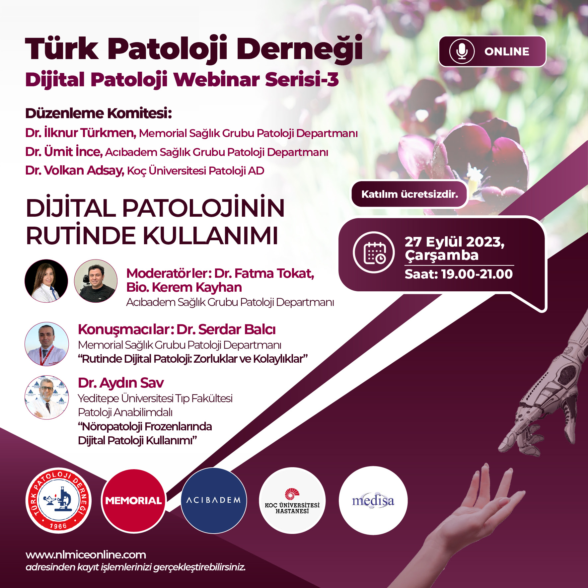

<script async="" charset="utf-8" src="https://badge.dimensions.ai/badge.js"></script>

<script src="https://d1bxh8uas1mnw7.cloudfront.net/assets/embed.js" type="text/javascript"></script>

<div itemscope="" itemtype="https://schema.org/Person">
<script type="application/ld+json">
{
  "@context": "http://schema.org",
  "@type": "Person",
  "name": "Serdar Balcı",
  "url": "https://www.serdarbalci.com/",
  "jobTitle": "MD, Pathologist",
  "sameAs": [
    "https://www.facebook.com/serdarbalcimd",
    "https://www.facebook.com/serdarbalcimdpathologist/",
    "https://www.instagram.com/balciserdar/",
    "https://www.linkedin.com/in/serdar-balci-md-pathologist/",
    "https://twitter.com/serdarbalci",
    "https://github.com/sbalci",
    "https://www.parapathology.com",
    "https://www.patolojinotlari.com",
    "https://www.patolojiai.com/",
    "https://www.memorial.com.tr/doktorlar/serdar-balci-k"
  ]
}
</script></div>

```{r global_options, include=FALSE}
knitr::opts_chunk$set(fig.width = 12, fig.height = 8, fig.path = "Figs/", echo = FALSE, warning = FALSE, message = FALSE, error = FALSE, eval = TRUE, tidy = TRUE, comment = NA, cache = TRUE, R.options = list(width = 60))
```

```{r eval=FALSE, include=FALSE}
gotop::use_gotop(
  src = "fas fa-chevron-circle-up", # css class from Font Awesome
  color = "tomato", # color
  opacity = 0.8, # transparency
  width = 30, # size
  # appear = 100 # number of pixels before appearance
  appear = 0
  )
```


## Biyografi

**Serdar Balcı**  
*Türk Hekim ve Araştırmacı. Patoloji Uzmanı.*  
2005 yılında Hacettepe Üniversitesi Tıp (İng) Fakültesi'nden mezun oldu. Aynı yıl patoloji asistanlığına başladı. 2010 yılında patoloji uzmanı oldu. 2009 ve 2013-2014 arasında ABD'de Emory Üniversitesi'nde pankreatobilier sistem tümörleri üzerinde araştırmalar yaptı. Katıldığı çalışmalar ışığında tümör sınıflama ve kılavuzlarında güncellemeler oldu. 2016 yılında doçent oldu.
İlgi alanları arasında tümör sınıflandırılması, tümör evrelemesi, patolojide kalite kontrol uygulamaları, anatomik patolojide istatistik uygulamaları ve R-project yer almaktadır.
Halen serbest akademik danışman olarak araştırmalarına devam etmektedir.

<aside>
```{r img SerdarBalci-MD-Pathologist.jpg}

```
</aside>

## Biography

I am a Medical Doctor and Pathologist. I graduated from Hacettepe University Faculty of Medicine, Ankara, Turkey, the top medical institution in Turkey. I completed my pathology residency in the Department of Pathology in Hacettepe and then worked at Emory University, Atlanta, GA, USA as a research scholar, and had the opportunity to participate in numerous studies. Since I have always been interested in research, I took statistics and introductory bioinformatics courses at Hacettepe University Biostatistics Department.


<aside>
```{r img docdrserdarbalcijpg_b2d2.jpg}

```
</aside>


I have more than 50 articles published in peer-reviewed journals. I have participated in many international studies. For these studies, I have not only participated as a pathologist but was also actively involved in project planning and I have been the main person responsible for data preparation, data cleaning, data analyses, and reporting. I have experience in bibliography programs and image editing software. I have also used SEER data for cancer research.

I am interested in the application of statistical and bioinformatic methods in anatomic and digital pathology. I am also interested in publication metrics and have done some research on bibliometrics. I am using vosviewer and citespace for side projects, and used PubMed data for bibliography and text mining studies.

I have reviewed research papers as you can see on my Publons profile.

Currently, I am on [the website committee](https://pbpath.org/our-committees/) of Pancreatobiliary Pathology Society and I am actively preparing [the Journal Watch](http://pbpath.org/current-journal-watch/) for this society.

<aside>
<iframe src="https://www.google.com/maps/embed?pb=!1m18!1m12!1m3!1d3008.315122572471!2d28.971432050097803!3d41.062103979193644!2m3!1f0!2f0!3f0!3m2!1i1024!2i768!4f13.1!3m3!1m2!1s0x14cab77500bbab5f%3A0x4e5c9efdf6925c87!2sDo%C3%A7.%20Dr.%20Serdar%20Balc%C4%B1%20Patoloji%20Uzman%C4%B1!5e0!3m2!1sen!2str!4v1646745748883!5m2!1sen!2str" width="600" height="450" style="border:0;" allowfullscreen="" loading="lazy"></iframe>
</aside>


# Genel Uğraşılar {#genel-ugrasilar}

[Genel Uğraşılarım]( # "Eşyanın isimleri bize Dede mirasıdır 2/31")

- Gastrointestinal ve Pankreatobilier Patoloji
- Anatomik patolojide istatistik ve biyoinformatik yöntemlerin uygulanması
- Dijital patoloji
- Patolojide kalite kontrol


# Motto yahut Şiar

- Eşyanın isimleri bize Dede mirasıdır. *(2/31)*

- In God we trust. All others must bring data.  
In GOTT vertrauen wir, alle anderen müssen Daten bringen.

- Hakkı hak bilip hakka ittiba, bâtılı bâtıl bilip bâtıldan ictinâb.

- Data driven ethical decision making.


# Güncel Uğraşılar {#guncel-ugrasilar}

- [Patoloji Atlası](https://www.patolojiatlasi.com/)

<aside>
<iframe width='160' height='400' src='https://leanpub.com/patolojiatlasi/embed' frameborder='0' allowtransparency='true'></iframe>
</aside>

- [Bibliographic Çalışmalar](https://sbalci.github.io/pubmed/BibliographicStudies.html)

- [ClinicoPath Jamovi Module](https://sbalci.github.io/ClinicoPathJamoviModule/)

- [Open Knowledge Maps](https://openknowledgemaps.org/news#enthusiasts2020)

<aside>
https://openknowledgemaps.org/news#enthusiasts2020

https://openknowledgemaps.org/community


<blockquote class="twitter-tweet"><p lang="en" dir="ltr">We are happy to announce our 2020 enthusiasts 😃 <br>Please welcome with us: Nancy Kwangwa, Daniel Deogratus, Paloma Marín Arraiza, Hamdan Hidayat &amp; Serdar Balci!<br><br>In light of COVID-19, we extended the program&#39;s time frame and added more support for webinars: <a href="https://t.co/111bH4AbRf">https://t.co/111bH4AbRf</a> <a href="https://t.co/dk3e3DcEBJ">pic.twitter.com/dk3e3DcEBJ</a></p>&mdash; Open Knowledge Maps (@OK_Maps) <a href="https://twitter.com/OK_Maps/status/1252577217542045696?ref_src=twsrc%5Etfw">April 21, 2020</a></blockquote> <script async src="https://platform.twitter.com/widgets.js" charset="utf-8"></script>

</aside>


# Linkler 

- https://www.serdarbalci.com/
- https://www.facebook.com/serdarbalcimd
- https://www.facebook.com/serdarbalcimdpathologist/
- https://www.instagram.com/balciserdar/
- https://www.linkedin.com/in/serdar-balci-md-pathologist/
- https://twitter.com/serdarbalci
- <a rel="me" href="https://mastodon.social/@serdarbalci">Mastodon</a>
- https://github.com/sbalci
- https://www.parapathology.com
- https://www.patolojinotlari.com
- https://www.patolojiai.com/
- https://www.memorial.com.tr/doktorlar/serdar-balci-k


# Eğitim {#education}


|  Öğrenim Dönemi|  Derece|  Üniversite|  Öğretim Alanı|
|--:|--:|--:|--:|
|  1998-2005|  Lisans|  Hacettepe Üniversitesi Tıp (İngilizce) Fakültesi|  Tıp Doktorluğu|
|  2005-2010|  Tıbbi Patoloji Uzmanı|  Hacettepe Üniversitesi Tıp Fakültesi Tıbbi Patoloji Anabilim Dalı|  Tıbbi Patoloji Uzmanlığı|
|  2010-2011|  Özel Öğrenci|  Hacettepe Üniversitesi Sağlık Bilimleri Enstitüsü|  Tıp Fakültesi Biyoistatistik Anabilim Dalı|


# Yayınlar {#peer-reviewed-publications}


## Yayın Listeleri {#publication-lists}

- [CV, Özgeçmiş](https://drive.google.com/file/d/0B4x15l9fUIsjMm01UTAyTkJvNm8/)

- [GoogleScholar](http://scholar.google.com/citations?user=q40DcqYAAAAJ)

- [ResearcherID: B-6401-2011](http://www.researcherid.com/rid/B-6401-2011)

- [Publons](https://publons.com/researcher/467202/serdar-balci/)  


- [PubMed My Bibliography](http://www.ncbi.nlm.nih.gov/sites/myncbi/collections/public/14I_qdU6Oj6VsIwzi12Lbng/)

<aside>
[PubMed My Bibliography](http://www.ncbi.nlm.nih.gov/sites/myncbi/collections/public/1n_xodb65Uqv226D6zhH5rj/?sort=date&amp;direction=ascending)  
[PubMed My Bibliography](https://www.ncbi.nlm.nih.gov/myncbi/serdar.balci.1/bibliography/public/)
</aside>

- [ORCID](http://orcid.org/0000-0002-7852-3851)

<aside>
<a content="https://orcid.org/0000-0002-7852-3851" href="https://orcid.org/0000-0002-7852-3851" itemprop="sameAs" rel="noopener noreferrer" style="vertical-align: top;" target="orcid.widget">orcid.org/0000-0002-7852-3851</a>
</aside>

- [ResearchGate](https://www.researchgate.net/profile/Serdar_Balci)

<aside>
<a href="https://www.researchgate.net/profile/Serdar_Balci?cp=shp" target="_blank" title="Follow me on ResearchGate"></a>
</aside>

- [Scopus](https://www.scopus.com/authid/detail.uri?authorId=22933834600)

- [Loop](http://loop.frontiersin.org/people/306241/overview)

<!-- 
- [Microsoft Academic](https://academic.microsoft.com/profile/302g2i05-e15h-492i-ff3f-029i0g14j5j4/serdarbalci/)

<aside>
https://academic.microsoft.com/profile/302g2i05-e15h-492i-ff3f-029i0g14j5j4/SerdarBALCI/publication
</aside>
-->

- [Europe PMC](https://europepmc.org/authors/0000-0002-7852-3851)

- [Semantic Scholar](https://www.semanticscholar.org/author/Serdar-Balci/2755920)

- [Lens Scholar](https://www.lens.org/lens/profile/311391349/scholar)

- [openknowledgemaps](https://openknowledgemaps.org/map/cb13e14ef3ea4038280826bbaf87d9f1&embed=true)


<!-- <iframe width="100%" src="http://visualbib.uniud.it/visualBib2/visualBib.min.html?id=c22cef766037d3a918056157466db2e4&embed=1" frameborder="0" > -->
<!--    </iframe> -->


## Atıflar {#citations}


- [Impact Story](https://impactstory.org/u/0000-0002-7852-3851/)


- [Google Scholar](http://scholar.google.com/citations?user=q40DcqYAAAAJ)

<aside>
```{r google scholar, eval=FALSE, include=FALSE}
# suppressPackageStartupMessages(library(scholar))
# suppressPackageStartupMessages(library(ggplot2))
# cit <- get_citation_history("q40DcqYAAAAJ")
# ggplot(cit, aes(x = year, y = cites)) +
#   geom_bar(stat = "identity") +
#   theme_bw() +
#   xlab("Year of citation") +
#   ylab("Google Scholar\n cites") +
#   annotate("text", label = format(Sys.time(), "%Y-%m-%d %H:%M:%S %Z"), x = -Inf, y = Inf, vjust = 1.5, hjust = -0.05, size = 3, colour = "gray")
```
</aside>


<!-- <a href="https://scholar.google.com.tr/citations?user=q40DcqYAAAAJ"></a> -->


- [Publons](https://publons.com/researcher/467202/serdar-balci/)


- [ResearcherID](http://www.researcherid.com/rid/B-6401-2011)


## Uluslararası Yayınlar  {#international-publications}

### Araştırma Makaleleri  {#research-publications}


- Medullary Carcinoma of the Ampulla Has Distinct Clinicopathologic Characteristics Including Common Association with Microsatellite Instability and PD-L1 Expression. Hum Pathol. 2022 Dec 8:S0046-8177(22)00282-9. doi: 10.1016/j.humpath.2022.12.004. Epub ahead of print. PMID: 36502926.  
Xue Y, Balci S, Pehlivanoglu B, Muraki T, Memis B, Saka B, Kim G, Bandopadhyay S, Knight J, El-Rayes B, Kooby D, Maithel SK, Sarmiento J, Basturk O, Reid MD, Adsay V. 


- Hepatic Cysts: Reappraisal of the Classification, Terminology, Differential Diagnosis, and Clinicopathologic Characteristics in 258 Cases. Am J Surg Pathol. 2022 Jul 4. doi: 10.1097/PAS.0000000000001930. Epub ahead of print. PMID: 35778790.
Armutlu A, Quigley B, Choi H, Basturk O, Akkas G, Pehlivanoglu B, Memis B, Jang KT, Erkan M, Erkan B, Balci S, Saka B, Bagci P, Farris AB, Kooby DA, Martin D, Kalb B, Maithel SK, Sarmiento J, Reid MD, Adsay NV.


- Infiltration pattern predicts metastasis and progression better than the T-stage and grade in pancreatic neuroendocrine tumors: a proposal for a novel infiltration-based morphologic grading. Mod Pathol. 2022 Jun;35(6):777-785. doi: 10.1038/s41379-021-00995-4. Epub 2021 Dec 30. PMID: 34969955.
Taskin OC, Reid MD, Bagci P, Balci S, Armutlu A, Demirtas D, Pehlivanoglu B, Saka B, Memis B, Bozkurtlar E, Leblebici CB, Birceanu A, Xue Y, Erkan M, Kapran Y, Baygul A, Sokmensuer C, Scarpa A, Luchini C, Basturk O, Adsay V. 


- T2 gallbladder cancer shows substantial survival variation between continents and this is not due to histopathologic criteria or pathologic sampling differences.  
[Virchows Arch. 2021 Jan 7.](https://link.springer.com/article/10.1007%2Fs00428-020-02968-5)  
DeSimone MS, Goodman M, Pehlivanoglu B, Memis B, Balci S, Roa JC, Jang KT, Jang JY, Hong SM, Lee K, Kim H, Choi HJ, Muraki T, Araya JC, Bellolio E, Sarmiento JM, Maithel SK, Losada HF, Basturk O, Reid MD, Koshiol J, Adsay V.  

<aside>
[doi: 10.1007/s00428-020-02968-5](https://doi.org/10.1007/s00428-020-02968-5)  
[PMID: 33411027](https://pubmed.ncbi.nlm.nih.gov/33411027/)  
<span class="__dimensions_badge_embed__" data-doi="10.1007/s00428-020-02968-5" data-style="small_circle"></span>  
<span class="altmetric-embed" data-badge-popover="right" data-badge-type="donut" data-doi="10.1007/s00428-020-02968-5"></span>  
[Semantic](https://api.semanticscholar.org/10.1007/s00428-020-02968-5?include_unknown_references=true)  
[Scite](https://scite.ai/reports/10.1007/s00428-020-02968-5)  
[Connections](https://www.connectedpapers.com/main/d778f3589086bce9c0f0de257c8278df67ae3036/T2-gallbladder-cancer-shows-substantial-survival-variation-between-continents-and-this-is-not-due-to-histopathologic-criteria-or-pathologic-sampling-differences/graph)
<hr>
</aside>


- Gallbladder polyps: Correlation of size and clinicopathologic characteristics based on updated definitions.  
[PLoS One. 2020 Sep 11;15(9):e0237979.](https://dx.plos.org/10.1371/journal.pone.0237979)  
Taskin OC, Basturk O, Reid MD, Dursun N, Bagci P, Saka B, <i>Balci S</i>, Memis B, Bellolio E, Araya JC, Roa JC, Tapia O, Losada H, Sarmiento J, Jang KT, Jang JY, Pehlivanoglu B, Erkan M, Adsay V.  

<aside>
[doi: 10.1371/journal.pone.0237979](https://doi.org/10.1371/journal.pone.0237979)  
[PMID: 32915805](https://pubmed.ncbi.nlm.nih.gov/32915805/)  
[PMCID: PMC7485812](http://www.ncbi.nlm.nih.gov/pmc/articles/pmc7485812/)  
<span class="__dimensions_badge_embed__" data-doi="10.4103/ijpm.ijpm_85_17" data-style="small_circle"></span>  
<span class="altmetric-embed" data-badge-popover="right" data-badge-type="donut" data-doi="10.4103/ijpm.ijpm_85_17"></span>  
[Semantic](https://api.semanticscholar.org/10.1371/journal.pone.0237979?include_unknown_references=true)  
[Scite](https://scite.ai/reports/10.1371/journal.pone.0237979)  
[Connections](https://www.connectedpapers.com/main/534922d45f8bb38cc2499ddcb0dfb1a01814000d/Gallbladder-polyps-Correlation-of-size-and-clinicopathologic-characteristics-based-on-updated-definitions/graph)  
<hr>
</aside>


- Frequency and clinicopathologic associations of DNA mismatch repair protein deficiency in ampullary carcinoma: Routine testing is indicated.  
Cancer. 2020 Aug 28.  
Xue Y, <i>Balci S</i>, Aydin Mericoz C, Taskin OC, Jiang H, Pehlivanoglu B, Muraki T, Memis B, Saka B, Kim GE, Bandopadhyay S, Knight J, El-Rayes BF, Sarmiento J, Reid MD, Erkan M, Basturk O, Adsay V.

<aside>
[doi: 10.1002/cncr.33135](https://doi.org/10.1002/cncr.33135)  
[PMID: 32857459](https://pubmed.ncbi.nlm.nih.gov/32857459/)  
<span class="__dimensions_badge_embed__" data-doi="10.1002/cncr.33135" data-style="small_circle"></span>  
<span class="altmetric-embed" data-badge-popover="right" data-badge-type="donut" data-doi="10.1002/cncr.33135"></span>  
[Semantic](https://api.semanticscholar.org/10.1002/cncr.33135?include_unknown_references=true)  
[Scite](https://scite.ai/reports/10.1002/cncr.33135)  
[Connections](https://www.connectedpapers.com/main/2f258c96e2bea4ed973b3ba67ffde9e0cc3d56c9/Frequency-and-clinicopathologic-associations-of-DNA-mismatch-repair-protein-deficiency-in-ampullary-carcinoma-Routine-testing-is-indicated/graph)
<hr>
</aside>

- Intracholecystic tubular non-mucinous neoplasm (ICTN) of the gallbladder: a clinicopathologically distinct, invasion-resistant entity.
Virchows Arch. 2020 Jul 20.
Pehlivanoglu B, <i>Balci S</i>, Basturk O, Bagci P, Erbarut Seven I, Memis B, Dursun N, Jang KT, Saka B, Ohike N, Tajiri T, Roa JC, Sarmiento JM, Reid MD, Adsay V. 

<aside>
[doi: 10.1007/s00428-020-02877-7](https://doi.org/10.1007/s00428-020-02877-7)
[PMID: 32691142](https://pubmed.ncbi.nlm.nih.gov/32691142/)
<!-- [PMCID: PMC7485812](http://www.ncbi.nlm.nih.gov/pmc/articles/pmc7485812/)   -->
<span class="__dimensions_badge_embed__" data-doi="10.1007/s00428-020-02877-7" data-style="small_circle"></span>
<span class="altmetric-embed" data-badge-popover="right" data-badge-type="donut" data-doi="10.1007/s00428-020-02877-7">
</span>
[Semantic](https://api.semanticscholar.org/10.1007/s00428-020-02877-7?include_unknown_references=true)
[Scite](https://scite.ai/reports/10.1007/s00428-020-02877-7)
<!-- [Connections](https://www.connectedpapers.com/main/534922d45f8bb38cc2499ddcb0dfb1a01814000d/Gallbladder-polyps-Correlation-of-size-and-clinicopathologic-characteristics-based-on-updated-definitions/graph) -->
<hr>
</aside>

- Follicular Cholecystitis: Reappraisal of Incidence, Definition, and Clinicopathologic Associations in an Analysis of 2550 Cholecystectomies.
Int J Surg Pathol. 2020 May 18:1066896920924079.
Saka B, Memis B, Seven IE, Pehlivanoglu B, <i>Balci S</i>, Bagci P, Reid M, Dursun N, Escalano OT, Roa JC, Araya JC, Kong SY, Basturk O, Koshiol J, Adsay NV. 

<aside>
doi: 10.1177/1066896920924079.  PMID: 32423360.
<!-- [doi: 10.1371/journal.pone.0237979](https://doi.org/10.1371/journal.pone.0237979)   -->
<!-- [PMID: 32915805](https://pubmed.ncbi.nlm.nih.gov/32915805/)   -->
<!-- [PMCID: PMC7485812](http://www.ncbi.nlm.nih.gov/pmc/articles/pmc7485812/)   -->
<!-- <span class="__dimensions_badge_embed__" data-doi="10.4103/ijpm.ijpm_85_17" data-style="small_circle"></span>   -->
<!-- <span class="altmetric-embed" data-badge-popover="right" data-badge-type="donut" data-doi="10.4103/ijpm.ijpm_85_17"> -->
<!-- </span>   -->
<!-- [Semantic](https://api.semanticscholar.org/10.1371/journal.pone.0237979?include_unknown_references=true)   -->
<!-- [Scite](https://scite.ai/reports/10.1371/journal.pone.0237979)   -->
<!-- [Connections](https://www.connectedpapers.com/main/534922d45f8bb38cc2499ddcb0dfb1a01814000d/Gallbladder-polyps-Correlation-of-size-and-clinicopathologic-characteristics-based-on-updated-definitions/graph) -->
<hr>
</aside>


- Non-neoplastic Polyps of the Gallbladder: A Clinicopathologic Analysis of 447 Cases.
Am J Surg Pathol. 2019 Nov 12.  
Taskin OC, Bellolio E, Dursun N, Seven IE, Roa JC, Araya JC, Villaseca M, Tapia O, Vance C, Saka B, <i>Balci S</i>, Bagci P, Losada H, Sarmiento J, Memis B, Pehlivanoğlu B, Basturk O, Reid MD, Koshiol J, Cheng JD, Kapran Y, Adsay V.

<aside>
doi: 10.1097/PAS.0000000000001405.
PubMed PMID: 31725469.
<!-- [doi: 10.1371/journal.pone.0237979](https://doi.org/10.1371/journal.pone.0237979)   -->
<!-- [PMID: 32915805](https://pubmed.ncbi.nlm.nih.gov/32915805/)   -->
<!-- [PMCID: PMC7485812](http://www.ncbi.nlm.nih.gov/pmc/articles/pmc7485812/)   -->
<!-- <span class="__dimensions_badge_embed__" data-doi="10.4103/ijpm.ijpm_85_17" data-style="small_circle"></span>   -->
<!-- <span class="altmetric-embed" data-badge-popover="right" data-badge-type="donut" data-doi="10.4103/ijpm.ijpm_85_17"> -->
<!-- </span>   -->
<!-- [Semantic](https://api.semanticscholar.org/10.1371/journal.pone.0237979?include_unknown_references=true)   -->
<!-- [Scite](https://scite.ai/reports/10.1371/journal.pone.0237979)   -->
<!-- [Connections](https://www.connectedpapers.com/main/534922d45f8bb38cc2499ddcb0dfb1a01814000d/Gallbladder-polyps-Correlation-of-size-and-clinicopathologic-characteristics-based-on-updated-definitions/graph) -->
<hr>
</aside>


-  Poorly Cohesive (Signet Ring Cell) Carcinoma of the Ampulla of Vater. Int J Surg Pathol. 2019 Oct 15;:1066896919880968.
Tuncel D, Basturk O, Bradley KT, Kim GE, Xue Y, Reid MD, <i>Balci S</i>, Erbarut I, Adsay V.

<aside>
doi: 10.1177/1066896919880968
PMID: 31612756
https://journals.sagepub.com/doi/abs/10.1177/1066896919880968
<!-- [doi: 10.1371/journal.pone.0237979](https://doi.org/10.1371/journal.pone.0237979)   -->
<!-- [PMID: 32915805](https://pubmed.ncbi.nlm.nih.gov/32915805/)   -->
<!-- [PMCID: PMC7485812](http://www.ncbi.nlm.nih.gov/pmc/articles/pmc7485812/)   -->
<!-- <span class="__dimensions_badge_embed__" data-doi="10.4103/ijpm.ijpm_85_17" data-style="small_circle"></span>   -->
<!-- <span class="altmetric-embed" data-badge-popover="right" data-badge-type="donut" data-doi="10.4103/ijpm.ijpm_85_17"> -->
<!-- </span>   -->
<!-- [Semantic](https://api.semanticscholar.org/10.1371/journal.pone.0237979?include_unknown_references=true)   -->
<!-- [Scite](https://scite.ai/reports/10.1371/journal.pone.0237979)   -->
<!-- [Connections](https://www.connectedpapers.com/main/534922d45f8bb38cc2499ddcb0dfb1a01814000d/Gallbladder-polyps-Correlation-of-size-and-clinicopathologic-characteristics-based-on-updated-definitions/graph) -->
<hr>
</aside>

- Sarcomatoid carcinomas of the gallbladder: clinicopathologic characteristics. 
Virchows Arch. 2019 Jun 8
Taskin OC, Akkas G, Memis B, Seven IE, Basturk O, Jang KT, Roa JC, Araya JC, Bellolio E, Losada H, Sarmiento J, <i>Balci S</i>, Pehlivanoglu B, Reid MD, Koshiol J, Adsay V. 

<aside>
doi: 10.1007/s00428-019-02583-z.
[PMID: 31177317](https://www.ncbi.nlm.nih.gov/pubmed/31177317)
<!-- [doi: 10.1371/journal.pone.0237979](https://doi.org/10.1371/journal.pone.0237979)   -->
<!-- [PMID: 32915805](https://pubmed.ncbi.nlm.nih.gov/32915805/)   -->
<!-- [PMCID: PMC7485812](http://www.ncbi.nlm.nih.gov/pmc/articles/pmc7485812/)   -->
<!-- <span class="__dimensions_badge_embed__" data-doi="10.4103/ijpm.ijpm_85_17" data-style="small_circle"></span>   -->
<!-- <span class="altmetric-embed" data-badge-popover="right" data-badge-type="donut" data-doi="10.4103/ijpm.ijpm_85_17"> -->
<!-- </span>   -->
<!-- [Semantic](https://api.semanticscholar.org/10.1371/journal.pone.0237979?include_unknown_references=true)   -->
<!-- [Scite](https://scite.ai/reports/10.1371/journal.pone.0237979)   -->
<!-- [Connections](https://www.connectedpapers.com/main/534922d45f8bb38cc2499ddcb0dfb1a01814000d/Gallbladder-polyps-Correlation-of-size-and-clinicopathologic-characteristics-based-on-updated-definitions/graph) -->
<hr>
</aside>


- <i>Role of calcium-sensing receptor, Galectin-3, Cyclin D1, and Ki-67 immunohistochemistry to favor in the diagnosis of parathyroid carcinoma.</i>
Sungu N, Dogan H, Kilicarslan A, Kilic M, Polat S, Tokac M, Akbaba S, Parlak Omer, <i>Balci S</i>, Ogut B, Cakir B.
<a href="http://www.ijpmonline.org/article.asp?issn=0377-4929;year=2018;volume=61;issue=1;spage=22;epage=26;aulast=Sungu;type=0;aid=IndianJPatholMicrobiol_2018_61_1_22_228201" target="_blank">Indian Journal of Pathology and Microbiology 2018, 61:22-26</a>


<aside>
<a href="http://dx.doi.org/10.4103/ijpm.ijpm_85_17" target="_blank">doi: 10.4103/ijpm.ijpm_85_17</a>
<span class="__dimensions_badge_embed__" data-doi="10.4103/ijpm.ijpm_85_17" data-style="small_circle"></span>
<span class="altmetric-embed" data-badge-popover="right" data-badge-type="donut" data-doi="10.4103/ijpm.ijpm_85_17">
</span>
<!-- [doi: 10.1371/journal.pone.0237979](https://doi.org/10.1371/journal.pone.0237979)   -->
<!-- [PMID: 32915805](https://pubmed.ncbi.nlm.nih.gov/32915805/)   -->
<!-- [PMCID: PMC7485812](http://www.ncbi.nlm.nih.gov/pmc/articles/pmc7485812/)   -->
<!-- <span class="__dimensions_badge_embed__" data-doi="10.4103/ijpm.ijpm_85_17" data-style="small_circle"></span>   -->
<!-- <span class="altmetric-embed" data-badge-popover="right" data-badge-type="donut" data-doi="10.4103/ijpm.ijpm_85_17"> -->
<!-- </span>   -->
<!-- [Semantic](https://api.semanticscholar.org/10.1371/journal.pone.0237979?include_unknown_references=true)   -->
<!-- [Scite](https://scite.ai/reports/10.1371/journal.pone.0237979)   -->
<!-- [Connections](https://www.connectedpapers.com/main/534922d45f8bb38cc2499ddcb0dfb1a01814000d/Gallbladder-polyps-Correlation-of-size-and-clinicopathologic-characteristics-based-on-updated-definitions/graph) -->
<hr>
</aside>

- <i>A FISH assay efficiently screens for BRAF gene rearrangements in pancreatic acinar-type neoplasms.</i>
Wang L, Basturk O, Wang J, Benayed R, Middha S, Zehir A, Linkov I, Rao M, Aryeequaye R, Cao L, Chmielecki J, Ross J, Stephens PJ, Adsay V, Askan G, <i>Balci S</i>, Klimstra DS
<a href="https://www.nature.com/articles/modpathol2017106" target="_blank">Mod Pathol. 2018 Jan;31(1):132-140.</a>


<aside>
https://api.semanticscholar.org/10.1038/modpathol.2017.106?include_unknown_references=true)
https://www.connectedpapers.com/main/b082e8216300b4a314d7601697cde755e34b409c/A-FISH-assay-efficiently-screens-for-BRAF-gene-rearrangements-in-pancreatic-acinartype-neoplasms/graph
<a href="http://dx.doi.org/10.1038/modpathol.2017.106" target="_blank">doi: 10.1038/modpathol.2017.106</a>
<a href="https://www.ncbi.nlm.nih.gov/pubmed/28884748" target="_blank">PMID: 28884748</a>

<span class="__dimensions_badge_embed__" data-doi="10.1038/modpathol.2017.106" data-style="small_circle"></span>
<span class="altmetric-embed" data-badge-popover="right" data-badge-type="donut" data-doi="10.1038/modpathol.2017.106">
</span>


<!-- [doi: 10.1371/journal.pone.0237979](https://doi.org/10.1371/journal.pone.0237979)   -->
<!-- [PMID: 32915805](https://pubmed.ncbi.nlm.nih.gov/32915805/)   -->
<!-- [PMCID: PMC7485812](http://www.ncbi.nlm.nih.gov/pmc/articles/pmc7485812/)   -->
<!-- <span class="__dimensions_badge_embed__" data-doi="10.4103/ijpm.ijpm_85_17" data-style="small_circle"></span>   -->
<!-- <span class="altmetric-embed" data-badge-popover="right" data-badge-type="donut" data-doi="10.4103/ijpm.ijpm_85_17"> -->
<!-- </span>   -->
<!-- [Semantic](https://api.semanticscholar.org/10.1371/journal.pone.0237979?include_unknown_references=true)   -->
<!-- [Scite](https://scite.ai/reports/10.1371/journal.pone.0237979)   -->
<!-- [Connections](https://www.connectedpapers.com/main/534922d45f8bb38cc2499ddcb0dfb1a01814000d/Gallbladder-polyps-Correlation-of-size-and-clinicopathologic-characteristics-based-on-updated-definitions/graph) -->
<hr>
</aside>


- <i>Pancreatic intraductal tubulopapillary neoplasm is genetically distinct from intraductal papillary mucinous neoplasm and ductal adenocarcinoma.</i>
Basturk O, Berger MF, Yamaguchi H, Adsay V, Askan G, Bhanot UK, Zehir A, Carneiro F, Hong SM, Zamboni G, Dikoglu E, Jobanputra V, Wrzeszczynski KO, <i>Balci S</i>, Allen P, Ikari N, Takeuchi S, Akagawa H, Kanno A, Shimosegawa T, Morikawa T, Motoi F, Unno M, Higuchi R, Yamamoto M, Shimizu K, Furukawa T, Klimstra DS
<a href="https://www.nature.com/articles/modpathol201760" target="_blank">Mod Pathol. 2017 Aug 4</a>


<aside>
<a href="https://doi.org/10.1038/modpathol.2017.60" target="_blank">doi: 10.1038/modpathol.2017.60</a>
<a href="https://www.ncbi.nlm.nih.gov/pubmed/28776573" target="_blank">PMID: 28776573</a>

<span class="__dimensions_badge_embed__" data-doi="10.1038/modpathol.2017.60" data-style="small_circle"></span>
<span class="altmetric-embed" data-badge-popover="right" data-badge-type="donut" data-doi="10.1038/modpathol.2017.60">
</span>


<!-- [doi: 10.1371/journal.pone.0237979](https://doi.org/10.1371/journal.pone.0237979)   -->
<!-- [PMID: 32915805](https://pubmed.ncbi.nlm.nih.gov/32915805/)   -->
<!-- [PMCID: PMC7485812](http://www.ncbi.nlm.nih.gov/pmc/articles/pmc7485812/)   -->
<!-- <span class="__dimensions_badge_embed__" data-doi="10.4103/ijpm.ijpm_85_17" data-style="small_circle"></span>   -->
<!-- <span class="altmetric-embed" data-badge-popover="right" data-badge-type="donut" data-doi="10.4103/ijpm.ijpm_85_17"> -->
<!-- </span>   -->
<!-- [Semantic](https://api.semanticscholar.org/10.1371/journal.pone.0237979?include_unknown_references=true)   -->
<!-- [Scite](https://scite.ai/reports/10.1371/journal.pone.0237979)   -->
<!-- [Connections](https://www.connectedpapers.com/main/534922d45f8bb38cc2499ddcb0dfb1a01814000d/Gallbladder-polyps-Correlation-of-size-and-clinicopathologic-characteristics-based-on-updated-definitions/graph) -->
<hr>
</aside>


- <i>Immunohistochemical Classification of Ampullary Carcinomas: Critical Reappraisal Fails to Confirm Prognostic Relevance for Recently Proposed Panels, and Highlights MUC5AC as a Strong Prognosticator.</i>
Xue Y, Reid MD, <i>Balci S</i>, Quigley B, Muraki T, Memis B, Xia J, Hacihasanoglu E, Bedolla G, Pehlivanoglu B, Kim GE, Tajiri T, Ohike N, Aneja R, Krasinskas AM, Adsay V
<a href="https://journals.lww.com/ajsp/Abstract/2017/07000/Immunohistochemical_Classification_of_Ampullary.1.aspx" target="_blank">Am J Surg Pathol. 2017 Jul;41(7):865-876.</a>


<aside>
<a href="https://doi.org/10.1097/PAS.0000000000000863" target="_blank">doi: 10.1097/PAS.0000000000000863</a>
<a href="https://www.ncbi.nlm.nih.gov/pubmed/28505002" target="_blank">PMID: 28505002</a>

<span class="__dimensions_badge_embed__" data-doi="10.1097/PAS.0000000000000863" data-style="small_circle"></span>
<span class="altmetric-embed" data-badge-popover="right" data-badge-type="donut" data-doi="10.1097/PAS.0000000000000863">
</span>

https://scite.ai/reports/10.1097/PAS.0000000000000863

<!-- [doi: 10.1371/journal.pone.0237979](https://doi.org/10.1371/journal.pone.0237979)   -->
<!-- [PMID: 32915805](https://pubmed.ncbi.nlm.nih.gov/32915805/)   -->
<!-- [PMCID: PMC7485812](http://www.ncbi.nlm.nih.gov/pmc/articles/pmc7485812/)   -->
<!-- <span class="__dimensions_badge_embed__" data-doi="10.4103/ijpm.ijpm_85_17" data-style="small_circle"></span>   -->
<!-- <span class="altmetric-embed" data-badge-popover="right" data-badge-type="donut" data-doi="10.4103/ijpm.ijpm_85_17"> -->
<!-- </span>   -->
<!-- [Semantic](https://api.semanticscholar.org/10.1371/journal.pone.0237979?include_unknown_references=true)   -->
<!-- [Scite](https://scite.ai/reports/10.1371/journal.pone.0237979)   -->
<!-- [Connections](https://www.connectedpapers.com/main/534922d45f8bb38cc2499ddcb0dfb1a01814000d/Gallbladder-polyps-Correlation-of-size-and-clinicopathologic-characteristics-based-on-updated-definitions/graph) -->
<hr>
</aside>

- Basturk O, Adsay V, Askan G, Dhall D, Zamboni G, Shimizu M, Cymes K, Carneiro F, <i>Balci S</i>, Sigel C, Reid MD, Esposito I, Baldaia H, Allen P, Klöppel G, Klimstra DS. Intraductal Tubulopapillary Neoplasm of the Pancreas: A Clinicopathologic and Immunohistochemical Analysis of 33 Cases. Am J Surg Pathol. 2016 Dec 14.


<aside>
PMID: 27984235 DOI: 10.1097/PAS.0000000000000782
<span class="__dimensions_badge_embed__" data-doi="10.1097/PAS.0000000000000782" data-style="small_circle"></span>
<span class="altmetric-embed" data-badge-popover="right" data-badge-type="donut" data-doi="10.1097/PAS.0000000000000782">
</span>

https://scite.ai/reports/10.1038/MODPATHOL.2017.60

<!-- [doi: 10.1371/journal.pone.0237979](https://doi.org/10.1371/journal.pone.0237979)   -->
<!-- [PMID: 32915805](https://pubmed.ncbi.nlm.nih.gov/32915805/)   -->
<!-- [PMCID: PMC7485812](http://www.ncbi.nlm.nih.gov/pmc/articles/pmc7485812/)   -->
<!-- <span class="__dimensions_badge_embed__" data-doi="10.4103/ijpm.ijpm_85_17" data-style="small_circle"></span>   -->
<!-- <span class="altmetric-embed" data-badge-popover="right" data-badge-type="donut" data-doi="10.4103/ijpm.ijpm_85_17"> -->
<!-- </span>   -->
<!-- [Semantic](https://api.semanticscholar.org/10.1371/journal.pone.0237979?include_unknown_references=true)   -->
<!-- [Scite](https://scite.ai/reports/10.1371/journal.pone.0237979)   -->
<!-- [Connections](https://www.connectedpapers.com/main/534922d45f8bb38cc2499ddcb0dfb1a01814000d/Gallbladder-polyps-Correlation-of-size-and-clinicopathologic-characteristics-based-on-updated-definitions/graph) -->
<hr> </aside>

- Xue Y, Vanoli A, <i>Balci S</i>, Reid MM, Saka B, Bagci P, Memis B, Choi H, Ohike N, Tajiri T, Muraki T, Quigley B, El-Rayes BF, Shaib W, Kooby D, Sarmiento J, Maithel SK, Knight JH, Goodman M, Krasinskas AM, Adsay V. Non-ampullary-duodenal carcinomas: clinicopathologic analysis of 47 cases and comparison with ampullary and pancreatic adenocarcinomas. Mod Pathol. 2016 Oct 14. 


<aside>
doi: 10.1038/modpathol.2016.174. PMID: 27739441

<span class="__dimensions_badge_embed__" data-doi="10.1038/modpathol.2016.174" data-style="small_circle"></span>
<span class="altmetric-embed" data-badge-popover="right" data-badge-type="donut" data-doi="10.1038/modpathol.2016.174">
</span>

https://scite.ai/reports/10.1038/MODPATHOL.2016.174

<!-- [doi: 10.1371/journal.pone.0237979](https://doi.org/10.1371/journal.pone.0237979)   -->
<!-- [PMID: 32915805](https://pubmed.ncbi.nlm.nih.gov/32915805/)   -->
<!-- [PMCID: PMC7485812](http://www.ncbi.nlm.nih.gov/pmc/articles/pmc7485812/)   -->
<!-- <span class="__dimensions_badge_embed__" data-doi="10.4103/ijpm.ijpm_85_17" data-style="small_circle"></span>   -->
<!-- <span class="altmetric-embed" data-badge-popover="right" data-badge-type="donut" data-doi="10.4103/ijpm.ijpm_85_17"> -->
<!-- </span>   -->
<!-- [Semantic](https://api.semanticscholar.org/10.1371/journal.pone.0237979?include_unknown_references=true)   -->
<!-- [Scite](https://scite.ai/reports/10.1371/journal.pone.0237979)   -->
<!-- [Connections](https://www.connectedpapers.com/main/534922d45f8bb38cc2499ddcb0dfb1a01814000d/Gallbladder-polyps-Correlation-of-size-and-clinicopathologic-characteristics-based-on-updated-definitions/graph) -->
<hr>
</aside>


- Yazgan A, <i>Balci S</i>, Dincer N, Ersoy PE, Tuzun D, Ersoy R, Cigdem I, Bekir C, Guler G. Thyroid FNAC containing hürthle cells and hürthle-like cells: A study of 128 cases. Journal of Cytology, 2016, 33(4), 214. 


<aside>
doi: 10.4103/0970-9371.190447

<span class="__dimensions_badge_embed__" data-doi="10.4103/0970-9371.190447" data-style="small_circle"></span>
<span class="altmetric-embed" data-badge-popover="right" data-badge-type="donut" data-doi="10.4103/0970-9371.190447">
</span>

<!-- [doi: 10.1371/journal.pone.0237979](https://doi.org/10.1371/journal.pone.0237979)   -->
<!-- [PMID: 32915805](https://pubmed.ncbi.nlm.nih.gov/32915805/)   -->
<!-- [PMCID: PMC7485812](http://www.ncbi.nlm.nih.gov/pmc/articles/pmc7485812/)   -->
<!-- <span class="__dimensions_badge_embed__" data-doi="10.4103/ijpm.ijpm_85_17" data-style="small_circle"></span>   -->
<!-- <span class="altmetric-embed" data-badge-popover="right" data-badge-type="donut" data-doi="10.4103/ijpm.ijpm_85_17"> -->
<!-- </span>   -->
<!-- [Semantic](https://api.semanticscholar.org/10.1371/journal.pone.0237979?include_unknown_references=true)   -->
<!-- [Scite](https://scite.ai/reports/10.1371/journal.pone.0237979)   -->
<!-- [Connections](https://www.connectedpapers.com/main/534922d45f8bb38cc2499ddcb0dfb1a01814000d/Gallbladder-polyps-Correlation-of-size-and-clinicopathologic-characteristics-based-on-updated-definitions/graph) -->
<hr>
</aside>


- Basturk O, Chung SM, Hruban RH, Adsay NV, Askan G, Iacobuzio-Donahue C, <i>Balci S</i>, Zee SY, Memis B, Shia J, Klimstra DS. Distinct pathways of pathogenesis of intraductal oncocytic papillary neoplasms and intraductal papillary mucinous neoplasms of the pancreas. Virchows Arch. 2016 Sep 3.  


<aside>
PMID: 27591765 DOI: 10.1007/s00428-016-2014-x

<span class="__dimensions_badge_embed__" data-doi="10.1007/s00428-016-2014-x" data-style="small_circle"></span>
<span class="altmetric-embed" data-badge-popover="right" data-badge-type="donut" data-doi="10.1007/s00428-016-2014-x">
</span>

https://scite.ai/reports/10.1007/S00428-016-2014-X

<!-- [doi: 10.1371/journal.pone.0237979](https://doi.org/10.1371/journal.pone.0237979)   -->
<!-- [PMID: 32915805](https://pubmed.ncbi.nlm.nih.gov/32915805/)   -->
<!-- [PMCID: PMC7485812](http://www.ncbi.nlm.nih.gov/pmc/articles/pmc7485812/)   -->
<!-- <span class="__dimensions_badge_embed__" data-doi="10.4103/ijpm.ijpm_85_17" data-style="small_circle"></span>   -->
<!-- <span class="altmetric-embed" data-badge-popover="right" data-badge-type="donut" data-doi="10.4103/ijpm.ijpm_85_17"> -->
<!-- </span>   -->
<!-- [Semantic](https://api.semanticscholar.org/10.1371/journal.pone.0237979?include_unknown_references=true)   -->
<!-- [Scite](https://scite.ai/reports/10.1371/journal.pone.0237979)   -->
<!-- [Connections](https://www.connectedpapers.com/main/534922d45f8bb38cc2499ddcb0dfb1a01814000d/Gallbladder-polyps-Correlation-of-size-and-clinicopathologic-characteristics-based-on-updated-definitions/graph) -->
<hr>
</aside>

- Reid MD, <i>Balci S</i>, Ohike N, Xue Y, Kim GE, Tajiri T, Memis B, Coban I, Dolgun A, Krasinskas AM, Basturk O, Kooby DA, Sarmiento JM, Maithel SK, El-Rayes BF, Adsay V. Ampullary carcinoma is often of mixed or hybrid histologic type: an analysis of reproducibility and clinical relevance of classification as pancreatobiliary versus intestinal in 232 cases. Mod Pathol. 2016 Sep 2.  


<aside>
PMID: 27586202 DOI: 10.1038/modpathol.2016.124

<span class="__dimensions_badge_embed__" data-doi="10.1038/modpathol.2016.124" data-style="small_circle"></span>
<span class="altmetric-embed" data-badge-popover="right" data-badge-type="donut" data-doi="10.1038/modpathol.2016.124">
</span>

https://scite.ai/reports/10.1038/MODPATHOL.2016.124

<!-- [doi: 10.1371/journal.pone.0237979](https://doi.org/10.1371/journal.pone.0237979)   -->
<!-- [PMID: 32915805](https://pubmed.ncbi.nlm.nih.gov/32915805/)   -->
<!-- [PMCID: PMC7485812](http://www.ncbi.nlm.nih.gov/pmc/articles/pmc7485812/)   -->
<!-- <span class="__dimensions_badge_embed__" data-doi="10.4103/ijpm.ijpm_85_17" data-style="small_circle"></span>   -->
<!-- <span class="altmetric-embed" data-badge-popover="right" data-badge-type="donut" data-doi="10.4103/ijpm.ijpm_85_17"> -->
<!-- </span>   -->
<!-- [Semantic](https://api.semanticscholar.org/10.1371/journal.pone.0237979?include_unknown_references=true)   -->
<!-- [Scite](https://scite.ai/reports/10.1371/journal.pone.0237979)   -->
<!-- [Connections](https://www.connectedpapers.com/main/534922d45f8bb38cc2499ddcb0dfb1a01814000d/Gallbladder-polyps-Correlation-of-size-and-clinicopathologic-characteristics-based-on-updated-definitions/graph) -->
<hr> </aside>

- Sungu N, Yavuz S, Marali S, <i>Balci S</i>, Kilicarslan A, Altunkaya C, Dogan HT, Güler G. (2016), Skin Punch Biopsy Sectioning: Before or After Tissue Processing?. J Cutan Pathol. Accepted Author Manuscript. doi:10.1111/cup.12790 PMID: 27513982

<span class="__dimensions_badge_embed__" data-doi="10.1111/cup.12790" data-style="small_circle"></span>
<span class="altmetric-embed" data-badge-popover="right" data-badge-type="donut" data-doi="10.1111/cup.12790">
</span>

<aside>
<!-- [doi: 10.1371/journal.pone.0237979](https://doi.org/10.1371/journal.pone.0237979)   -->
<!-- [PMID: 32915805](https://pubmed.ncbi.nlm.nih.gov/32915805/)   -->
<!-- [PMCID: PMC7485812](http://www.ncbi.nlm.nih.gov/pmc/articles/pmc7485812/)   -->
<!-- <span class="__dimensions_badge_embed__" data-doi="10.4103/ijpm.ijpm_85_17" data-style="small_circle"></span>   -->
<!-- <span class="altmetric-embed" data-badge-popover="right" data-badge-type="donut" data-doi="10.4103/ijpm.ijpm_85_17"> -->
<!-- </span>   -->
<!-- [Semantic](https://api.semanticscholar.org/10.1371/journal.pone.0237979?include_unknown_references=true)   -->
<!-- [Scite](https://scite.ai/reports/10.1371/journal.pone.0237979)   -->
<!-- [Connections](https://www.connectedpapers.com/main/534922d45f8bb38cc2499ddcb0dfb1a01814000d/Gallbladder-polyps-Correlation-of-size-and-clinicopathologic-characteristics-based-on-updated-definitions/graph) -->
<hr> </aside>

- Gonzalez RS, Bagci P, Basturk O, Reid MD, <i>Balci S</i>, Knight JH, Kong SY, Memis B, Jang KT, Ohike N, Tajiri T, Bandyopadhyay S, Krasinskas AM, Kim GE1, Cheng JD, Adsay NV. Intrapancreatic distal common bile duct carcinoma: Analysis, staging considerations, and comparison with pancreatic ductal and ampullary adenocarcinomas. Mod Pathol. 2016 Jul 29. doi: 10.1038/modpathol.2016.125. PMID: 27469329

<span class="__dimensions_badge_embed__" data-doi="10.1038/modpathol.2016.125" data-style="small_circle"></span>
<span class="altmetric-embed" data-badge-popover="right" data-badge-type="donut" data-doi="10.1038/modpathol.2016.125">
</span>

<aside>
<!-- [doi: 10.1371/journal.pone.0237979](https://doi.org/10.1371/journal.pone.0237979)   -->
<!-- [PMID: 32915805](https://pubmed.ncbi.nlm.nih.gov/32915805/)   -->
<!-- [PMCID: PMC7485812](http://www.ncbi.nlm.nih.gov/pmc/articles/pmc7485812/)   -->
<!-- <span class="__dimensions_badge_embed__" data-doi="10.4103/ijpm.ijpm_85_17" data-style="small_circle"></span>   -->
<!-- <span class="altmetric-embed" data-badge-popover="right" data-badge-type="donut" data-doi="10.4103/ijpm.ijpm_85_17"> -->
<!-- </span>   -->
<!-- [Semantic](https://api.semanticscholar.org/10.1371/journal.pone.0237979?include_unknown_references=true)   -->
<!-- [Scite](https://scite.ai/reports/10.1371/journal.pone.0237979)   -->
<!-- [Connections](https://www.connectedpapers.com/main/534922d45f8bb38cc2499ddcb0dfb1a01814000d/Gallbladder-polyps-Correlation-of-size-and-clinicopathologic-characteristics-based-on-updated-definitions/graph) -->
<hr> </aside>

- Adenocarcinoma ex-goblet cell carcinoid (appendiceal-type crypt cell adenocarcinoma) is a morphologically distinct entity with highly aggressive behavior and frequent association with peritoneal/intra-abdominal dissemination: an analysis of 77 cases. Reid MD, Basturk O, Shaib WL, Xue Y, <i>Balci S</i>, Choi HJ, Akkas G, Memis B, Robinson BS, El-Rayes BF, Staley CA, Staley CA, Winer JH, Russell MC, Knight JH, Goodman M, Krasinskas AM, Adsay V. Mod Pathol. 2016 Jun 24. doi: 10.1038/modpathol.2016.105. PMID: 27338636

<span class="__dimensions_badge_embed__" data-doi="10.1038/modpathol.2016.105" data-style="small_circle"></span>
<span class="altmetric-embed" data-badge-popover="right" data-badge-type="donut" data-doi="10.1038/modpathol.2016.105">
</span>

https://scite.ai/reports/10.1038/MODPATHOL.2016.105

<aside>
<!-- [doi: 10.1371/journal.pone.0237979](https://doi.org/10.1371/journal.pone.0237979)   -->
<!-- [PMID: 32915805](https://pubmed.ncbi.nlm.nih.gov/32915805/)   -->
<!-- [PMCID: PMC7485812](http://www.ncbi.nlm.nih.gov/pmc/articles/pmc7485812/)   -->
<!-- <span class="__dimensions_badge_embed__" data-doi="10.4103/ijpm.ijpm_85_17" data-style="small_circle"></span>   -->
<!-- <span class="altmetric-embed" data-badge-popover="right" data-badge-type="donut" data-doi="10.4103/ijpm.ijpm_85_17"> -->
<!-- </span>   -->
<!-- [Semantic](https://api.semanticscholar.org/10.1371/journal.pone.0237979?include_unknown_references=true)   -->
<!-- [Scite](https://scite.ai/reports/10.1371/journal.pone.0237979)   -->
<!-- [Connections](https://www.connectedpapers.com/main/534922d45f8bb38cc2499ddcb0dfb1a01814000d/Gallbladder-polyps-Correlation-of-size-and-clinicopathologic-characteristics-based-on-updated-definitions/graph) -->
<hr> </aside>

- Yazgan A, Yıldırım N, Gözalan A, Gümüştaş S, Kılıçarslan A, <i>Balci S</i>, Aydın C, Ersoy R, Cakir B, Güler G. The Correlation of Sodium Iodide Symporter and BRAF V600E Mutation in Classical Variant Papillary Thyroid Carcinoma. Ann Diagn Pathol. 2016 Jun;22:58-62. PMID: 27180062 doi: 10.1016/j.anndiagpath.2016.04.002

<span class="__dimensions_badge_embed__" data-doi="10.1016/j.anndiagpath.2016.04.002" data-style="small_circle"></span>
<span class="altmetric-embed" data-badge-popover="right" data-badge-type="donut" data-doi="10.1016/j.anndiagpath.2016.04.002">
</span>

https://scite.ai/reports/10.1016/J.ANNDIAGPATH.2016.04.002

<aside>
<!-- [doi: 10.1371/journal.pone.0237979](https://doi.org/10.1371/journal.pone.0237979)   -->
<!-- [PMID: 32915805](https://pubmed.ncbi.nlm.nih.gov/32915805/)   -->
<!-- [PMCID: PMC7485812](http://www.ncbi.nlm.nih.gov/pmc/articles/pmc7485812/)   -->
<!-- <span class="__dimensions_badge_embed__" data-doi="10.4103/ijpm.ijpm_85_17" data-style="small_circle"></span>   -->
<!-- <span class="altmetric-embed" data-badge-popover="right" data-badge-type="donut" data-doi="10.4103/ijpm.ijpm_85_17"> -->
<!-- </span>   -->
<!-- [Semantic](https://api.semanticscholar.org/10.1371/journal.pone.0237979?include_unknown_references=true)   -->
<!-- [Scite](https://scite.ai/reports/10.1371/journal.pone.0237979)   -->
<!-- [Connections](https://www.connectedpapers.com/main/534922d45f8bb38cc2499ddcb0dfb1a01814000d/Gallbladder-polyps-Correlation-of-size-and-clinicopathologic-characteristics-based-on-updated-definitions/graph) -->
<hr> </aside>

- Irkkan C, <i>Balci S</i>, Güler Tezel G, Akinci B, Yalcin B, Güler G. Comparison of Clinicopathologic Parameters and Survivals Between Epstein-Barr Virus-positive and Her2-positive Gastric Cancers. Appl Immunohistochem Mol Morphol. 2016 Mar 3.  PMID: 26945448 DOI: 10.1097/PAI.0000000000000353

<span class="__dimensions_badge_embed__" data-doi="10.1097/PAI.0000000000000353" data-style="small_circle"></span>
<span class="altmetric-embed" data-badge-popover="right" data-badge-type="donut" data-doi="10.1097/PAI.0000000000000353">
</span>

https://scite.ai/reports/10.1097/PAI.0000000000000353


<aside>
<!-- [doi: 10.1371/journal.pone.0237979](https://doi.org/10.1371/journal.pone.0237979)   -->
<!-- [PMID: 32915805](https://pubmed.ncbi.nlm.nih.gov/32915805/)   -->
<!-- [PMCID: PMC7485812](http://www.ncbi.nlm.nih.gov/pmc/articles/pmc7485812/)   -->
<!-- <span class="__dimensions_badge_embed__" data-doi="10.4103/ijpm.ijpm_85_17" data-style="small_circle"></span>   -->
<!-- <span class="altmetric-embed" data-badge-popover="right" data-badge-type="donut" data-doi="10.4103/ijpm.ijpm_85_17"> -->
<!-- </span>   -->
<!-- [Semantic](https://api.semanticscholar.org/10.1371/journal.pone.0237979?include_unknown_references=true)   -->
<!-- [Scite](https://scite.ai/reports/10.1371/journal.pone.0237979)   -->
<!-- [Connections](https://www.connectedpapers.com/main/534922d45f8bb38cc2499ddcb0dfb1a01814000d/Gallbladder-polyps-Correlation-of-size-and-clinicopathologic-characteristics-based-on-updated-definitions/graph) -->
<hr> </aside>

- Saka B, <i>Balci S</i>, Basturk O, Bagci P, Postlewait LM, Maithel S, Knight J, El-Rayes B, Kooby D, Sarmiento J, Muraki T, Oliva I, Bandyopadhyay S, Akkas G, Goodman M, Reid MD, Krasinskas A, Everett R, Adsay V. Pancreatic Ductal Adenocarcinoma is Spread to the Peripancreatic Soft Tissue in the Majority of Resected Cases, Rendering the AJCC T-Stage Protocol (7th Edition) Inapplicable and Insignificant: A Size-Based Staging System (pT1: ≤2, pT2: &gt;2-≤4, pT3: &gt;4 cm) is More Valid and Clinically Relevant. Ann Surg Oncol. 2016 Jan 29.  PMID: 26832882 doi:10.1245/s10434-016-5093-7

<span class="__dimensions_badge_embed__" data-doi="10.1245/s10434-016-5093-7" data-style="small_circle"></span>
<span class="altmetric-embed" data-badge-popover="right" data-badge-type="donut" data-doi="10.1245/s10434-016-5093-7">
</span>

https://scite.ai/reports/10.1245/S10434-016-5093-7

<aside>
<!-- [doi: 10.1371/journal.pone.0237979](https://doi.org/10.1371/journal.pone.0237979)   -->
<!-- [PMID: 32915805](https://pubmed.ncbi.nlm.nih.gov/32915805/)   -->
<!-- [PMCID: PMC7485812](http://www.ncbi.nlm.nih.gov/pmc/articles/pmc7485812/)   -->
<!-- <span class="__dimensions_badge_embed__" data-doi="10.4103/ijpm.ijpm_85_17" data-style="small_circle"></span>   -->
<!-- <span class="altmetric-embed" data-badge-popover="right" data-badge-type="donut" data-doi="10.4103/ijpm.ijpm_85_17"> -->
<!-- </span>   -->
<!-- [Semantic](https://api.semanticscholar.org/10.1371/journal.pone.0237979?include_unknown_references=true)   -->
<!-- [Scite](https://scite.ai/reports/10.1371/journal.pone.0237979)   -->
<!-- [Connections](https://www.connectedpapers.com/main/534922d45f8bb38cc2499ddcb0dfb1a01814000d/Gallbladder-polyps-Correlation-of-size-and-clinicopathologic-characteristics-based-on-updated-definitions/graph) -->
<hr> </aside>

- Fisher KE, Zhang L, Wang J, Smith GH, Newman S, Schneider TM, Pillai RN, Kudchadkar RR, Owonikoko TK, Ramalingam SS, Lawson DH, Delman KA, El-Rayes BF, Wilson MM, Sullivan HC, Morrison AS, <i>Balci S</i>, Adsay NV, Gal AA, Sica GL, Saxe DF, Mann KP, Hill CE, Khuri FR, Rossi MR. Clinical Validation and Implementation of a Targeted Next-Generation Sequencing Assay to Detect Somatic Variants in Non-Small Cell Lung, Melanoma, and Gastrointestinal Malignancies. J Mol Diagn. 2016 Jan 19. pii: S1525-1578(15)00276-7. PMID: 26801070 doi: 10.1016/j.jmoldx.2015.11.006. 

<span class="__dimensions_badge_embed__" data-doi="10.1016/j.jmoldx.2015.11.006" data-style="small_circle"></span>
<span class="altmetric-embed" data-badge-popover="right" data-badge-type="donut" data-doi="10.1016/j.jmoldx.2015.11.006">
</span>

https://scite.ai/reports/10.1016/J.JMOLDX.2015.11.006

<aside>
<!-- [doi: 10.1371/journal.pone.0237979](https://doi.org/10.1371/journal.pone.0237979)   -->
<!-- [PMID: 32915805](https://pubmed.ncbi.nlm.nih.gov/32915805/)   -->
<!-- [PMCID: PMC7485812](http://www.ncbi.nlm.nih.gov/pmc/articles/pmc7485812/)   -->
<!-- <span class="__dimensions_badge_embed__" data-doi="10.4103/ijpm.ijpm_85_17" data-style="small_circle"></span>   -->
<!-- <span class="altmetric-embed" data-badge-popover="right" data-badge-type="donut" data-doi="10.4103/ijpm.ijpm_85_17"> -->
<!-- </span>   -->
<!-- [Semantic](https://api.semanticscholar.org/10.1371/journal.pone.0237979?include_unknown_references=true)   -->
<!-- [Scite](https://scite.ai/reports/10.1371/journal.pone.0237979)   -->
<!-- [Connections](https://www.connectedpapers.com/main/534922d45f8bb38cc2499ddcb0dfb1a01814000d/Gallbladder-polyps-Correlation-of-size-and-clinicopathologic-characteristics-based-on-updated-definitions/graph) -->
<hr> </aside>

- Basturk O, Saka B, <i>Balci S</i>, Postlewait LM, Knight J, Goodman M, Kooby D, Sarmiento JM, El-Rayes B, Choi H, Bagci P, Krasinskas A, Quigley B, Reid MD, Akkas G, Maithel SK, Adsay V. Substaging of Lymph Node Status in Resected Pancreatic Ductal Adenocarcinoma Has Strong Prognostic Correlations: Proposal for a Revised N Classification for TNM Staging. Ann Surg Oncol. 2015 Sep 11. PMID:26362048 doi: 10.1245/s10434-015-4861-0

<span class="__dimensions_badge_embed__" data-doi="10.1245/s10434-015-4861-0" data-style="small_circle"></span>
<span class="altmetric-embed" data-badge-popover="right" data-badge-type="donut" data-doi="10.1245/s10434-015-4861-0">
</span>

https://scite.ai/reports/10.1245/S10434-015-4861-0

<aside>
<!-- [doi: 10.1371/journal.pone.0237979](https://doi.org/10.1371/journal.pone.0237979)   -->
<!-- [PMID: 32915805](https://pubmed.ncbi.nlm.nih.gov/32915805/)   -->
<!-- [PMCID: PMC7485812](http://www.ncbi.nlm.nih.gov/pmc/articles/pmc7485812/)   -->
<!-- <span class="__dimensions_badge_embed__" data-doi="10.4103/ijpm.ijpm_85_17" data-style="small_circle"></span>   -->
<!-- <span class="altmetric-embed" data-badge-popover="right" data-badge-type="donut" data-doi="10.4103/ijpm.ijpm_85_17"> -->
<!-- </span>   -->
<!-- [Semantic](https://api.semanticscholar.org/10.1371/journal.pone.0237979?include_unknown_references=true)   -->
<!-- [Scite](https://scite.ai/reports/10.1371/journal.pone.0237979)   -->
<!-- [Connections](https://www.connectedpapers.com/main/534922d45f8bb38cc2499ddcb0dfb1a01814000d/Gallbladder-polyps-Correlation-of-size-and-clinicopathologic-characteristics-based-on-updated-definitions/graph) -->
<hr> </aside>

- Tahtaci M, Yurekli OT, Bolat AD, <i>Balci S</i>, Akn FE, Buyukasik NS, Ersoy O. Increased mean platelet volume is related to histologic severity of primary biliary cirrhosis. Eur J Gastroenterol Hepatol. 2015 Aug 25.  PMID: 26308712 doi: 10.1097/MEG.0000000000000463.

<span class="__dimensions_badge_embed__" data-doi="10.1097/MEG.0000000000000463" data-style="small_circle"></span>
<span class="altmetric-embed" data-badge-popover="right" data-badge-type="donut" data-doi="10.1097/MEG.0000000000000463">
</span>

https://scite.ai/reports/10.1097/MEG.0000000000000463

<aside>
<!-- [doi: 10.1371/journal.pone.0237979](https://doi.org/10.1371/journal.pone.0237979)   -->
<!-- [PMID: 32915805](https://pubmed.ncbi.nlm.nih.gov/32915805/)   -->
<!-- [PMCID: PMC7485812](http://www.ncbi.nlm.nih.gov/pmc/articles/pmc7485812/)   -->
<!-- <span class="__dimensions_badge_embed__" data-doi="10.4103/ijpm.ijpm_85_17" data-style="small_circle"></span>   -->
<!-- <span class="altmetric-embed" data-badge-popover="right" data-badge-type="donut" data-doi="10.4103/ijpm.ijpm_85_17"> -->
<!-- </span>   -->
<!-- [Semantic](https://api.semanticscholar.org/10.1371/journal.pone.0237979?include_unknown_references=true)   -->
<!-- [Scite](https://scite.ai/reports/10.1371/journal.pone.0237979)   -->
<!-- [Connections](https://www.connectedpapers.com/main/534922d45f8bb38cc2499ddcb0dfb1a01814000d/Gallbladder-polyps-Correlation-of-size-and-clinicopathologic-characteristics-based-on-updated-definitions/graph) -->
<hr> </aside>

- Kiliçarslan A, Süngü N, <i>Balci S</i>, Canda E, Altinova S, Güler G. The role of collecting bladder wash fluid before biopsy procedure to help the cytological diagnosis of residual tumor. Journal of Cytology, 2015, 32 (2): 85-89 PMID: 26229243 doi: 10.4103/0970-9371.160549.

<span class="__dimensions_badge_embed__" data-doi="10.4103/0970-9371.160549" data-style="small_circle"></span>
<span class="altmetric-embed" data-badge-popover="right" data-badge-type="donut" data-doi="10.4103/0970-9371.160549">
</span>

<aside>
<!-- [doi: 10.1371/journal.pone.0237979](https://doi.org/10.1371/journal.pone.0237979)   -->
<!-- [PMID: 32915805](https://pubmed.ncbi.nlm.nih.gov/32915805/)   -->
<!-- [PMCID: PMC7485812](http://www.ncbi.nlm.nih.gov/pmc/articles/pmc7485812/)   -->
<!-- <span class="__dimensions_badge_embed__" data-doi="10.4103/ijpm.ijpm_85_17" data-style="small_circle"></span>   -->
<!-- <span class="altmetric-embed" data-badge-popover="right" data-badge-type="donut" data-doi="10.4103/ijpm.ijpm_85_17"> -->
<!-- </span>   -->
<!-- [Semantic](https://api.semanticscholar.org/10.1371/journal.pone.0237979?include_unknown_references=true)   -->
<!-- [Scite](https://scite.ai/reports/10.1371/journal.pone.0237979)   -->
<!-- [Connections](https://www.connectedpapers.com/main/534922d45f8bb38cc2499ddcb0dfb1a01814000d/Gallbladder-polyps-Correlation-of-size-and-clinicopathologic-characteristics-based-on-updated-definitions/graph) -->
<hr> </aside>

- Schlitter AM, Jang KT, Klöppel G, Saka B, Hong SM, Choi H, Offerhaus GJ, Hruban RH, Zen Y, Konukiewitz B, Regel I, Allgäuer M, <i>Balci S</i>, Basturk O, Reid MD, Esposito I, Adsay V. Intraductal tubulopapillary neoplasms of the bile ducts: clinicopathologic, immunohistochemical, and molecular analysis of 20 cases. Mod Pathol. 2015 Jun 26. doi: 10.1038/modpathol.2015.61. PMID: 26111977

<span class="__dimensions_badge_embed__" data-doi="10.1038/modpathol.2015.61" data-style="small_circle"></span>
<span class="altmetric-embed" data-badge-popover="right" data-badge-type="donut" data-doi="10.1038/modpathol.2015.61">
</span>

https://scite.ai/reports/10.1038/MODPATHOL.2015.61

<aside>
<!-- [doi: 10.1371/journal.pone.0237979](https://doi.org/10.1371/journal.pone.0237979)   -->
<!-- [PMID: 32915805](https://pubmed.ncbi.nlm.nih.gov/32915805/)   -->
<!-- [PMCID: PMC7485812](http://www.ncbi.nlm.nih.gov/pmc/articles/pmc7485812/)   -->
<!-- <span class="__dimensions_badge_embed__" data-doi="10.4103/ijpm.ijpm_85_17" data-style="small_circle"></span>   -->
<!-- <span class="altmetric-embed" data-badge-popover="right" data-badge-type="donut" data-doi="10.4103/ijpm.ijpm_85_17"> -->
<!-- </span>   -->
<!-- [Semantic](https://api.semanticscholar.org/10.1371/journal.pone.0237979?include_unknown_references=true)   -->
<!-- [Scite](https://scite.ai/reports/10.1371/journal.pone.0237979)   -->
<!-- [Connections](https://www.connectedpapers.com/main/534922d45f8bb38cc2499ddcb0dfb1a01814000d/Gallbladder-polyps-Correlation-of-size-and-clinicopathologic-characteristics-based-on-updated-definitions/graph) -->
<hr> </aside>

- <i>Substaging Nodal Status in Ampullary Carcinomas has Significant Prognostic Value: Proposed Revised Staging Based on an Analysis of 313 Well-Characterized Cases.</i>
<i>Balci S</i>, Basturk O, Saka B, Bagci P, Postlewait LM, Tajiri T, Jang KT, Ohike N, Kim GE, Krasinskas A, Choi H, Sarmiento JM, Kooby DA, El-Rayes BF, Knight JH, Goodman M, Akkas G, Reid MD, Maithel SK, Adsay V.
Ann Surg Oncol. 2015 Dec;22(13):4392-401.
doi: 10.1245/s10434-015-4499-y.
PMID: 25783680

<span class="__dimensions_badge_embed__" data-doi="10.1245/s10434-015-4499-y" data-style="small_circle"></span>
<span class="altmetric-embed" data-badge-popover="right" data-badge-type="donut" data-doi="10.1245/s10434-015-4499-y">
</span>

https://scite.ai/reports/10.1245/S10434-015-4499-Y

<aside>
<!-- [doi: 10.1371/journal.pone.0237979](https://doi.org/10.1371/journal.pone.0237979)   -->
<!-- [PMID: 32915805](https://pubmed.ncbi.nlm.nih.gov/32915805/)   -->
<!-- [PMCID: PMC7485812](http://www.ncbi.nlm.nih.gov/pmc/articles/pmc7485812/)   -->
<!-- <span class="__dimensions_badge_embed__" data-doi="10.4103/ijpm.ijpm_85_17" data-style="small_circle"></span>   -->
<!-- <span class="altmetric-embed" data-badge-popover="right" data-badge-type="donut" data-doi="10.4103/ijpm.ijpm_85_17"> -->
<!-- </span>   -->
<!-- [Semantic](https://api.semanticscholar.org/10.1371/journal.pone.0237979?include_unknown_references=true)   -->
<!-- [Scite](https://scite.ai/reports/10.1371/journal.pone.0237979)   -->
<!-- [Connections](https://www.connectedpapers.com/main/534922d45f8bb38cc2499ddcb0dfb1a01814000d/Gallbladder-polyps-Correlation-of-size-and-clinicopathologic-characteristics-based-on-updated-definitions/graph) -->
<hr> </aside>

- Basturk O, Yang Z, Tang LH, Hruban RH, Adsay V, McCall CM, Krasinskas AM, Jang KT, Frankel WL, <i>Balci S</i>, Sigel C, Klimstra DS. The High-grade (WHO G3) Pancreatic Neuroendocrine Tumor Category Is Morphologically and Biologically Heterogenous and Includes Both Well Differentiated and Poorly Differentiated Neoplasms. Am J Surg Pathol. 2015 May;39(5):683-90. doi: 10.1097/PAS.0000000000000408. PMID: 25723112

<span class="__dimensions_badge_embed__" data-doi="10.1097/PAS.0000000000000408" data-style="small_circle"></span>
<span class="altmetric-embed" data-badge-popover="right" data-badge-type="donut" data-doi="10.1097/PAS.0000000000000408">
</span>

https://scite.ai/reports/10.1097/PAS.0000000000000408

<aside>
<!-- [doi: 10.1371/journal.pone.0237979](https://doi.org/10.1371/journal.pone.0237979)   -->
<!-- [PMID: 32915805](https://pubmed.ncbi.nlm.nih.gov/32915805/)   -->
<!-- [PMCID: PMC7485812](http://www.ncbi.nlm.nih.gov/pmc/articles/pmc7485812/)   -->
<!-- <span class="__dimensions_badge_embed__" data-doi="10.4103/ijpm.ijpm_85_17" data-style="small_circle"></span>   -->
<!-- <span class="altmetric-embed" data-badge-popover="right" data-badge-type="donut" data-doi="10.4103/ijpm.ijpm_85_17"> -->
<!-- </span>   -->
<!-- [Semantic](https://api.semanticscholar.org/10.1371/journal.pone.0237979?include_unknown_references=true)   -->
<!-- [Scite](https://scite.ai/reports/10.1371/journal.pone.0237979)   -->
<!-- [Connections](https://www.connectedpapers.com/main/534922d45f8bb38cc2499ddcb0dfb1a01814000d/Gallbladder-polyps-Correlation-of-size-and-clinicopathologic-characteristics-based-on-updated-definitions/graph) -->
<hr> </aside>


- Colbert LE, Fisher SB, <i>Balci S</i>, Saka B, Chen Z, Kim S, El-Rayes BF, Adsay NV, Maithel SK, Landry JC, Curran WJ Jr. High Nuclear Hypoxia-Inducible Factor 1 Alpha Expression Is a Predictor of Distant Recurrence in Patients With Resected Pancreatic Adenocarcinoma. Int J Radiat Oncol Biol Phys. 2015 Mar 1;91(3):631-9. doi: 10.1016/j.ijrobp.2014.11.004.

<span class="__dimensions_badge_embed__" data-doi="10.1016/j.ijrobp.2014.11.004" data-style="small_circle"></span>
<span class="altmetric-embed" data-badge-popover="right" data-badge-type="donut" data-doi="10.1016/j.ijrobp.2014.11.004">
</span>

https://scite.ai/reports/10.1016/J.IJROBP.2014.11.004

<aside>
<!-- [doi: 10.1371/journal.pone.0237979](https://doi.org/10.1371/journal.pone.0237979)   -->
<!-- [PMID: 32915805](https://pubmed.ncbi.nlm.nih.gov/32915805/)   -->
<!-- [PMCID: PMC7485812](http://www.ncbi.nlm.nih.gov/pmc/articles/pmc7485812/)   -->
<!-- <span class="__dimensions_badge_embed__" data-doi="10.4103/ijpm.ijpm_85_17" data-style="small_circle"></span>   -->
<!-- <span class="altmetric-embed" data-badge-popover="right" data-badge-type="donut" data-doi="10.4103/ijpm.ijpm_85_17"> -->
<!-- </span>   -->
<!-- [Semantic](https://api.semanticscholar.org/10.1371/journal.pone.0237979?include_unknown_references=true)   -->
<!-- [Scite](https://scite.ai/reports/10.1371/journal.pone.0237979)   -->
<!-- [Connections](https://www.connectedpapers.com/main/534922d45f8bb38cc2499ddcb0dfb1a01814000d/Gallbladder-polyps-Correlation-of-size-and-clinicopathologic-characteristics-based-on-updated-definitions/graph) -->
<hr> </aside>

- <i>Balci S</i>, Saglam A, Oruckaptan H, Erbas T, Soylemezoglu F. Pituitary adenoma with gangliocytic component: report of 5 cases with focus on immunoprofile of gangliocytic component. Pituitary. 2015 Feb;18(1):23-30. doi: 10.1007/s11102-013-0551-8. PMID: 24430434

<span class="__dimensions_badge_embed__" data-doi="10.1007/s11102-013-0551-8" data-style="small_circle"></span>
<span class="altmetric-embed" data-badge-popover="right" data-badge-type="donut" data-doi="10.1007/s11102-013-0551-8">
</span>

<aside>
<!-- [doi: 10.1371/journal.pone.0237979](https://doi.org/10.1371/journal.pone.0237979)   -->
<!-- [PMID: 32915805](https://pubmed.ncbi.nlm.nih.gov/32915805/)   -->
<!-- [PMCID: PMC7485812](http://www.ncbi.nlm.nih.gov/pmc/articles/pmc7485812/)   -->
<!-- <span class="__dimensions_badge_embed__" data-doi="10.4103/ijpm.ijpm_85_17" data-style="small_circle"></span>   -->
<!-- <span class="altmetric-embed" data-badge-popover="right" data-badge-type="donut" data-doi="10.4103/ijpm.ijpm_85_17"> -->
<!-- </span>   -->
<!-- [Semantic](https://api.semanticscholar.org/10.1371/journal.pone.0237979?include_unknown_references=true)   -->
<!-- [Scite](https://scite.ai/reports/10.1371/journal.pone.0237979)   -->
<!-- [Connections](https://www.connectedpapers.com/main/534922d45f8bb38cc2499ddcb0dfb1a01814000d/Gallbladder-polyps-Correlation-of-size-and-clinicopathologic-characteristics-based-on-updated-definitions/graph) -->
<hr> </aside>

- Reid MD, Bagci P, Ohike N, Saka B, Erbarut Seven I, Dursun N, <i>Balci S</i>, Gucer H, Jang KT, Tajiri T, Basturk O, Kong SY, Goodman M, Akkas G, Adsay V. Calculation of the Ki67 index in pancreatic neuroendocrine tumors: a comparative analysis of four counting methodologies. Mod Pathol. 2014 Nov 21. doi: 10.1038/modpathol.2014.156.  PMID: 25412850

<span class="__dimensions_badge_embed__" data-doi="10.1038/modpathol.2014.156" data-style="small_circle"></span>
<span class="altmetric-embed" data-badge-popover="right" data-badge-type="donut" data-doi="10.1038/modpathol.2014.156">
</span>

https://scite.ai/reports/10.1038/MODPATHOL.2014.156

<aside>
<!-- [doi: 10.1371/journal.pone.0237979](https://doi.org/10.1371/journal.pone.0237979)   -->
<!-- [PMID: 32915805](https://pubmed.ncbi.nlm.nih.gov/32915805/)   -->
<!-- [PMCID: PMC7485812](http://www.ncbi.nlm.nih.gov/pmc/articles/pmc7485812/)   -->
<!-- <span class="__dimensions_badge_embed__" data-doi="10.4103/ijpm.ijpm_85_17" data-style="small_circle"></span>   -->
<!-- <span class="altmetric-embed" data-badge-popover="right" data-badge-type="donut" data-doi="10.4103/ijpm.ijpm_85_17"> -->
<!-- </span>   -->
<!-- [Semantic](https://api.semanticscholar.org/10.1371/journal.pone.0237979?include_unknown_references=true)   -->
<!-- [Scite](https://scite.ai/reports/10.1371/journal.pone.0237979)   -->
<!-- [Connections](https://www.connectedpapers.com/main/534922d45f8bb38cc2499ddcb0dfb1a01814000d/Gallbladder-polyps-Correlation-of-size-and-clinicopathologic-characteristics-based-on-updated-definitions/graph) -->
<hr> </aside>

- Gasparini P, Cascione L, Fassan M, Lovat F, Guler G, <i>Balci S</i>, Irkkan C, Morrison C, Croce CM, Shapiro CL, Huebner K. microRNA expression profiling identifies a four microRNA signature as a novel diagnostic and prognostic biomarker in triple negative breast cancers. Oncotarget. 2014 Mar 15;5(5):1174-84. PMID: 24632568 DOI: 10.18632/oncotarget.1682

<span class="__dimensions_badge_embed__" data-doi="10.18632/oncotarget.1682" data-style="small_circle"></span>
<span class="altmetric-embed" data-badge-popover="right" data-badge-type="donut" data-doi="10.18632/oncotarget.1682">
</span>

https://scite.ai/reports/10.18632/ONCOTARGET.1682

<aside>
<!-- [doi: 10.1371/journal.pone.0237979](https://doi.org/10.1371/journal.pone.0237979)   -->
<!-- [PMID: 32915805](https://pubmed.ncbi.nlm.nih.gov/32915805/)   -->
<!-- [PMCID: PMC7485812](http://www.ncbi.nlm.nih.gov/pmc/articles/pmc7485812/)   -->
<!-- <span class="__dimensions_badge_embed__" data-doi="10.4103/ijpm.ijpm_85_17" data-style="small_circle"></span>   -->
<!-- <span class="altmetric-embed" data-badge-popover="right" data-badge-type="donut" data-doi="10.4103/ijpm.ijpm_85_17"> -->
<!-- </span>   -->
<!-- [Semantic](https://api.semanticscholar.org/10.1371/journal.pone.0237979?include_unknown_references=true)   -->
<!-- [Scite](https://scite.ai/reports/10.1371/journal.pone.0237979)   -->
<!-- [Connections](https://www.connectedpapers.com/main/534922d45f8bb38cc2499ddcb0dfb1a01814000d/Gallbladder-polyps-Correlation-of-size-and-clinicopathologic-characteristics-based-on-updated-definitions/graph) -->
<hr> </aside>

- Gasparini P, Fassan M, Cascione L, Guler G, <i>Balci S</i>, Irkkan C, Paisie C, Lovat F, Morrison C, Zhang J, Scarpa A, Croce CM, Shapiro CL, Huebner K. Androgen receptor status is a prognostic marker in non-basal triple negative breast cancers and determines novel therapeutic options. PLoS One. 2014 Feb 5;9(2):e88525. doi: 10.1371/journal.pone.0088525. eCollection 2014 PMID: 24505496

<span class="__dimensions_badge_embed__" data-doi="10.1371/journal.pone.0088525" data-style="small_circle"></span>
<span class="altmetric-embed" data-badge-popover="right" data-badge-type="donut" data-doi="10.1371/journal.pone.0088525">
</span>

https://scite.ai/reports/10.1371/JOURNAL.PONE.0088525

<aside>
<!-- [doi: 10.1371/journal.pone.0237979](https://doi.org/10.1371/journal.pone.0237979)   -->
<!-- [PMID: 32915805](https://pubmed.ncbi.nlm.nih.gov/32915805/)   -->
<!-- [PMCID: PMC7485812](http://www.ncbi.nlm.nih.gov/pmc/articles/pmc7485812/)   -->
<!-- <span class="__dimensions_badge_embed__" data-doi="10.4103/ijpm.ijpm_85_17" data-style="small_circle"></span>   -->
<!-- <span class="altmetric-embed" data-badge-popover="right" data-badge-type="donut" data-doi="10.4103/ijpm.ijpm_85_17"> -->
<!-- </span>   -->
<!-- [Semantic](https://api.semanticscholar.org/10.1371/journal.pone.0237979?include_unknown_references=true)   -->
<!-- [Scite](https://scite.ai/reports/10.1371/journal.pone.0237979)   -->
<!-- [Connections](https://www.connectedpapers.com/main/534922d45f8bb38cc2499ddcb0dfb1a01814000d/Gallbladder-polyps-Correlation-of-size-and-clinicopathologic-characteristics-based-on-updated-definitions/graph) -->
<hr> </aside>

- Kiliç M, <i>Balci S</i>, Irkkan Ç, Yetişir F, Ebru Salman A, Bilal Ozkardes A, Buluş H, Narci A, Ozaydin I, Guler G. The effect of payment and working system of specialist surgeons on the rate of negative appendectomy in different types of hospitals in Turkey. Chirurgia 2013 April;26(2):115-9

<aside>
<!-- [doi: 10.1371/journal.pone.0237979](https://doi.org/10.1371/journal.pone.0237979)   -->
<!-- [PMID: 32915805](https://pubmed.ncbi.nlm.nih.gov/32915805/)   -->
<!-- [PMCID: PMC7485812](http://www.ncbi.nlm.nih.gov/pmc/articles/pmc7485812/)   -->
<!-- <span class="__dimensions_badge_embed__" data-doi="10.4103/ijpm.ijpm_85_17" data-style="small_circle"></span>   -->
<!-- <span class="altmetric-embed" data-badge-popover="right" data-badge-type="donut" data-doi="10.4103/ijpm.ijpm_85_17"> -->
<!-- </span>   -->
<!-- [Semantic](https://api.semanticscholar.org/10.1371/journal.pone.0237979?include_unknown_references=true)   -->
<!-- [Scite](https://scite.ai/reports/10.1371/journal.pone.0237979)   -->
<!-- [Connections](https://www.connectedpapers.com/main/534922d45f8bb38cc2499ddcb0dfb1a01814000d/Gallbladder-polyps-Correlation-of-size-and-clinicopathologic-characteristics-based-on-updated-definitions/graph) -->
<hr> </aside>

- Guney G, Tezel GG, Kosemehmetoglu K, Yilmaz E, <i>Balci S</i>, Ersoy R, Cakir B, Guler G. Molecular Features of Follicular Variant Papillary Carcinoma of Thyroid: Comparison of Areas With or Without Classical Nuclear Features. Endocr Pathol. 2014 Sep;25(3):241-7. doi: 10.1007/s12022-013-9275-6. PMID: 24277231

<span class="__dimensions_badge_embed__" data-doi="10.1007/s12022-013-9275-6" data-style="small_circle"></span>
<span class="altmetric-embed" data-badge-popover="right" data-badge-type="donut" data-doi="10.1007/s12022-013-9275-6">
</span>

https://scite.ai/reports/10.1007/S12022-013-9275-6

<aside>
<!-- [doi: 10.1371/journal.pone.0237979](https://doi.org/10.1371/journal.pone.0237979)   -->
<!-- [PMID: 32915805](https://pubmed.ncbi.nlm.nih.gov/32915805/)   -->
<!-- [PMCID: PMC7485812](http://www.ncbi.nlm.nih.gov/pmc/articles/pmc7485812/)   -->
<!-- <span class="__dimensions_badge_embed__" data-doi="10.4103/ijpm.ijpm_85_17" data-style="small_circle"></span>   -->
<!-- <span class="altmetric-embed" data-badge-popover="right" data-badge-type="donut" data-doi="10.4103/ijpm.ijpm_85_17"> -->
<!-- </span>   -->
<!-- [Semantic](https://api.semanticscholar.org/10.1371/journal.pone.0237979?include_unknown_references=true)   -->
<!-- [Scite](https://scite.ai/reports/10.1371/journal.pone.0237979)   -->
<!-- [Connections](https://www.connectedpapers.com/main/534922d45f8bb38cc2499ddcb0dfb1a01814000d/Gallbladder-polyps-Correlation-of-size-and-clinicopathologic-characteristics-based-on-updated-definitions/graph) -->
<hr> </aside>

- Hazer DB, Bal E, Nurlu G, Benli K, <i>Balci S</i>, Öztürk F, Hazer B. In vivo application of poly-3-hydroxyoctanoate as peripheral nerve graft. J Zhejiang Univ Sci B. 2013 Nov;14(11):993-1003. doi: 10.1631/jzus.B1300016. PMID: 24190445

<span class="__dimensions_badge_embed__" data-doi="10.1631/jzus.B1300016" data-style="small_circle"></span>
<span class="altmetric-embed" data-badge-popover="right" data-badge-type="donut" data-doi="10.1631/jzus.B1300016">
</span>

<aside>
<!-- [doi: 10.1371/journal.pone.0237979](https://doi.org/10.1371/journal.pone.0237979)   -->
<!-- [PMID: 32915805](https://pubmed.ncbi.nlm.nih.gov/32915805/)   -->
<!-- [PMCID: PMC7485812](http://www.ncbi.nlm.nih.gov/pmc/articles/pmc7485812/)   -->
<!-- <span class="__dimensions_badge_embed__" data-doi="10.4103/ijpm.ijpm_85_17" data-style="small_circle"></span>   -->
<!-- <span class="altmetric-embed" data-badge-popover="right" data-badge-type="donut" data-doi="10.4103/ijpm.ijpm_85_17"> -->
<!-- </span>   -->
<!-- [Semantic](https://api.semanticscholar.org/10.1371/journal.pone.0237979?include_unknown_references=true)   -->
<!-- [Scite](https://scite.ai/reports/10.1371/journal.pone.0237979)   -->
<!-- [Connections](https://www.connectedpapers.com/main/534922d45f8bb38cc2499ddcb0dfb1a01814000d/Gallbladder-polyps-Correlation-of-size-and-clinicopathologic-characteristics-based-on-updated-definitions/graph) -->
<hr> </aside>

- Yazgan A, <i>Balci S</i>, Dincer N, Kiyak G, Tuzun D, Ersoy R, Cakir B, Guler G. Hürthle cell presence alters the distribution and outcome of categories in the Bethesda system for reporting thyroid cytopathology. Cytopathology. 2014 Jun;25(3):185-9. doi: 10.1111/cyt.12093. PMID: 24024935

<span class="__dimensions_badge_embed__" data-doi="10.1111/cyt.12093" data-style="small_circle"></span>
<span class="altmetric-embed" data-badge-popover="right" data-badge-type="donut" data-doi="10.1111/cyt.12093">
</span>

https://scite.ai/reports/10.1111/CYT.12093

<aside>
<!-- [doi: 10.1371/journal.pone.0237979](https://doi.org/10.1371/journal.pone.0237979)   -->
<!-- [PMID: 32915805](https://pubmed.ncbi.nlm.nih.gov/32915805/)   -->
<!-- [PMCID: PMC7485812](http://www.ncbi.nlm.nih.gov/pmc/articles/pmc7485812/)   -->
<!-- <span class="__dimensions_badge_embed__" data-doi="10.4103/ijpm.ijpm_85_17" data-style="small_circle"></span>   -->
<!-- <span class="altmetric-embed" data-badge-popover="right" data-badge-type="donut" data-doi="10.4103/ijpm.ijpm_85_17"> -->
<!-- </span>   -->
<!-- [Semantic](https://api.semanticscholar.org/10.1371/journal.pone.0237979?include_unknown_references=true)   -->
<!-- [Scite](https://scite.ai/reports/10.1371/journal.pone.0237979)   -->
<!-- [Connections](https://www.connectedpapers.com/main/534922d45f8bb38cc2499ddcb0dfb1a01814000d/Gallbladder-polyps-Correlation-of-size-and-clinicopathologic-characteristics-based-on-updated-definitions/graph) -->
<hr> </aside>

- Varan A, Batu A, Cila A, Soylemezoğlu F, <i>Balci S</i>, Akalan N, Zorlu F, Akyüz C, Kutluk T, Büyükpamukçu M. Optic glioma in children: a retrospective analysis of 101 cases. Am J Clin Oncol. 2013 Jun;36(3):287-92. doi: 10.1097/COC.0b013e3182467efa. PMID: 22547006

<span class="__dimensions_badge_embed__" data-doi="10.1097/COC.0b013e3182467efa" data-style="small_circle"></span>
<span class="altmetric-embed" data-badge-popover="right" data-badge-type="donut" data-doi="10.1097/COC.0b013e3182467efa">
</span>

https://scite.ai/reports/10.1097/COC.0B013E3182467EFA

<aside>
<!-- [doi: 10.1371/journal.pone.0237979](https://doi.org/10.1371/journal.pone.0237979)   -->
<!-- [PMID: 32915805](https://pubmed.ncbi.nlm.nih.gov/32915805/)   -->
<!-- [PMCID: PMC7485812](http://www.ncbi.nlm.nih.gov/pmc/articles/pmc7485812/)   -->
<!-- <span class="__dimensions_badge_embed__" data-doi="10.4103/ijpm.ijpm_85_17" data-style="small_circle"></span>   -->
<!-- <span class="altmetric-embed" data-badge-popover="right" data-badge-type="donut" data-doi="10.4103/ijpm.ijpm_85_17"> -->
<!-- </span>   -->
<!-- [Semantic](https://api.semanticscholar.org/10.1371/journal.pone.0237979?include_unknown_references=true)   -->
<!-- [Scite](https://scite.ai/reports/10.1371/journal.pone.0237979)   -->
<!-- [Connections](https://www.connectedpapers.com/main/534922d45f8bb38cc2499ddcb0dfb1a01814000d/Gallbladder-polyps-Correlation-of-size-and-clinicopathologic-characteristics-based-on-updated-definitions/graph) -->
<hr> </aside>

- Tan S, Ozcan MF, Tezcan F, <i>Balci S</i>, Karaoğlanoğlu M, Huddam B, Arslan H. Real-time elastography for distinguishing angiomyolipoma from renal cell carcinoma: preliminary observations. AJR Am J Roentgenol. 2013 Apr;200(4):W369-75. doi: 10.2214/AJR.12.9139. PMID: 23521480

<span class="__dimensions_badge_embed__" data-doi="10.2214/AJR.12.9139" data-style="small_circle"></span>
<span class="altmetric-embed" data-badge-popover="right" data-badge-type="donut" data-doi="10.2214/AJR.12.9139">
</span>

https://scite.ai/reports/10.2214/AJR.12.9139

<aside>
<!-- [doi: 10.1371/journal.pone.0237979](https://doi.org/10.1371/journal.pone.0237979)   -->
<!-- [PMID: 32915805](https://pubmed.ncbi.nlm.nih.gov/32915805/)   -->
<!-- [PMCID: PMC7485812](http://www.ncbi.nlm.nih.gov/pmc/articles/pmc7485812/)   -->
<!-- <span class="__dimensions_badge_embed__" data-doi="10.4103/ijpm.ijpm_85_17" data-style="small_circle"></span>   -->
<!-- <span class="altmetric-embed" data-badge-popover="right" data-badge-type="donut" data-doi="10.4103/ijpm.ijpm_85_17"> -->
<!-- </span>   -->
<!-- [Semantic](https://api.semanticscholar.org/10.1371/journal.pone.0237979?include_unknown_references=true)   -->
<!-- [Scite](https://scite.ai/reports/10.1371/journal.pone.0237979)   -->
<!-- [Connections](https://www.connectedpapers.com/main/534922d45f8bb38cc2499ddcb0dfb1a01814000d/Gallbladder-polyps-Correlation-of-size-and-clinicopathologic-characteristics-based-on-updated-definitions/graph) -->
<hr> </aside>

- Altunoğlu A, Erten S, Canoz MB, Yuksel A, Ceylan GG, <i>Balci S</i>, Dogan HT. Phenotype 2 Familial Mediterranean Fever: Evaluation of 22 Case Series and Review of the Literature on Phenotype 2 FMF. Ren Fail. 2013;35(2):226-30. doi: 10.3109/0886022X.2012.745115. PMID:23228227 Epub 2012 Dec 11. pdfplus

<span class="__dimensions_badge_embed__" data-doi="10.3109/0886022X.2012.745115" data-style="small_circle"></span>
<span class="altmetric-embed" data-badge-popover="right" data-badge-type="donut" data-doi="10.3109/0886022X.2012.745115">
</span>

https://scite.ai/reports/10.3109/0886022X.2012.745115

<aside>
<!-- [doi: 10.1371/journal.pone.0237979](https://doi.org/10.1371/journal.pone.0237979)   -->
<!-- [PMID: 32915805](https://pubmed.ncbi.nlm.nih.gov/32915805/)   -->
<!-- [PMCID: PMC7485812](http://www.ncbi.nlm.nih.gov/pmc/articles/pmc7485812/)   -->
<!-- <span class="__dimensions_badge_embed__" data-doi="10.4103/ijpm.ijpm_85_17" data-style="small_circle"></span>   -->
<!-- <span class="altmetric-embed" data-badge-popover="right" data-badge-type="donut" data-doi="10.4103/ijpm.ijpm_85_17"> -->
<!-- </span>   -->
<!-- [Semantic](https://api.semanticscholar.org/10.1371/journal.pone.0237979?include_unknown_references=true)   -->
<!-- [Scite](https://scite.ai/reports/10.1371/journal.pone.0237979)   -->
<!-- [Connections](https://www.connectedpapers.com/main/534922d45f8bb38cc2499ddcb0dfb1a01814000d/Gallbladder-polyps-Correlation-of-size-and-clinicopathologic-characteristics-based-on-updated-definitions/graph) -->
<hr> </aside>

- Dincer N, <i>Balci S</i>, Yazgan A, Guney G, Ersoy R, Cakir B, Guler G. Follow-up of atypia and follicular lesions of undetermined significance in thyroid fine needle aspiration cytology. Cytopathology. 2013 Dec;24(6):385-90. doi: 10.1111/cyt.12021. Epub 2012 Oct 18. PMID: 23078633

<span class="__dimensions_badge_embed__" data-doi="10.1111/cyt.12021" data-style="small_circle"></span>
<span class="altmetric-embed" data-badge-popover="right" data-badge-type="donut" data-doi="10.1111/cyt.12021">
</span>

https://scite.ai/reports/10.1111/CYT.12021

<aside>
<!-- [doi: 10.1371/journal.pone.0237979](https://doi.org/10.1371/journal.pone.0237979)   -->
<!-- [PMID: 32915805](https://pubmed.ncbi.nlm.nih.gov/32915805/)   -->
<!-- [PMCID: PMC7485812](http://www.ncbi.nlm.nih.gov/pmc/articles/pmc7485812/)   -->
<!-- <span class="__dimensions_badge_embed__" data-doi="10.4103/ijpm.ijpm_85_17" data-style="small_circle"></span>   -->
<!-- <span class="altmetric-embed" data-badge-popover="right" data-badge-type="donut" data-doi="10.4103/ijpm.ijpm_85_17"> -->
<!-- </span>   -->
<!-- [Semantic](https://api.semanticscholar.org/10.1371/journal.pone.0237979?include_unknown_references=true)   -->
<!-- [Scite](https://scite.ai/reports/10.1371/journal.pone.0237979)   -->
<!-- [Connections](https://www.connectedpapers.com/main/534922d45f8bb38cc2499ddcb0dfb1a01814000d/Gallbladder-polyps-Correlation-of-size-and-clinicopathologic-characteristics-based-on-updated-definitions/graph) -->
<hr> </aside>

- Adsay V, Ohike N, Tajiri T, Kim GE, Krasinskas A, <i>Balci S</i>, Bagci P, Basturk O, Bandyopadhyay S, Jang KT, Kooby DA, Maithel SK, Sarmiento J, Staley CA, Gonzalez RS, Kong SY, Goodman M. Ampullary Region Carcinomas: Definition and Site Specific Classification with Delineation of Four Clinicopathologically and Prognostically Distinct Subsets in an Analysis of 249 Cases. Am J Surg Pathol. 2012 Nov;36(11):1592-608. doi: 10.1097/PAS.0b013e31826399d8. PMID: 23026934

<span class="__dimensions_badge_embed__" data-doi="10.1097/PAS.0b013e31826399d8" data-style="small_circle"></span>
<span class="altmetric-embed" data-badge-popover="right" data-badge-type="donut" data-doi="10.1097/PAS.0b013e31826399d8">
</span>

https://scite.ai/reports/10.1097/PAS.0B013E31826399D8

<aside>
<!-- [doi: 10.1371/journal.pone.0237979](https://doi.org/10.1371/journal.pone.0237979)   -->
<!-- [PMID: 32915805](https://pubmed.ncbi.nlm.nih.gov/32915805/)   -->
<!-- [PMCID: PMC7485812](http://www.ncbi.nlm.nih.gov/pmc/articles/pmc7485812/)   -->
<!-- <span class="__dimensions_badge_embed__" data-doi="10.4103/ijpm.ijpm_85_17" data-style="small_circle"></span>   -->
<!-- <span class="altmetric-embed" data-badge-popover="right" data-badge-type="donut" data-doi="10.4103/ijpm.ijpm_85_17"> -->
<!-- </span>   -->
<!-- [Semantic](https://api.semanticscholar.org/10.1371/journal.pone.0237979?include_unknown_references=true)   -->
<!-- [Scite](https://scite.ai/reports/10.1371/journal.pone.0237979)   -->
<!-- [Connections](https://www.connectedpapers.com/main/534922d45f8bb38cc2499ddcb0dfb1a01814000d/Gallbladder-polyps-Correlation-of-size-and-clinicopathologic-characteristics-based-on-updated-definitions/graph) -->
<hr> </aside>

- Ozcan MF, Dizdar O, Dincer N, <i>Balci S</i>, Guler G, Gok B, Pektas G, Seker MM, Aksoy S, Arslan C, Yalcin S, Balbay MD. Low ERCC1 expression is associated with prolonged survival in patients with bladder cancer receiving platinum-based neoadjuvant chemotherapy. Urol Oncol. 2013 Nov;31(8):1709-15. doi: 10.1016/j.urolonc.2012.06.014. Epub 2012 Aug 3. PMID:22863869

<span class="__dimensions_badge_embed__" data-doi="10.1016/j.urolonc.2012.06.014" data-style="small_circle"></span>
<span class="altmetric-embed" data-badge-popover="right" data-badge-type="donut" data-doi="10.1016/j.urolonc.2012.06.014">
</span>

https://scite.ai/reports/10.1016/J.UROLONC.2012.06.014

<aside>
<!-- [doi: 10.1371/journal.pone.0237979](https://doi.org/10.1371/journal.pone.0237979)   -->
<!-- [PMID: 32915805](https://pubmed.ncbi.nlm.nih.gov/32915805/)   -->
<!-- [PMCID: PMC7485812](http://www.ncbi.nlm.nih.gov/pmc/articles/pmc7485812/)   -->
<!-- <span class="__dimensions_badge_embed__" data-doi="10.4103/ijpm.ijpm_85_17" data-style="small_circle"></span>   -->
<!-- <span class="altmetric-embed" data-badge-popover="right" data-badge-type="donut" data-doi="10.4103/ijpm.ijpm_85_17"> -->
<!-- </span>   -->
<!-- [Semantic](https://api.semanticscholar.org/10.1371/journal.pone.0237979?include_unknown_references=true)   -->
<!-- [Scite](https://scite.ai/reports/10.1371/journal.pone.0237979)   -->
<!-- [Connections](https://www.connectedpapers.com/main/534922d45f8bb38cc2499ddcb0dfb1a01814000d/Gallbladder-polyps-Correlation-of-size-and-clinicopathologic-characteristics-based-on-updated-definitions/graph) -->
<hr> </aside>

- Guler G, <i>Balci S</i>, Costinean S, Ussakli CH, Irkkan C, Suren D, Sari E, Altundag K, Ozisik Y, Jones S, Bacher J, Shapiro CL, Huebner K. Stem cell-related markers in primary breast cancers and associated metastatic lesions. Mod Pathol. 2012 Jul;25(7):949-55. doi: 10.1038/modpathol.2012.37. Epub 2012 Mar 2. PMID:22388757 Web of Knowledge

<span class="__dimensions_badge_embed__" data-doi="10.1038/modpathol.2012.37" data-style="small_circle"></span>
<span class="altmetric-embed" data-badge-popover="right" data-badge-type="donut" data-doi="10.1038/modpathol.2012.37">
</span>

https://scite.ai/reports/10.1038/MODPATHOL.2012.37

<aside>
<!-- [doi: 10.1371/journal.pone.0237979](https://doi.org/10.1371/journal.pone.0237979)   -->
<!-- [PMID: 32915805](https://pubmed.ncbi.nlm.nih.gov/32915805/)   -->
<!-- [PMCID: PMC7485812](http://www.ncbi.nlm.nih.gov/pmc/articles/pmc7485812/)   -->
<!-- <span class="__dimensions_badge_embed__" data-doi="10.4103/ijpm.ijpm_85_17" data-style="small_circle"></span>   -->
<!-- <span class="altmetric-embed" data-badge-popover="right" data-badge-type="donut" data-doi="10.4103/ijpm.ijpm_85_17"> -->
<!-- </span>   -->
<!-- [Semantic](https://api.semanticscholar.org/10.1371/journal.pone.0237979?include_unknown_references=true)   -->
<!-- [Scite](https://scite.ai/reports/10.1371/journal.pone.0237979)   -->
<!-- [Connections](https://www.connectedpapers.com/main/534922d45f8bb38cc2499ddcb0dfb1a01814000d/Gallbladder-polyps-Correlation-of-size-and-clinicopathologic-characteristics-based-on-updated-definitions/graph) -->
<hr> </aside>

- Aghayev K, Bal E, Rahimli T, Mut M, <i>Balci S</i>, Vrionis F, Akalan N. Aquaporin-4 expression is not elevated in mild hydrocephalus. Acta Neurochir (Wien). 2012 Apr;154(4):753-9; discussion 759. doi: 10.1007/s00701-011-1241-9. Epub 2011 Dec 7. PMID:22146847

<span class="__dimensions_badge_embed__" data-doi="10.1007/s00701-011-1241-9" data-style="small_circle"></span>
<span class="altmetric-embed" data-badge-popover="right" data-badge-type="donut" data-doi="10.1007/s00701-011-1241-9">
</span>

https://scite.ai/reports/10.1007/S00701-011-1241-9

<aside>
<!-- [doi: 10.1371/journal.pone.0237979](https://doi.org/10.1371/journal.pone.0237979)   -->
<!-- [PMID: 32915805](https://pubmed.ncbi.nlm.nih.gov/32915805/)   -->
<!-- [PMCID: PMC7485812](http://www.ncbi.nlm.nih.gov/pmc/articles/pmc7485812/)   -->
<!-- <span class="__dimensions_badge_embed__" data-doi="10.4103/ijpm.ijpm_85_17" data-style="small_circle"></span>   -->
<!-- <span class="altmetric-embed" data-badge-popover="right" data-badge-type="donut" data-doi="10.4103/ijpm.ijpm_85_17"> -->
<!-- </span>   -->
<!-- [Semantic](https://api.semanticscholar.org/10.1371/journal.pone.0237979?include_unknown_references=true)   -->
<!-- [Scite](https://scite.ai/reports/10.1371/journal.pone.0237979)   -->
<!-- [Connections](https://www.connectedpapers.com/main/534922d45f8bb38cc2499ddcb0dfb1a01814000d/Gallbladder-polyps-Correlation-of-size-and-clinicopathologic-characteristics-based-on-updated-definitions/graph) -->
<hr> </aside>

- Basturk O, Singh R, Kaygusuz E, <i>Balci S</i>, Dursun N, Culhaci N, Adsay NV. GLUT-1 Expression in Pancreatic Neoplasia: Implications in Pathogenesis, Diagnosis, and Prognosis. Pancreas 2011 Mar;40(2):187-92.
doi: 10.1097/MPA.0b013e318201c935
PMID: 21206329
PMCID: PMC3164314

<span class="__dimensions_badge_embed__" data-doi="10.1097/MPA.0b013e318201c935" data-style="small_circle"></span>
<span class="altmetric-embed" data-badge-popover="right" data-badge-type="donut" data-doi="10.1097/MPA.0b013e318201c935">
</span>

https://scite.ai/reports/10.1097/MPA.0B013E318201C935

<aside>
<!-- [doi: 10.1371/journal.pone.0237979](https://doi.org/10.1371/journal.pone.0237979)   -->
<!-- [PMID: 32915805](https://pubmed.ncbi.nlm.nih.gov/32915805/)   -->
<!-- [PMCID: PMC7485812](http://www.ncbi.nlm.nih.gov/pmc/articles/pmc7485812/)   -->
<!-- <span class="__dimensions_badge_embed__" data-doi="10.4103/ijpm.ijpm_85_17" data-style="small_circle"></span>   -->
<!-- <span class="altmetric-embed" data-badge-popover="right" data-badge-type="donut" data-doi="10.4103/ijpm.ijpm_85_17"> -->
<!-- </span>   -->
<!-- [Semantic](https://api.semanticscholar.org/10.1371/journal.pone.0237979?include_unknown_references=true)   -->
<!-- [Scite](https://scite.ai/reports/10.1371/journal.pone.0237979)   -->
<!-- [Connections](https://www.connectedpapers.com/main/534922d45f8bb38cc2499ddcb0dfb1a01814000d/Gallbladder-polyps-Correlation-of-size-and-clinicopathologic-characteristics-based-on-updated-definitions/graph) -->
<hr> </aside>

- Aghayev K, Bal E, Rahimli T, Mut M, <i>Balci S</i>, Vrionis F, Akalan N. Expression of water channel aquaporin-4 during experimental syringomyelia Laboratory investigation. J Neurosurg Spine. 2011 Oct;15(4):428-32. doi: 10.3171/2011.5.SPINE10303. Epub 2011 Jun 17.
PMID: 21682559

<span class="__dimensions_badge_embed__" data-doi="10.3171/2011.5.SPINE10303" data-style="small_circle"></span>
<span class="altmetric-embed" data-badge-popover="right" data-badge-type="donut" data-doi="10.3171/2011.5.SPINE10303">
</span>

<aside>
<!-- [doi: 10.1371/journal.pone.0237979](https://doi.org/10.1371/journal.pone.0237979)   -->
<!-- [PMID: 32915805](https://pubmed.ncbi.nlm.nih.gov/32915805/)   -->
<!-- [PMCID: PMC7485812](http://www.ncbi.nlm.nih.gov/pmc/articles/pmc7485812/)   -->
<!-- <span class="__dimensions_badge_embed__" data-doi="10.4103/ijpm.ijpm_85_17" data-style="small_circle"></span>   -->
<!-- <span class="altmetric-embed" data-badge-popover="right" data-badge-type="donut" data-doi="10.4103/ijpm.ijpm_85_17"> -->
<!-- </span>   -->
<!-- [Semantic](https://api.semanticscholar.org/10.1371/journal.pone.0237979?include_unknown_references=true)   -->
<!-- [Scite](https://scite.ai/reports/10.1371/journal.pone.0237979)   -->
<!-- [Connections](https://www.connectedpapers.com/main/534922d45f8bb38cc2499ddcb0dfb1a01814000d/Gallbladder-polyps-Correlation-of-size-and-clinicopathologic-characteristics-based-on-updated-definitions/graph) -->
<hr> </aside>

- Usubütün A, Ozseker HS, Himmetoglu C, <i>Balci S</i>, Ayhan A. Omentectomy for gynecologic cancer: how much sampling is adequate for microscopic examination? Arch Pathol Lab Med. 2007 Oct;131(10):1578-81 Web of Knowledge

<span class="__dimensions_badge_embed__" data-pmid="17922596" data-style="small_circle"></span>
<span class="altmetric-embed" data-badge-popover="right" data-badge-type="donut" data-pmid="17922596">
</span>

<aside>
<!-- [doi: 10.1371/journal.pone.0237979](https://doi.org/10.1371/journal.pone.0237979)   -->
<!-- [PMID: 32915805](https://pubmed.ncbi.nlm.nih.gov/32915805/)   -->
<!-- [PMCID: PMC7485812](http://www.ncbi.nlm.nih.gov/pmc/articles/pmc7485812/)   -->
<!-- <span class="__dimensions_badge_embed__" data-doi="10.4103/ijpm.ijpm_85_17" data-style="small_circle"></span>   -->
<!-- <span class="altmetric-embed" data-badge-popover="right" data-badge-type="donut" data-doi="10.4103/ijpm.ijpm_85_17"> -->
<!-- </span>   -->
<!-- [Semantic](https://api.semanticscholar.org/10.1371/journal.pone.0237979?include_unknown_references=true)   -->
<!-- [Scite](https://scite.ai/reports/10.1371/journal.pone.0237979)   -->
<!-- [Connections](https://www.connectedpapers.com/main/534922d45f8bb38cc2499ddcb0dfb1a01814000d/Gallbladder-polyps-Correlation-of-size-and-clinicopathologic-characteristics-based-on-updated-definitions/graph) -->
<hr> </aside>


### Derlemeler {#reviews}


- Reid MD, Choi H, <i>Balci S</i>, Akkas G, Adsay V. Serous cystic neoplasms of the pancreas: Clinicopathologic and molecular characteristics. Semin Diagn Pathol. 2014 Nov;31(6):475-83. doi: 10.1053/j.semdp.2014.08.009. Epub 2014 Sep 3. PMID: 25441309

<span class="__dimensions_badge_embed__" data-doi="10.1053/j.semdp.2014.08.009" data-style="small_circle"></span>
<span class="altmetric-embed" data-badge-popover="right" data-badge-type="donut" data-doi="10.1053/j.semdp.2014.08.009">
</span>

https://scite.ai/reports/10.1053/J.SEMDP.2014.08.009


<aside>
<!-- [doi: 10.1371/journal.pone.0237979](https://doi.org/10.1371/journal.pone.0237979)   -->
<!-- [PMID: 32915805](https://pubmed.ncbi.nlm.nih.gov/32915805/)   -->
<!-- [PMCID: PMC7485812](http://www.ncbi.nlm.nih.gov/pmc/articles/pmc7485812/)   -->
<!-- <span class="__dimensions_badge_embed__" data-doi="10.4103/ijpm.ijpm_85_17" data-style="small_circle"></span>   -->
<!-- <span class="altmetric-embed" data-badge-popover="right" data-badge-type="donut" data-doi="10.4103/ijpm.ijpm_85_17"> -->
<!-- </span>   -->
<!-- [Semantic](https://api.semanticscholar.org/10.1371/journal.pone.0237979?include_unknown_references=true)   -->
<!-- [Scite](https://scite.ai/reports/10.1371/journal.pone.0237979)   -->
<!-- [Connections](https://www.connectedpapers.com/main/534922d45f8bb38cc2499ddcb0dfb1a01814000d/Gallbladder-polyps-Correlation-of-size-and-clinicopathologic-characteristics-based-on-updated-definitions/graph) -->
<hr> </aside>


- Adsay NV, Basturk O, Saka B, Bagci P, Ozdemir D, <i>Balci S</i>, Sarmiento JM, Kooby DA, Staley C, Maithel SK, Everett R, Cheng JD, Thirabanjasak D, Weaver DW. Whipple made simple for surgical pathologists: orientation, dissection, and sampling of pancreaticoduodenectomy specimens for a more practical and accurate evaluation of pancreatic, distal common bile duct, and ampullary tumors. Am J Surg Pathol. 2014 Apr;38(4):480-93. doi: 10.1097/PAS.0000000000000165. PMID: 24451278

<span class="__dimensions_badge_embed__" data-doi="10.1097/PAS.0000000000000165" data-style="small_circle"></span>
<span class="altmetric-embed" data-badge-popover="right" data-badge-type="donut" data-doi="10.1097/PAS.0000000000000165">
</span>

https://scite.ai/reports/10.1097/PAS.0000000000000165

<aside>
<!-- [doi: 10.1371/journal.pone.0237979](https://doi.org/10.1371/journal.pone.0237979)   -->
<!-- [PMID: 32915805](https://pubmed.ncbi.nlm.nih.gov/32915805/)   -->
<!-- [PMCID: PMC7485812](http://www.ncbi.nlm.nih.gov/pmc/articles/pmc7485812/)   -->
<!-- <span class="__dimensions_badge_embed__" data-doi="10.4103/ijpm.ijpm_85_17" data-style="small_circle"></span>   -->
<!-- <span class="altmetric-embed" data-badge-popover="right" data-badge-type="donut" data-doi="10.4103/ijpm.ijpm_85_17"> -->
<!-- </span>   -->
<!-- [Semantic](https://api.semanticscholar.org/10.1371/journal.pone.0237979?include_unknown_references=true)   -->
<!-- [Scite](https://scite.ai/reports/10.1371/journal.pone.0237979)   -->
<!-- [Connections](https://www.connectedpapers.com/main/534922d45f8bb38cc2499ddcb0dfb1a01814000d/Gallbladder-polyps-Correlation-of-size-and-clinicopathologic-characteristics-based-on-updated-definitions/graph) -->
<hr> </aside>

- Reid MD, Saka B, <i>Balci S</i>, Goldblum AS, Adsay NV. Molecular genetics of pancreatic neoplasms and their morphologic correlates: an update on recent advances and potential diagnostic applications. Am J Clin Pathol. 2014 Feb;141(2):168-80. doi: 10.1309/AJCP0FKDP7ENVKEV. Review. PMID: 24436263

<span class="__dimensions_badge_embed__" data-doi="10.1309/AJCP0FKDP7ENVKEV" data-style="small_circle"></span>
<span class="altmetric-embed" data-badge-popover="right" data-badge-type="donut" data-doi="10.1309/AJCP0FKDP7ENVKEV">
</span>

https://scite.ai/reports/10.1309/AJCP0FKDP7ENVKEV

<aside>
<!-- [doi: 10.1371/journal.pone.0237979](https://doi.org/10.1371/journal.pone.0237979)   -->
<!-- [PMID: 32915805](https://pubmed.ncbi.nlm.nih.gov/32915805/)   -->
<!-- [PMCID: PMC7485812](http://www.ncbi.nlm.nih.gov/pmc/articles/pmc7485812/)   -->
<!-- <span class="__dimensions_badge_embed__" data-doi="10.4103/ijpm.ijpm_85_17" data-style="small_circle"></span>   -->
<!-- <span class="altmetric-embed" data-badge-popover="right" data-badge-type="donut" data-doi="10.4103/ijpm.ijpm_85_17"> -->
<!-- </span>   -->
<!-- [Semantic](https://api.semanticscholar.org/10.1371/journal.pone.0237979?include_unknown_references=true)   -->
<!-- [Scite](https://scite.ai/reports/10.1371/journal.pone.0237979)   -->
<!-- [Connections](https://www.connectedpapers.com/main/534922d45f8bb38cc2499ddcb0dfb1a01814000d/Gallbladder-polyps-Correlation-of-size-and-clinicopathologic-characteristics-based-on-updated-definitions/graph) -->
<hr> </aside>

- Reid MD, <i>Balci S</i>, Saka B, Adsay NV. Neuroendocrine Tumors of the Pancreas: Current Concepts and Controversies. Endocr Pathol. 2014 Mar;25(1):65-79. doi: 10.1007/s12022-013-9295-2. PMID: 24430597

<span class="__dimensions_badge_embed__" data-doi="10.1007/s12022-013-9295-2" data-style="small_circle"></span>
<span class="altmetric-embed" data-badge-popover="right" data-badge-type="donut" data-doi="10.1007/s12022-013-9295-2">
</span>

https://scite.ai/reports/10.1007/S12022-013-9295-2


<aside>
<!-- [doi: 10.1371/journal.pone.0237979](https://doi.org/10.1371/journal.pone.0237979)   -->
<!-- [PMID: 32915805](https://pubmed.ncbi.nlm.nih.gov/32915805/)   -->
<!-- [PMCID: PMC7485812](http://www.ncbi.nlm.nih.gov/pmc/articles/pmc7485812/)   -->
<!-- <span class="__dimensions_badge_embed__" data-doi="10.4103/ijpm.ijpm_85_17" data-style="small_circle"></span>   -->
<!-- <span class="altmetric-embed" data-badge-popover="right" data-badge-type="donut" data-doi="10.4103/ijpm.ijpm_85_17"> -->
<!-- </span>   -->
<!-- [Semantic](https://api.semanticscholar.org/10.1371/journal.pone.0237979?include_unknown_references=true)   -->
<!-- [Scite](https://scite.ai/reports/10.1371/journal.pone.0237979)   -->
<!-- [Connections](https://www.connectedpapers.com/main/534922d45f8bb38cc2499ddcb0dfb1a01814000d/Gallbladder-polyps-Correlation-of-size-and-clinicopathologic-characteristics-based-on-updated-definitions/graph) -->
<hr> </aside>

- Adsay NV, Bagci P, Tajiri T, Oliva I, Ohike N, <i>Balci S</i>, Gonzalez RS, Basturk O, Jang KT, Roa JC. Pathologic staging of pancreatic, ampullary, biliary, and gallbladder cancers: pitfalls and practical limitations of the current AJCC/UICC TNM staging system and opportunities for improvement. Semin Diagn Pathol. 2012 Aug;29(3):127-41. doi: 10.1053/j.semdp.2012.08.010. PMID: 23062420

<span class="__dimensions_badge_embed__" data-doi="10.1053/j.semdp.2012.08.010" data-style="small_circle"></span>
<span class="altmetric-embed" data-badge-popover="right" data-badge-type="donut" data-doi="10.1053/j.semdp.2012.08.010">
</span>

https://scite.ai/reports/10.1053/J.SEMDP.2012.08.010

<aside>
<!-- [doi: 10.1371/journal.pone.0237979](https://doi.org/10.1371/journal.pone.0237979)   -->
<!-- [PMID: 32915805](https://pubmed.ncbi.nlm.nih.gov/32915805/)   -->
<!-- [PMCID: PMC7485812](http://www.ncbi.nlm.nih.gov/pmc/articles/pmc7485812/)   -->
<!-- <span class="__dimensions_badge_embed__" data-doi="10.4103/ijpm.ijpm_85_17" data-style="small_circle"></span>   -->
<!-- <span class="altmetric-embed" data-badge-popover="right" data-badge-type="donut" data-doi="10.4103/ijpm.ijpm_85_17"> -->
<!-- </span>   -->
<!-- [Semantic](https://api.semanticscholar.org/10.1371/journal.pone.0237979?include_unknown_references=true)   -->
<!-- [Scite](https://scite.ai/reports/10.1371/journal.pone.0237979)   -->
<!-- [Connections](https://www.connectedpapers.com/main/534922d45f8bb38cc2499ddcb0dfb1a01814000d/Gallbladder-polyps-Correlation-of-size-and-clinicopathologic-characteristics-based-on-updated-definitions/graph) -->
<hr> </aside>

### Vaka serileri, vaka raporları ve editöre mektuplar  {#case-reports}


- Bozkurt S, Aktekin L, Uğurlu FG, <i>Balci S</i>, Sezer N, Akkus S. An Unusual Cause of Myelopathy: Ochronotic Spondyloarthropathy with Positive HLA B27. Am J Phys Med Rehabil. 2017 Feb 24. 


<aside>
doi: 10.1097/PHM.0000000000000727.
PMID: 28240677

<span class="__dimensions_badge_embed__" data-doi="10.1097/PHM.0000000000000727" data-style="small_circle"></span>
<span class="altmetric-embed" data-badge-popover="right" data-badge-type="donut" data-doi="10.1097/PHM.0000000000000727">
</span>

<!-- [doi: 10.1371/journal.pone.0237979](https://doi.org/10.1371/journal.pone.0237979)   -->
<!-- [PMID: 32915805](https://pubmed.ncbi.nlm.nih.gov/32915805/)   -->
<!-- [PMCID: PMC7485812](http://www.ncbi.nlm.nih.gov/pmc/articles/pmc7485812/)   -->
<!-- <span class="__dimensions_badge_embed__" data-doi="10.4103/ijpm.ijpm_85_17" data-style="small_circle"></span>   -->
<!-- <span class="altmetric-embed" data-badge-popover="right" data-badge-type="donut" data-doi="10.4103/ijpm.ijpm_85_17"> -->
<!-- </span>   -->
<!-- [Semantic](https://api.semanticscholar.org/10.1371/journal.pone.0237979?include_unknown_references=true)   -->
<!-- [Scite](https://scite.ai/reports/10.1371/journal.pone.0237979)   -->
<!-- [Connections](https://www.connectedpapers.com/main/534922d45f8bb38cc2499ddcb0dfb1a01814000d/Gallbladder-polyps-Correlation-of-size-and-clinicopathologic-characteristics-based-on-updated-definitions/graph) -->
<hr> </aside>

- Cohen D, Allen TC, <i>Balci S</i>, Cagle PT, Teruya-Feldstein J, Fine SW, Gondim DD, Hunt JL, Jacob J, Jewett K, Jiang X', Kaplan KJ, Kulac I, Meunier R, Riddle ND, Rush PS, Stall J, Stuart LN, Terrano D, Uthman E, Wasco MJ, Williamson SR, Wu RI, Gardner JM. #InSituPathologists: how the #USCAP2015 meeting went viral on Twitter and founded the social media movement for the United States and Canadian Academy of Pathology. Mod Pathol. 2017 Jan 13;(2):160-168.


<aside>
PMID: 28084341 DOI: 10.1038/modpathol.2016.223

<span class="__dimensions_badge_embed__" data-doi="10.1038/modpathol.2016.223" data-style="small_circle"></span>
<span class="altmetric-embed" data-badge-popover="right" data-badge-type="donut" data-doi="10.1038/modpathol.2016.223">
</span>

<!-- [doi: 10.1371/journal.pone.0237979](https://doi.org/10.1371/journal.pone.0237979)   -->
<!-- [PMID: 32915805](https://pubmed.ncbi.nlm.nih.gov/32915805/)   -->
<!-- [PMCID: PMC7485812](http://www.ncbi.nlm.nih.gov/pmc/articles/pmc7485812/)   -->
<!-- <span class="__dimensions_badge_embed__" data-doi="10.4103/ijpm.ijpm_85_17" data-style="small_circle"></span>   -->
<!-- <span class="altmetric-embed" data-badge-popover="right" data-badge-type="donut" data-doi="10.4103/ijpm.ijpm_85_17"> -->
<!-- </span>   -->
<!-- [Semantic](https://api.semanticscholar.org/10.1371/journal.pone.0237979?include_unknown_references=true)   -->
<!-- [Scite](https://scite.ai/reports/10.1371/journal.pone.0237979)   -->
<!-- [Connections](https://www.connectedpapers.com/main/534922d45f8bb38cc2499ddcb0dfb1a01814000d/Gallbladder-polyps-Correlation-of-size-and-clinicopathologic-characteristics-based-on-updated-definitions/graph) -->
<hr> </aside>

- Gurcan O, Kazanci A, Gurcay AG, <i>Balci S</i>, Kucukyildiz HC, Turkoglu OF, Bavbek M. Densly calcified cystic extraventricular neurocytoma: Radiological-pathological correlation. Neurol India. 2016 Nov-Dec;64(6):1355-1358. 


<aside>
doi: 10.4103/0028-3886.193824. PMID: 27841226

<span class="__dimensions_badge_embed__" data-doi="10.4103/0028-3886.193824" data-style="small_circle"></span>
<span class="altmetric-embed" data-badge-popover="right" data-badge-type="donut" data-doi="10.4103/0028-3886.193824">
</span>

<!-- [doi: 10.1371/journal.pone.0237979](https://doi.org/10.1371/journal.pone.0237979)   -->
<!-- [PMID: 32915805](https://pubmed.ncbi.nlm.nih.gov/32915805/)   -->
<!-- [PMCID: PMC7485812](http://www.ncbi.nlm.nih.gov/pmc/articles/pmc7485812/)   -->
<!-- <span class="__dimensions_badge_embed__" data-doi="10.4103/ijpm.ijpm_85_17" data-style="small_circle"></span>   -->
<!-- <span class="altmetric-embed" data-badge-popover="right" data-badge-type="donut" data-doi="10.4103/ijpm.ijpm_85_17"> -->
<!-- </span>   -->
<!-- [Semantic](https://api.semanticscholar.org/10.1371/journal.pone.0237979?include_unknown_references=true)   -->
<!-- [Scite](https://scite.ai/reports/10.1371/journal.pone.0237979)   -->
<!-- [Connections](https://www.connectedpapers.com/main/534922d45f8bb38cc2499ddcb0dfb1a01814000d/Gallbladder-polyps-Correlation-of-size-and-clinicopathologic-characteristics-based-on-updated-definitions/graph) -->
<hr> </aside>

- Kılınç İ, Dumlu EG, Öztürk V, Çuhacı N, <i>Balci S</i>, Yalçın A, Kılıç M. Idiopathic Adrenal Hematoma Mimicking Neoplasia: A Case Report. International Journal of Surgery Case Reports. 


<aside>
doi: http://dx.doi.org/10.1016/j.ijscr.2016.04.003 PMID: 27662215

<span class="__dimensions_badge_embed__" data-doi="10.1016/j.ijscr.2016.04.003" data-style="small_circle"></span>
<span class="altmetric-embed" data-badge-popover="right" data-badge-type="donut" data-doi="10.1016/j.ijscr.2016.04.003">
</span>

<!-- [doi: 10.1371/journal.pone.0237979](https://doi.org/10.1371/journal.pone.0237979)   -->
<!-- [PMID: 32915805](https://pubmed.ncbi.nlm.nih.gov/32915805/)   -->
<!-- [PMCID: PMC7485812](http://www.ncbi.nlm.nih.gov/pmc/articles/pmc7485812/)   -->
<!-- <span class="__dimensions_badge_embed__" data-doi="10.4103/ijpm.ijpm_85_17" data-style="small_circle"></span>   -->
<!-- <span class="altmetric-embed" data-badge-popover="right" data-badge-type="donut" data-doi="10.4103/ijpm.ijpm_85_17"> -->
<!-- </span>   -->
<!-- [Semantic](https://api.semanticscholar.org/10.1371/journal.pone.0237979?include_unknown_references=true)   -->
<!-- [Scite](https://scite.ai/reports/10.1371/journal.pone.0237979)   -->
<!-- [Connections](https://www.connectedpapers.com/main/534922d45f8bb38cc2499ddcb0dfb1a01814000d/Gallbladder-polyps-Correlation-of-size-and-clinicopathologic-characteristics-based-on-updated-definitions/graph) -->
<hr> </aside>

- <i>Balci S</i>, Akkas G, Roa JC, Adsay NV. Intracholecystic Papillary Tubular Neoplasm of the Gallbladder With Microinvasive Carcinoma. Pathology Case Reviews 2014 19 (6), 283-288.


<aside>
doi: 10.1097/PCR.0000000000000069

<span class="__dimensions_badge_embed__" data-doi="10.1097/PCR.0000000000000069" data-style="small_circle"></span>
<span class="altmetric-embed" data-badge-popover="right" data-badge-type="donut" data-doi="10.1097/PCR.0000000000000069">
</span>

<!-- [doi: 10.1371/journal.pone.0237979](https://doi.org/10.1371/journal.pone.0237979)   -->
<!-- [PMID: 32915805](https://pubmed.ncbi.nlm.nih.gov/32915805/)   -->
<!-- [PMCID: PMC7485812](http://www.ncbi.nlm.nih.gov/pmc/articles/pmc7485812/)   -->
<!-- <span class="__dimensions_badge_embed__" data-doi="10.4103/ijpm.ijpm_85_17" data-style="small_circle"></span>   -->
<!-- <span class="altmetric-embed" data-badge-popover="right" data-badge-type="donut" data-doi="10.4103/ijpm.ijpm_85_17"> -->
<!-- </span>   -->
<!-- [Semantic](https://api.semanticscholar.org/10.1371/journal.pone.0237979?include_unknown_references=true)   -->
<!-- [Scite](https://scite.ai/reports/10.1371/journal.pone.0237979)   -->
<!-- [Connections](https://www.connectedpapers.com/main/534922d45f8bb38cc2499ddcb0dfb1a01814000d/Gallbladder-polyps-Correlation-of-size-and-clinicopathologic-characteristics-based-on-updated-definitions/graph) -->
<hr> </aside>

- Ersoy O, Akin E, Demirezer A, Koseoglu H, <i>Balci S</i>, Kiyak G. Cavernous haemangioma of small intestine mimicking gastrointestinal stromal tumour. Arab J Gastroenterol. 2013 Sep;14(3):139-40. 


<aside>
doi: 10.1016/j.ajg.2013.08.008. PMID: 24206746

<span class="__dimensions_badge_embed__" data-doi="10.1016/j.ajg.2013.08.008" data-style="small_circle"></span>
<span class="altmetric-embed" data-badge-popover="right" data-badge-type="donut" data-doi="10.1016/j.ajg.2013.08.008">
</span>

<!-- [doi: 10.1371/journal.pone.0237979](https://doi.org/10.1371/journal.pone.0237979)   -->
<!-- [PMID: 32915805](https://pubmed.ncbi.nlm.nih.gov/32915805/)   -->
<!-- [PMCID: PMC7485812](http://www.ncbi.nlm.nih.gov/pmc/articles/pmc7485812/)   -->
<!-- <span class="__dimensions_badge_embed__" data-doi="10.4103/ijpm.ijpm_85_17" data-style="small_circle"></span>   -->
<!-- <span class="altmetric-embed" data-badge-popover="right" data-badge-type="donut" data-doi="10.4103/ijpm.ijpm_85_17"> -->
<!-- </span>   -->
<!-- [Semantic](https://api.semanticscholar.org/10.1371/journal.pone.0237979?include_unknown_references=true)   -->
<!-- [Scite](https://scite.ai/reports/10.1371/journal.pone.0237979)   -->
<!-- [Connections](https://www.connectedpapers.com/main/534922d45f8bb38cc2499ddcb0dfb1a01814000d/Gallbladder-polyps-Correlation-of-size-and-clinicopathologic-characteristics-based-on-updated-definitions/graph) -->
<hr> </aside>

- Akin S, Karadag O, Kalyoncu U, <i>Balci S</i>, Ozgen B. Nasopharyngeal sarcoidosis: a rare involvement. Rheumatol Int. 2012 May;32(5):1407-9. doi: 10.1007/s00296-011-1866-2. Epub 2011 Mar 25.


<aside>
PMID: 21437690

<span class="__dimensions_badge_embed__" data-doi="10.1007/s00296-011-1866-2" data-style="small_circle"></span>
<span class="altmetric-embed" data-badge-popover="right" data-badge-type="donut" data-doi="10.1007/s00296-011-1866-2">
</span>

<!-- [doi: 10.1371/journal.pone.0237979](https://doi.org/10.1371/journal.pone.0237979)   -->
<!-- [PMID: 32915805](https://pubmed.ncbi.nlm.nih.gov/32915805/)   -->
<!-- [PMCID: PMC7485812](http://www.ncbi.nlm.nih.gov/pmc/articles/pmc7485812/)   -->
<!-- <span class="__dimensions_badge_embed__" data-doi="10.4103/ijpm.ijpm_85_17" data-style="small_circle"></span>   -->
<!-- <span class="altmetric-embed" data-badge-popover="right" data-badge-type="donut" data-doi="10.4103/ijpm.ijpm_85_17"> -->
<!-- </span>   -->
<!-- [Semantic](https://api.semanticscholar.org/10.1371/journal.pone.0237979?include_unknown_references=true)   -->
<!-- [Scite](https://scite.ai/reports/10.1371/journal.pone.0237979)   -->
<!-- [Connections](https://www.connectedpapers.com/main/534922d45f8bb38cc2499ddcb0dfb1a01814000d/Gallbladder-polyps-Correlation-of-size-and-clinicopathologic-characteristics-based-on-updated-definitions/graph) -->
<hr> </aside>

- <i>Balci S</i>, SaglamA, Usubutun A. Primary Signet-ring Cell Carcinoma of the Cervix: Case Report and Review of the Literature Int J Gynecol Pathol. 2010 Mar;29(2):181-4.


<aside>
doi: 10.1097/PGP.0b013e3181b70176. PMID: 20173504 Web of Knowledge

<span class="__dimensions_badge_embed__" data-doi="10.1097/PGP.0b013e3181b70176" data-style="small_circle"></span>
<span class="altmetric-embed" data-badge-popover="right" data-badge-type="donut" data-doi="10.1097/PGP.0b013e3181b70176">
</span>

https://scite.ai/reports/10.1097/PGP.0B013E3181B70176

<!-- [doi: 10.1371/journal.pone.0237979](https://doi.org/10.1371/journal.pone.0237979)   -->
<!-- [PMID: 32915805](https://pubmed.ncbi.nlm.nih.gov/32915805/)   -->
<!-- [PMCID: PMC7485812](http://www.ncbi.nlm.nih.gov/pmc/articles/pmc7485812/)   -->
<!-- <span class="__dimensions_badge_embed__" data-doi="10.4103/ijpm.ijpm_85_17" data-style="small_circle"></span>   -->
<!-- <span class="altmetric-embed" data-badge-popover="right" data-badge-type="donut" data-doi="10.4103/ijpm.ijpm_85_17"> -->
<!-- </span>   -->
<!-- [Semantic](https://api.semanticscholar.org/10.1371/journal.pone.0237979?include_unknown_references=true)   -->
<!-- [Scite](https://scite.ai/reports/10.1371/journal.pone.0237979)   -->
<!-- [Connections](https://www.connectedpapers.com/main/534922d45f8bb38cc2499ddcb0dfb1a01814000d/Gallbladder-polyps-Correlation-of-size-and-clinicopathologic-characteristics-based-on-updated-definitions/graph) -->
<hr> </aside>

- Kiratli H, Ustünel S, <i>Balci S</i>, Söylemezoğlu F. Ipsilateral ciliary body schwannoma and ciliary body melanoma in a child. J AAPOS. 2010 Apr;14(2):175-7.


<aside>
PubMed: 20451861 doi: 10.1016/j.jaapos.2010.01.013
<span class="__dimensions_badge_embed__" data-doi="10.1016/j.jaapos.2010.01.013" data-style="small_circle"></span>
<span class="altmetric-embed" data-badge-popover="right" data-badge-type="donut" data-doi="10.1016/j.jaapos.2010.01.013">
</span>
<!-- [doi: 10.1371/journal.pone.0237979](https://doi.org/10.1371/journal.pone.0237979)   -->
<!-- [PMID: 32915805](https://pubmed.ncbi.nlm.nih.gov/32915805/)   -->
<!-- [PMCID: PMC7485812](http://www.ncbi.nlm.nih.gov/pmc/articles/pmc7485812/)   -->
<!-- <span class="__dimensions_badge_embed__" data-doi="10.4103/ijpm.ijpm_85_17" data-style="small_circle"></span>   -->
<!-- <span class="altmetric-embed" data-badge-popover="right" data-badge-type="donut" data-doi="10.4103/ijpm.ijpm_85_17"> -->
<!-- </span>   -->
<!-- [Semantic](https://api.semanticscholar.org/10.1371/journal.pone.0237979?include_unknown_references=true)   -->
<!-- [Scite](https://scite.ai/reports/10.1371/journal.pone.0237979)   -->
<!-- [Connections](https://www.connectedpapers.com/main/534922d45f8bb38cc2499ddcb0dfb1a01814000d/Gallbladder-polyps-Correlation-of-size-and-clinicopathologic-characteristics-based-on-updated-definitions/graph) -->
<hr> </aside>

- Isikay I, Berker M, <i>Balci S</i>, Cila A. Somatotroph adenoma cells may populate paranasal sinus mucosa. Acta Neurochir (Wien). 2010 Sep;152(9):1629-30; discussion 1630. doi: 10.1007/s00701-010-0677-7. Epub 2010 May 6. PMID: 20446098 Web of Knowledge


<aside>
<span class="__dimensions_badge_embed__" data-doi="10.1007/s00701-010-0677-7" data-style="small_circle"></span>
<span class="altmetric-embed" data-badge-popover="right" data-badge-type="donut" data-doi="10.1007/s00701-010-0677-7">
</span>
<!-- [doi: 10.1371/journal.pone.0237979](https://doi.org/10.1371/journal.pone.0237979)   -->
<!-- [PMID: 32915805](https://pubmed.ncbi.nlm.nih.gov/32915805/)   -->
<!-- [PMCID: PMC7485812](http://www.ncbi.nlm.nih.gov/pmc/articles/pmc7485812/)   -->
<!-- <span class="__dimensions_badge_embed__" data-doi="10.4103/ijpm.ijpm_85_17" data-style="small_circle"></span>   -->
<!-- <span class="altmetric-embed" data-badge-popover="right" data-badge-type="donut" data-doi="10.4103/ijpm.ijpm_85_17"> -->
<!-- </span>   -->
<!-- [Semantic](https://api.semanticscholar.org/10.1371/journal.pone.0237979?include_unknown_references=true)   -->
<!-- [Scite](https://scite.ai/reports/10.1371/journal.pone.0237979)   -->
<!-- [Connections](https://www.connectedpapers.com/main/534922d45f8bb38cc2499ddcb0dfb1a01814000d/Gallbladder-polyps-Correlation-of-size-and-clinicopathologic-characteristics-based-on-updated-definitions/graph) -->
<hr> </aside>

- <i>Scanning electron microscopic examination of the hair in Chédiak-Higashi syndrome</i>
Celik HH, Tore H, <i>Balci S</i>, Bagcicek O, Ozdemir B
<a href="https://www.amjcaserep.com/download/index/idArt/451376">Case Rep Clin Pract Rev;4(3):252-255, 2003</a>


<aside>
<!-- [doi: 10.1371/journal.pone.0237979](https://doi.org/10.1371/journal.pone.0237979)   -->
<!-- [PMID: 32915805](https://pubmed.ncbi.nlm.nih.gov/32915805/)   -->
<!-- [PMCID: PMC7485812](http://www.ncbi.nlm.nih.gov/pmc/articles/pmc7485812/)   -->
<!-- <span class="__dimensions_badge_embed__" data-doi="10.4103/ijpm.ijpm_85_17" data-style="small_circle"></span>   -->
<!-- <span class="altmetric-embed" data-badge-popover="right" data-badge-type="donut" data-doi="10.4103/ijpm.ijpm_85_17"> -->
<!-- </span>   -->
<!-- [Semantic](https://api.semanticscholar.org/10.1371/journal.pone.0237979?include_unknown_references=true)   -->
<!-- [Scite](https://scite.ai/reports/10.1371/journal.pone.0237979)   -->
<!-- [Connections](https://www.connectedpapers.com/main/534922d45f8bb38cc2499ddcb0dfb1a01814000d/Gallbladder-polyps-Correlation-of-size-and-clinicopathologic-characteristics-based-on-updated-definitions/graph) -->
<hr> </aside>


## Türkiye dergilerinde yer alan yayınlar  {#publications-in-Turkish}


### Araştırma Makaleleri  {#research-articles-in-Turkish}


- 
Turk Patoloji Derg

. 2020;36(3):188-194.
doi: 10.5146/tjpath.2020.01483.
The Contribution of Additional Sampling in Cholecystectomy Materials: A Multicenter Prospective Study 


<aside>
PMID: 32364613 DOI: 10.5146/tjpath.2020.01483 
<!-- [doi: 10.1371/journal.pone.0237979](https://doi.org/10.1371/journal.pone.0237979)   -->
<!-- [PMID: 32915805](https://pubmed.ncbi.nlm.nih.gov/32915805/)   -->
<!-- [PMCID: PMC7485812](http://www.ncbi.nlm.nih.gov/pmc/articles/pmc7485812/)   -->
<!-- <span class="__dimensions_badge_embed__" data-doi="10.4103/ijpm.ijpm_85_17" data-style="small_circle"></span>   -->
<!-- <span class="altmetric-embed" data-badge-popover="right" data-badge-type="donut" data-doi="10.4103/ijpm.ijpm_85_17"> -->
<!-- </span>   -->
<!-- [Semantic](https://api.semanticscholar.org/10.1371/journal.pone.0237979?include_unknown_references=true)   -->
<!-- [Scite](https://scite.ai/reports/10.1371/journal.pone.0237979)   -->
<!-- [Connections](https://www.connectedpapers.com/main/534922d45f8bb38cc2499ddcb0dfb1a01814000d/Gallbladder-polyps-Correlation-of-size-and-clinicopathologic-characteristics-based-on-updated-definitions/graph) -->
<hr> </aside>


- A Retrospective Evaluation of the Epithelial Changes/Lesions and Neoplasms of the Gallbladder in Turkey and a Review of the Existing Sampling Methods: A Multicentre Study.
Güldal Esendağlı, F. Göknur Akarca, Serdar Balcı, Asuman Argon, Selma Şengiz Erhan, Nesrin Turhan, Neslihan İnce Zengin, Sevinç Hallaç Keser, Betül Çelik, Tangül Bulut, Samir Abdullazade, Esra Erden, Berna Savaş, Temmuz Bostan, Özgül Sağol, Anıl Aysal Ağalar, Nuray Kepil, Yıldırım Karslıoğlu, Armağan Günal, Fatma Markoç, Burcu Saka, Gonca Özgün, Şükrü Oğuz Özdamar, Burak Bahadır, Esin Kaymaz, Emre Işık, Semin Ayhan, Deniz Tunçel, Banu Özgüven Yılmaz, Sevinç Çelik, Tuba Karabacak, İpek Erbarut Seven, Çiğdem Ataizi Çelikel, Zuhal Gücin, Özgür Ekinci, Gülen Akyol


<aside>
DOI: 10.5146/tjpath.2017.01404
<span class="__dimensions_badge_embed__" data-doi="10.5146/tjpath.2017.01404" data-style="small_circle"></span>
<span class="altmetric-embed" data-badge-popover="right" data-badge-type="donut" data-doi="10.5146/tjpath.2017.01404">
</span>
https://scite.ai/reports/10.5146/TJPATH.2017.01404
<!-- [doi: 10.1371/journal.pone.0237979](https://doi.org/10.1371/journal.pone.0237979)   -->
<!-- [PMID: 32915805](https://pubmed.ncbi.nlm.nih.gov/32915805/)   -->
<!-- [PMCID: PMC7485812](http://www.ncbi.nlm.nih.gov/pmc/articles/pmc7485812/)   -->
<!-- <span class="__dimensions_badge_embed__" data-doi="10.4103/ijpm.ijpm_85_17" data-style="small_circle"></span>   -->
<!-- <span class="altmetric-embed" data-badge-popover="right" data-badge-type="donut" data-doi="10.4103/ijpm.ijpm_85_17"> -->
<!-- </span>   -->
<!-- [Semantic](https://api.semanticscholar.org/10.1371/journal.pone.0237979?include_unknown_references=true)   -->
<!-- [Scite](https://scite.ai/reports/10.1371/journal.pone.0237979)   -->
<!-- [Connections](https://www.connectedpapers.com/main/534922d45f8bb38cc2499ddcb0dfb1a01814000d/Gallbladder-polyps-Correlation-of-size-and-clinicopathologic-characteristics-based-on-updated-definitions/graph) -->
<hr> </aside>

- Aysun Kılıç Süloğlu, Gözde Girgin, Güldeniz Selmanoğlu, Serdar Balcı, Terken Baydar
Possible effects of lycopene and silymarin on rat liver functions and oxidative stress markers (Likopen ve silimarinin sıçan karaciğer işlevleri ve oksidatif stres göstergeleri üzerine olası etkileri)
Türk Biyokimya Dergisi 2014, 39: 344-350 10.5505/tjb.2014.17136


<aside>
<span class="__dimensions_badge_embed__" data-doi="10.5505/tjb.2014.17136  " data-style="small_circle"></span>
<span class="altmetric-embed" data-badge-popover="right" data-badge-type="donut" data-doi="10.5505/tjb.2014.17136  ">
</span>
<!-- [doi: 10.1371/journal.pone.0237979](https://doi.org/10.1371/journal.pone.0237979)   -->
<!-- [PMID: 32915805](https://pubmed.ncbi.nlm.nih.gov/32915805/)   -->
<!-- [PMCID: PMC7485812](http://www.ncbi.nlm.nih.gov/pmc/articles/pmc7485812/)   -->
<!-- <span class="__dimensions_badge_embed__" data-doi="10.4103/ijpm.ijpm_85_17" data-style="small_circle"></span>   -->
<!-- <span class="altmetric-embed" data-badge-popover="right" data-badge-type="donut" data-doi="10.4103/ijpm.ijpm_85_17"> -->
<!-- </span>   -->
<!-- [Semantic](https://api.semanticscholar.org/10.1371/journal.pone.0237979?include_unknown_references=true)   -->
<!-- [Scite](https://scite.ai/reports/10.1371/journal.pone.0237979)   -->
<!-- [Connections](https://www.connectedpapers.com/main/534922d45f8bb38cc2499ddcb0dfb1a01814000d/Gallbladder-polyps-Correlation-of-size-and-clinicopathologic-characteristics-based-on-updated-definitions/graph) -->
<hr> </aside>

- Usubütün A, <i>Balci S</i>, Yörükoğlu K. The Situation of Consultation Practice in Pathology in Turkey. (Türkiye'de Patoloji Konsültasyonlarının Durumu)
Turk Patoloji Derg. 2012;28(3):195-203

<aside>
doi: 10.5146/tjpath.2012.01125
PMID: 23011821
<span class="__dimensions_badge_embed__" data-doi="10.5146/tjpath.2012.01125" data-style="small_circle"></span>
<span class="altmetric-embed" data-badge-popover="right" data-badge-type="donut" data-doi="10.5146/tjpath.2012.01125">
</span>
<!-- [doi: 10.1371/journal.pone.0237979](https://doi.org/10.1371/journal.pone.0237979)   -->
<!-- [PMID: 32915805](https://pubmed.ncbi.nlm.nih.gov/32915805/)   -->
<!-- [PMCID: PMC7485812](http://www.ncbi.nlm.nih.gov/pmc/articles/pmc7485812/)   -->
<!-- <span class="__dimensions_badge_embed__" data-doi="10.4103/ijpm.ijpm_85_17" data-style="small_circle"></span>   -->
<!-- <span class="altmetric-embed" data-badge-popover="right" data-badge-type="donut" data-doi="10.4103/ijpm.ijpm_85_17"> -->
<!-- </span>   -->
<!-- [Semantic](https://api.semanticscholar.org/10.1371/journal.pone.0237979?include_unknown_references=true)   -->
<!-- [Scite](https://scite.ai/reports/10.1371/journal.pone.0237979)   -->
<!-- [Connections](https://www.connectedpapers.com/main/534922d45f8bb38cc2499ddcb0dfb1a01814000d/Gallbladder-polyps-Correlation-of-size-and-clinicopathologic-characteristics-based-on-updated-definitions/graph) -->
<hr> </aside>

- Usubütün A, <i>Balci S</i>, Al P
Uluslararası İndekslerde Yer Alan Patoloji Dergilerinde Yayımlanan Türkiye Adresli Yayınların Değerlendirilmesi (Evaluation of Articles from Turkey Published in Pathology Journals Indexed in International Indexes)
Türk Patoloji Dergisi/Turkish Journal of Pathology Cilt/Vol. 26, No. 2, 2010; Sayfa/Page 107-113
doi: 10.5146/tjpath.2010.01006


<aside>
<span class="__dimensions_badge_embed__" data-doi="10.5146/tjpath.2010.01006" data-style="small_circle"></span>
<span class="altmetric-embed" data-badge-popover="right" data-badge-type="donut" data-doi="10.5146/tjpath.2010.01006">
</span>
<!-- [doi: 10.1371/journal.pone.0237979](https://doi.org/10.1371/journal.pone.0237979)   -->
<!-- [PMID: 32915805](https://pubmed.ncbi.nlm.nih.gov/32915805/)   -->
<!-- [PMCID: PMC7485812](http://www.ncbi.nlm.nih.gov/pmc/articles/pmc7485812/)   -->
<!-- <span class="__dimensions_badge_embed__" data-doi="10.4103/ijpm.ijpm_85_17" data-style="small_circle"></span>   -->
<!-- <span class="altmetric-embed" data-badge-popover="right" data-badge-type="donut" data-doi="10.4103/ijpm.ijpm_85_17"> -->
<!-- </span>   -->
<!-- [Semantic](https://api.semanticscholar.org/10.1371/journal.pone.0237979?include_unknown_references=true)   -->
<!-- [Scite](https://scite.ai/reports/10.1371/journal.pone.0237979)   -->
<!-- [Connections](https://www.connectedpapers.com/main/534922d45f8bb38cc2499ddcb0dfb1a01814000d/Gallbladder-polyps-Correlation-of-size-and-clinicopathologic-characteristics-based-on-updated-definitions/graph) -->
<hr> </aside>


### Derlemeler {#reviews-in-Turkish}

- <i>Balci S</i>. Dünya Sağlık Örgütü Santral Sinir Sistemi Tümörleri Sınıflaması ve Glial Tümörlerin Genetik Özelliklerindeki Yenilikler. World Health Organization Classification of Central Nervous System Neoplasms and Developments in Genetic Properties of Glial Tumors
<a href="http://www.turkiyeklinikleri.com/article/en-dunya-saglik-orgutu-santral-sinir-sistemi-tumorleri-siniflamasi-ve-glial-tumorlerin-genetik-ozelliklerindeki-yenilikler-65128.html">Turkiye Klinikleri J Med Oncol-Special Topics 2013;6(1):6-13</a>

<aside>
<!-- [doi: 10.1371/journal.pone.0237979](https://doi.org/10.1371/journal.pone.0237979)   -->
<!-- [PMID: 32915805](https://pubmed.ncbi.nlm.nih.gov/32915805/)   -->
<!-- [PMCID: PMC7485812](http://www.ncbi.nlm.nih.gov/pmc/articles/pmc7485812/)   -->
<!-- <span class="__dimensions_badge_embed__" data-doi="10.4103/ijpm.ijpm_85_17" data-style="small_circle"></span>   -->
<!-- <span class="altmetric-embed" data-badge-popover="right" data-badge-type="donut" data-doi="10.4103/ijpm.ijpm_85_17"> -->
<!-- </span>   -->
<!-- [Semantic](https://api.semanticscholar.org/10.1371/journal.pone.0237979?include_unknown_references=true)   -->
<!-- [Scite](https://scite.ai/reports/10.1371/journal.pone.0237979)   -->
<!-- [Connections](https://www.connectedpapers.com/main/534922d45f8bb38cc2499ddcb0dfb1a01814000d/Gallbladder-polyps-Correlation-of-size-and-clinicopathologic-characteristics-based-on-updated-definitions/graph) -->
<hr> </aside>

### Vaka raporları ve vaka serileri {#case-reports-in-Turkish}

- <i>Balci S</i>, Önder S, Tezel GG. Adrenal Bezde Hodgkin Lenfoma (Hodgkin Lymphoma in Adrenal Gland)
Türk Patoloji Dergisi 2010, Cilt 26, Sayı 1, 091-094


<aside>
<!-- [doi: 10.1371/journal.pone.0237979](https://doi.org/10.1371/journal.pone.0237979)   -->
<!-- [PMID: 32915805](https://pubmed.ncbi.nlm.nih.gov/32915805/)   -->
<!-- [PMCID: PMC7485812](http://www.ncbi.nlm.nih.gov/pmc/articles/pmc7485812/)   -->
<!-- <span class="__dimensions_badge_embed__" data-doi="10.4103/ijpm.ijpm_85_17" data-style="small_circle"></span>   -->
<!-- <span class="altmetric-embed" data-badge-popover="right" data-badge-type="donut" data-doi="10.4103/ijpm.ijpm_85_17"> -->
<!-- </span>   -->
<!-- [Semantic](https://api.semanticscholar.org/10.1371/journal.pone.0237979?include_unknown_references=true)   -->
<!-- [Scite](https://scite.ai/reports/10.1371/journal.pone.0237979)   -->
<!-- [Connections](https://www.connectedpapers.com/main/534922d45f8bb38cc2499ddcb0dfb1a01814000d/Gallbladder-polyps-Correlation-of-size-and-clinicopathologic-characteristics-based-on-updated-definitions/graph) -->
<hr> </aside>

- C Salman, F Vaizoğlu, A Usubütün, S Balcı, MS Beksaç
Focal Endometrial Adenocarcinoma in Atypical Polypoid Adenomyoma of Low Malignant Potential
Gynecology Obstetrics &amp; Reproductive Medicine 15 (3), 2009

<aside>
<!-- [doi: 10.1371/journal.pone.0237979](https://doi.org/10.1371/journal.pone.0237979)   -->
<!-- [PMID: 32915805](https://pubmed.ncbi.nlm.nih.gov/32915805/)   -->
<!-- [PMCID: PMC7485812](http://www.ncbi.nlm.nih.gov/pmc/articles/pmc7485812/)   -->
<!-- <span class="__dimensions_badge_embed__" data-doi="10.4103/ijpm.ijpm_85_17" data-style="small_circle"></span>   -->
<!-- <span class="altmetric-embed" data-badge-popover="right" data-badge-type="donut" data-doi="10.4103/ijpm.ijpm_85_17"> -->
<!-- </span>   -->
<!-- [Semantic](https://api.semanticscholar.org/10.1371/journal.pone.0237979?include_unknown_references=true)   -->
<!-- [Scite](https://scite.ai/reports/10.1371/journal.pone.0237979)   -->
<!-- [Connections](https://www.connectedpapers.com/main/534922d45f8bb38cc2499ddcb0dfb1a01814000d/Gallbladder-polyps-Correlation-of-size-and-clinicopathologic-characteristics-based-on-updated-definitions/graph) -->
<hr> </aside>

- Arslankoz S, <i>Balci S</i>, Üner A
Images in hematology-oncology
Turkish Journal of Cancer Volume 39, No.1, 2009

</span>

<aside>
<!-- [doi: 10.1371/journal.pone.0237979](https://doi.org/10.1371/journal.pone.0237979)   -->
<!-- [PMID: 32915805](https://pubmed.ncbi.nlm.nih.gov/32915805/)   -->
<!-- [PMCID: PMC7485812](http://www.ncbi.nlm.nih.gov/pmc/articles/pmc7485812/)   -->
<!-- <span class="__dimensions_badge_embed__" data-doi="10.4103/ijpm.ijpm_85_17" data-style="small_circle"></span>   -->
<!-- <span class="altmetric-embed" data-badge-popover="right" data-badge-type="donut" data-doi="10.4103/ijpm.ijpm_85_17"> -->
<!-- </span>   -->
<!-- [Semantic](https://api.semanticscholar.org/10.1371/journal.pone.0237979?include_unknown_references=true)   -->
<!-- [Scite](https://scite.ai/reports/10.1371/journal.pone.0237979)   -->
<!-- [Connections](https://www.connectedpapers.com/main/534922d45f8bb38cc2499ddcb0dfb1a01814000d/Gallbladder-polyps-Correlation-of-size-and-clinicopathologic-characteristics-based-on-updated-definitions/graph) -->
<hr> </aside>

- Sahin A, <i>Balci S</i>, Altınok G, Akdoğan A
Sorun vaka: Pulmoner tromboembolizm ve interstisyel fibrozisli bir hastada klinikopatolojik değerlendirme
Hacettepe Tıp Dergisi; Mart 2008 39 (1):45-53

<aside>
<!-- [doi: 10.1371/journal.pone.0237979](https://doi.org/10.1371/journal.pone.0237979)   -->
<!-- [PMID: 32915805](https://pubmed.ncbi.nlm.nih.gov/32915805/)   -->
<!-- [PMCID: PMC7485812](http://www.ncbi.nlm.nih.gov/pmc/articles/pmc7485812/)   -->
<!-- <span class="__dimensions_badge_embed__" data-doi="10.4103/ijpm.ijpm_85_17" data-style="small_circle"></span>   -->
<!-- <span class="altmetric-embed" data-badge-popover="right" data-badge-type="donut" data-doi="10.4103/ijpm.ijpm_85_17"> -->
<!-- </span>   -->
<!-- [Semantic](https://api.semanticscholar.org/10.1371/journal.pone.0237979?include_unknown_references=true)   -->
<!-- [Scite](https://scite.ai/reports/10.1371/journal.pone.0237979)   -->
<!-- [Connections](https://www.connectedpapers.com/main/534922d45f8bb38cc2499ddcb0dfb1a01814000d/Gallbladder-polyps-Correlation-of-size-and-clinicopathologic-characteristics-based-on-updated-definitions/graph) -->
<hr> </aside>

- <i>Balci S</i>, Üner A
Lymphoma mimickers Images in hematology-oncology
Turkish Journal of Cancer Volume 37, No.1, 2007

<aside>
<!-- [doi: 10.1371/journal.pone.0237979](https://doi.org/10.1371/journal.pone.0237979)   -->
<!-- [PMID: 32915805](https://pubmed.ncbi.nlm.nih.gov/32915805/)   -->
<!-- [PMCID: PMC7485812](http://www.ncbi.nlm.nih.gov/pmc/articles/pmc7485812/)   -->
<!-- <span class="__dimensions_badge_embed__" data-doi="10.4103/ijpm.ijpm_85_17" data-style="small_circle"></span>   -->
<!-- <span class="altmetric-embed" data-badge-popover="right" data-badge-type="donut" data-doi="10.4103/ijpm.ijpm_85_17"> -->
<!-- </span>   -->
<!-- [Semantic](https://api.semanticscholar.org/10.1371/journal.pone.0237979?include_unknown_references=true)   -->
<!-- [Scite](https://scite.ai/reports/10.1371/journal.pone.0237979)   -->
<!-- [Connections](https://www.connectedpapers.com/main/534922d45f8bb38cc2499ddcb0dfb1a01814000d/Gallbladder-polyps-Correlation-of-size-and-clinicopathologic-characteristics-based-on-updated-definitions/graph) -->
<hr>
</aside>


## Sözlü Bildiriler

### Uluslararası kongrelerdeki sözel bildiriler {#platform-presentations}


- Implementation of Digital Pathology Workflow for Routine Primary Diagnosis in a Large Private Hospital Network  
[European Congress of Digital Pathology, ECDP2022, 15-18 June 2022 Berlin](https://www.ecdp2022.org/files/program-digital.pdf)  
Deniz Bayçelebi (Turkey), Emre Karakök, Serdar Balcı, Fatma Aktepe, Gülen Bülbül Doğusoy, İpek Çoban Elbeği, Pembe Gül Güneş, Yıldırım Karslıoğlu, Sezen Koçarslan, Fatma Gülgün Sade Koçak, Murat Oktay, Zeynep Pehlivanoğlu, Türkan Rezanko, Zuhal Silav, Mehtat Ünlü, Şemsi Yıldız, İlknur Türkmen  


- https://www.xcdsystem.com//uscap/program/2019/index.cfm?pgid=132&SearchTerm=balci&loginsuccess=1


- Michelle Reid, Serdar Balci, Yue Xue, Nobu Ohike, Takuma Tajiri, Olca Basturk, Takashi Muraki, Grace E Kim, Alyssa M Krasinskas, Brian Quigley, Burcu Saka, Pelin Bagci, Bassel El-Rayes, David Kooby, Juan Sarmiento, Shishir Maithel, Volkan Adsay
Significant Prognostic Factors in Invasive Ampullary Adenocarcinoma (AC): Clinicopathologic Analysis of 367 Cases. 2016/2/1
LABORATORY INVESTIGATION, 96, 194A-194A

<span class="__dimensions_badge_embed__" data-doi="" data-style="small_circle"></span>
<span class="altmetric-embed" data-badge-popover="right" data-badge-type="donut" data-doi="">
</span>


- Yue Xue, Michelle Reid, Serdar Balci, Brian Quigley, Bahar Memis, Jun Xia, Takashi Muraki, Ezgi Hacihasanoglu, Gabriela Bedolla, Grace E Kim, Takuma Tajiri, Nobu Ohike, Ritu Aneja, Alyssa M Krasinskas, Volkan Adsay
Immunohistochemical Typing of Ampullary Carcinomas May Not Be Ready for Prime Time: Analysis of 136 Cases Fails to Confirm Strong Prognostic Correlation with Recently Proposed Marker Panels, but Finds Strong Prognostic Value in MUC5AC
2016/2/1
LABORATORY INVESTIGATION, 96, 208A-208A

<span class="__dimensions_badge_embed__" data-doi="" data-style="small_circle"></span>
<span class="altmetric-embed" data-badge-popover="right" data-badge-type="donut" data-doi="">
</span>


- Serdar BALCI, Dilek ÖZTAŞ, Ayşegül AKSOY ALTINBOĞA, Gamze Bozcuk GÜZELDEMİRCİ, Emre YAŞAR, Yavuz SANİSOĞLU, Hicran FIRAT, Yusuf ÜSTÜ, Mehmet UĞURLU, Murat AKÇAY. Sitolojik ve Patolojik Tanı Arasındaki Uyumun Bir Kalite İndikatörü Olarak Değerlendirilmesi. VI. Uluslararası Sağlıkta Performans ve Kalite Kongresi. SB-286. 01-04 Mart 2016, Antalya

<span class="__dimensions_badge_embed__" data-doi="" data-style="small_circle"></span>
<span class="altmetric-embed" data-badge-popover="right" data-badge-type="donut" data-doi="">
</span>


- Dursun N, Okcu O, Memis B, Akkas G, Everett R, Basturk O, Bagci P, <i>Balci S</i>, Saka B, Quigley B, Krasinskas A, Roa J, Jang K-T, Sarmiento J, Adsay V. Adenomyomatous Nodules of the Gallbladder: Clinicopathologic Analysis of 234 Cases, Including 20 With Neoplastic Transformation. Modern Pathology. 2015 Feb;28:441A-2A. 104th Annual Meeting of the United States and Canadian Academy of Pathology. Boston, MA. MAR 21-27, 2015. WOS:000349502202476

<span class="__dimensions_badge_embed__" data-doi="" data-style="small_circle"></span>
<span class="altmetric-embed" data-badge-popover="right" data-badge-type="donut" data-doi="">
</span>


- L. Colbert, S.B. Fisher, S. Balci, Z. Chen, S. Kim, N.V. Adsay, S.K. Maithel, B.F. El-Rayes, J.C. Landry, W.J. Curran. Nuclear Hypoxia-Inducible Factor 1 Alpha is a Predictor of Distant Failure in Patients With Resected Pancreatic Adenocarcinoma. International Journal of Radiation Oncology o Biology o Physics Volume 90, Issue 1, Supplement, Page S49, September 1, 2014 http://www.redjournal.org/article/S0360-3016(14)00830-X/abstract

<span class="__dimensions_badge_embed__" data-doi="" data-style="small_circle"></span>
<span class="altmetric-embed" data-badge-popover="right" data-badge-type="donut" data-doi="">
</span>

- <i>Balci S</i>, Saka B, Krasinskas A, Kim G, Dursun N, Shaib W, El-Rayes B, Quigley B, Reid M, Farris AB, Bandopadhyay S, Everett R, Knight J, Adsay V. Clinicopathologic Associations Of Mismatch Repair Protein Expressions In Ampullary Carcinomas USCAP 103rd Annual Meeting, 1-7 March 2014, San Diego, California Modern Pathology, 2014 Feb, 27 Supp 2, 164A.

https://www.youtube.com/watch?v=1jyiiG7vLn8


<iframe width="560" height="315" src="https://www.youtube.com/embed/1jyiiG7vLn8" frameborder="0" allow="accelerometer; autoplay; encrypted-media; gyroscope; picture-in-picture" allowfullscreen></iframe>


<span class="__dimensions_badge_embed__" data-doi="" data-style="small_circle"></span>
<span class="altmetric-embed" data-badge-popover="right" data-badge-type="donut" data-doi="">
</span>


- <i>Balci S</i>, Bagci P, Dursun N, Jang KT, Saka B, Ohike N, Roa JC, Tajiri T, Moreno C, Rossi M, Xu J, Hruban R, Matthaei H, Fisher K, Terry P, Adsay V. Complex Tubular Type Intracholecystic Papillary Tubular Neoplasms (ICPN): Further Clinicopathologic And Molecular Characterization USCAP 103rd Annual Meeting, 1-7 March 2014, San Diego, California Modern Pathology, 2014 Feb, 27 Supp 2, 446A

<span class="__dimensions_badge_embed__" data-doi="" data-style="small_circle"></span>
<span class="altmetric-embed" data-badge-popover="right" data-badge-type="donut" data-doi="">
</span>

Bagci P, <i>Balci S</i>, Saka B, Hong SM, Jang KT, Ohike N, Kim G, Krasinskas A, Basturk O, Sarmiento J, Kooby D, El-Rayes B, Maithel S, Knight J, Goodman M, Adsay V. Sub-Staging Of Nodal Status In Ampullary Carcinomas As N1=3 Has Significant Prognostic Value: Proposal For Revised Staging Based On An Analysis Of 313 Cases Ampulla N Stage. USCAP 103rd Annual Meeting, 1-7 March 2014, San Diego, California Modern Pathology, 2014 Feb, 27 Supp 2, 164A

<span class="__dimensions_badge_embed__" data-doi="" data-style="small_circle"></span>
<span class="altmetric-embed" data-badge-popover="right" data-badge-type="donut" data-doi="">
</span>

Saka B, <i>Balci S</i>, Bagci P, Maithel S, Kooby D, Sarmiento J, Staley C, El-Rayes B, Choi H, Knight J, Goodman M, Krasinskas A, Adsay V. Proposal For A New And Prognostically Valuable Tumor Size Based T-Stage For Pancreatic Adenocarcinoma. USCAP 103rd Annual Meeting, 1-7 March 2014, San Diego, California Modern Pathology, 2014 Feb, 27 Supp 2, 453A

<span class="__dimensions_badge_embed__" data-doi="" data-style="small_circle"></span>
<span class="altmetric-embed" data-badge-popover="right" data-badge-type="donut" data-doi="">
</span>

Dincer N, <i>Balci S</i>, Yazgan A, Guney G, Ersoy R, Cakir B, Guler G. Follow up of AUS/FLUS in thyroid FNAC. 36th European Congress of Cytology 22-25 September 2011 Istanbul/Turkey (FP1-002 Cytopathology Volume 22, Issue Supplement s1, p: 39-54, DOI: 10.1111/j.1365-2303.2011.00910.x)

<span class="__dimensions_badge_embed__" data-doi="" data-style="small_circle"></span>
<span class="altmetric-embed" data-badge-popover="right" data-badge-type="donut" data-doi="">
</span>

Yazgan A, <i>Balci S</i>, Dincer N, Kiyak G, Tuzun D, Ersoy R, Cakir B, Guler G. Prediction of neoplastic outcome in FNAC containing Hürthle cell using cytomorphological features. 36th European Congress of Cytology 22-25 September 2011 Istanbul/Turkey (FP1-003 Cytopathology Volume 22, Issue Supplement s1, p: 39-54, DOI: 10.1111/j.1365-2303.2011.00910.x)

<span class="__dimensions_badge_embed__" data-doi="" data-style="small_circle"></span>
<span class="altmetric-embed" data-badge-popover="right" data-badge-type="donut" data-doi="">
</span>

Dursun B, Guler G, <i>Balci S</i>. Using fuzzy text search algorithms and Oracle Database for cytopathological correlation in cervical cytology; preliminary results. 36th European Congress of Cytology 22-25 September 2011 Istanbul/Turkey (FP3-033 Cytopathology Volume 22, Issue Supplement s1, p: 39-54, DOI: 10.1111/j.1365-2303.2011.00910.x)

<span class="__dimensions_badge_embed__" data-doi="" data-style="small_circle"></span>
<span class="altmetric-embed" data-badge-popover="right" data-badge-type="donut" data-doi="">
</span>


Adsay N, Ohike N, Tajiri T, Kim GE, Krasinskas A, <i>Balci S</i>, Basturk O, Bandyopadhyay S, Kooby DA, Maithel SK, Sarmiento J, Staley, CA. Site-Specific Subclassification of Ampullary Carcinomas: Delineation of Four Clinicopathologically and Prognostically Distinct Subsets in an Analysis of 249 Cases. USCAP 100th Annual Meeting, 26 Februrary-4 March 2011, San Antonio, TX USA (Modern Pathology 24(1): 356A, 2011)

<span class="__dimensions_badge_embed__" data-doi="" data-style="small_circle"></span>
<span class="altmetric-embed" data-badge-popover="right" data-badge-type="donut" data-doi="">
</span>


Tajiri T, Ohike N, <i>Balci S</i>, Kim GE, Krasinskas A, Basturk O, Dursun N, Goodman M, Kooby DA, Maithel SK, Sarmiento J, Staley CA, Adsay N. Proposal for a More Applicable and Clinically Relevant Staging Evaluation of Ampullary Carcinomas. USCAP 100th Annual Meeting, 26 Februrary-4 March 2011, San Antonio, TX USA (Modern Pathology 24(1): 169A, 2011) Web of Knowledge

<span class="__dimensions_badge_embed__" data-doi="" data-style="small_circle"></span>
<span class="altmetric-embed" data-badge-popover="right" data-badge-type="donut" data-doi="">
</span>


Aghayev K, Bal E, Rahimli T, Mut M, <i>Balci S</i>, Vrionis F, Akalan N. Expression of Aquaporin-4 in Experimental Mild Hydrocephalus. Annual Meeting of the American-Association-of-Neurological-Surgeons Denver CO, USA. 9-13 April 2011.(Journal of NeuroSurgery Volume: 115 Issue: 2 Pages: A430-A430)

<span class="__dimensions_badge_embed__" data-doi="" data-style="small_circle"></span>
<span class="altmetric-embed" data-badge-popover="right" data-badge-type="donut" data-doi="">
</span>


<i>Balci S</i>, Kim GE, Ohike N, Tajiri T, Coban I, Krasinskas A, Bandyopadhyay S, Basturk O, Dolgun A, Kooby D, Staley C, Adsay NV. Applicability and Prognostic Relevance of Ampullary Carcinoma Histologic Typing as Pancreatobiliary Versus Intestinal. USCAP 99th Annual Meeting. 20-26 March 2010. Washington DC USA. Mod Pathol. 2010 Feb;23:350A-A

<span class="__dimensions_badge_embed__" data-doi="" data-style="small_circle"></span>
<span class="altmetric-embed" data-badge-popover="right" data-badge-type="donut" data-doi="">
</span>


### Yurtiçi kongrelerdeki sözel bildiriler {#platform-presentations-in-Turkey}

Seda Maralı, Serdar Balcı, Fuat Özcan, Berrak Gümüşkaya. Tekrarlayan biyopsilerinde prostat karsinomu tanısı alan vakaların ilk biyopsilerinin yeniden incelenmesi. S27. 25. Ulusal Patoloji Kongresi ve 6. Sitopatoloji Kongresi, 14-17 Ekim 2015, Bursa

Aydan Kılıçarslan, Hayriye Tatlı Doğan, Nuran Süngü, Serdar Balcı. Primer kolorektal karsinomlarında Her2/neu ekspresyonu. S50. 25. Ulusal Patoloji Kongresi ve 6. Sitopatoloji Kongresi, 14-17 Ekim 2015, Bursa

Muhammet Fuat Özcan, Bahri Gök, Muhammed Ersagun Arslan, Serdar Balcı, Ahmet Tunç Özdemir, Ali Fuat Atmaca. Adrenalektomi Endikasyonları ve Patoloji Sonuçlarının Gözden Geçirilmesi, Poster S055, 22. Ulusal Üroloji Kongresi, Kuzey Kıbrıs Türk Cumhuriyeti (2012). Oral presentation

<i>Balci S</i>, Üner A, Günay Ç, Söylemezoğlu F. Oligodendrogliomlarda 1p ve 19q delesyonunda Floresan in situ hibridizasyon eşik değeri ne olmalı? 18. Ulusal Patoloji Kongresi 25-29 Ekim 2008 Antalya/ Türkiye


<i>Balci S</i>, Tezel GG, Güler G. Üçlü negatif meme kanserlerinde BRCA1 protein ekspresyonu ve promoter bölgesinin metilasyonunun araştırılması. 18.Ulusal Patoloji Kongresi 25-29 Ekim 2008 Antalya/ Türkiye


## Posters {#posters}

### Uluslararası kongrelerdeki poster sunumları {#meeting-posters}

https://www.xcdsystem.com//uscap/program/2019/index.cfm?pgid=132&SearchTerm=balci&loginsuccess=1

Muraki T, Reid MD, Keilin M, <i>Balci S</i>, Ohike N, Tajiri T, Xue Y, Memis B, Sekhar A, Mittal P, Krasinskas A, Kooby D, Maithel S, Sarmiento JM, Adsay V. Clinical Manifestations of Pathologic Site-Based Classification of Ampullary Carcinomas (ACs):An Analysis of 107 Resected ACs Demonstrates Distinct Clinicopathologic Associations (Abstract). Modern Pathology, 30(2S):189A, 2017

<span class="__dimensions_badge_embed__" data-doi="" data-style="small_circle"></span>
<span class="altmetric-embed" data-badge-popover="right" data-badge-type="donut" data-doi="">
</span>

Xue Y, Sica G, Muraki T, Memis B, <i>Balci S</i>, Cohen C, Quigley B, Krasinskas A, Reid MD, Adsay V. PD-L1 Expression in DNA Mismatch-Repair-Deficient and Medullary-Type Ampullary Carcinomas (Abstract). Modern Pathology,30(2S):208A, 2017

<span class="__dimensions_badge_embed__" data-doi="" data-style="small_circle"></span>
<span class="altmetric-embed" data-badge-popover="right" data-badge-type="donut" data-doi="">
</span>

Askan G, Adsay V, Dhall D, Zamboni G, Shimizu M, Cymes K, Carneiro F, <i>Balci S</i>, Sigel C, Reid MD, Esposito I, Baldaia H, Allen P, Klöppel G, Klimstra DS, Basturk O. Intraductal Tubulopapillary Neoplasm of the Pancreas: A Clinicopathologic and Immunohistochemical Analysis of 33 Cases(Abstract). Modern Pathology,30(2S):441A, 2017

<span class="__dimensions_badge_embed__" data-doi="" data-style="small_circle"></span>
<span class="altmetric-embed" data-badge-popover="right" data-badge-type="donut" data-doi="">
</span>

Vaidehi Avadhani, Ezgi Hacihasanoglu, Zerife Yusifli, Bahar Memis, Serdar Balci, Lauren Daniels, Michael Goodman, Alyssa M Krasinskas, Volkan Adsay, Michelle Reid. Concurrent Biopsies Improve Diagnosis of Malignancy over Bile Duct Brushings (BDBs) Alone. 2016/2/1. LABORATORY INVESTIGATION, 96, 162A-162A

<span class="__dimensions_badge_embed__" data-doi="" data-style="small_circle"></span>
<span class="altmetric-embed" data-badge-popover="right" data-badge-type="donut" data-doi="">
</span>

Michelle Reid, Olca Basturk, Walid Shaib, Serdar Balci, Hyejeong Choi, Gizem Akkas, Brian Robinson, Bahar Memis, Bassel El-Rayes, Charles Staley, Christopher Staley, Joshua Winer, Maria Russell, Jessica H Knight, Michael Goodman, Alyssa Krasinskas, Volkan Adsay. Adenocarcinoma Ex-Goblet Cell Carcinoid (XGC) Is a Morphologically Distinct" Appendiceal-Type Crypt Cell" Adenocarcinoma with Highly Aggressive Behavior and Frequent Association with Peritoneal/Intra-Abdominal Dissemination: An Analysis of 77 Cases. 2016/2/1. LABORATORY INVESTIGATION, 96, 194A-194A

<span class="__dimensions_badge_embed__" data-doi="" data-style="small_circle"></span>
<span class="altmetric-embed" data-badge-popover="right" data-badge-type="donut" data-doi="">
</span>

Dogan H., Canda A.E., Gok B., Oguz U., Gumustas S., Atmaca A.F., Vargol E., <i>Balci S</i>. Is there a difference in number of interstitial cells, neurons, presence of fibrosis and inflammation in UPJ tissues of patients with UPJ obstruction with and without crossing-vessel and normal subjects in humans? Eur Urol Suppl 2015; 14(3): e1114

<span class="__dimensions_badge_embed__" data-doi="" data-style="small_circle"></span>
<span class="altmetric-embed" data-badge-popover="right" data-badge-type="donut" data-doi="">
</span>

Akkas G, Memis B, Basturk O, Quigley B, Karaaslan S, Saka B, Dursun N, Bagci P, <i>Balci S</i>, Sarmiento J, Bandyopadhyay S, Escalona O, Goodman M, Knight J, Krasinskas A, Roa J, Adsay V. Pathologic Diagnosis as the Reason for Wide Discrepancies in the Literature Regarding the Incidence and Behavior of T1 Gallbladder Cancer (GBC): An Analysis of 473 GBC and Comparison With Literature. Modern Pathology. 2015 Feb;28:438A-9A. 104th Annual Meeting of the United States and Canadian Academy of Pathology. Boston, MA. MAR 21-27, 2015. PMID: WOS:000349502202463

<span class="__dimensions_badge_embed__" data-doi="" data-style="small_circle"></span>
<span class="altmetric-embed" data-badge-popover="right" data-badge-type="donut" data-doi="">
</span>

Memis B, Quigley B, Reid M, Dursun N, Akkas G, Karaaslan S, Basturk O, Saka B, Bagci P, <i>Balci S</i>, Krasinskas A, Roa J, Escalona O, Sarmiento J, Adsay V. Clinicopathologic Analysis of 21 Deceptively Benign-Appearing Adenocarcinomas ("Adenoma Malignum") of the Gallbladder and Their Differential Diagnosis From Pseudoinfiltrative Processes. Modern Pathology. 2015 Feb;28:446A-A. 104th Annual Meeting of the United States and Canadian Academy of Pathology. Boston, MA. MAR 21-27, 2015. PMID: WOS:000349502202494

<span class="__dimensions_badge_embed__" data-doi="" data-style="small_circle"></span>
<span class="altmetric-embed" data-badge-popover="right" data-badge-type="donut" data-doi="">
</span>

Reid M, Basturk O, Robinson B, <i>Balci S</i>, Akkas G, Ohike N, Debeljak M, Klimstra D, Eshleman J, Hruban R, Adsay V. GNAS Mutations Common To Intestinal Adenomas and Pancreatic IPMNs Are Not a Feature of Intra-Ampullary Papillary Tubular Neoplasms (IAPNs): Further Evidence for a Distinct Category of IAPN. Modern Pathology. 2015 Feb;28:186A-A. 104th Annual Meeting of the United States and Canadian Academy of Pathology. Boston, MA. MAR 21-27, 2015. PMID: WOS:000349502201073

<span class="__dimensions_badge_embed__" data-doi="" data-style="small_circle"></span>
<span class="altmetric-embed" data-badge-popover="right" data-badge-type="donut" data-doi="">
</span>

Robinson B, Fisher K, Xu J, <i>Balci S</i>, Rossi M, Moreno C, Quigley B, Reid M, Roa J, Basturk O, Terry P, Krasinskas A, Hruban R, Adsay V. Comparative Genetic Analysis of Invasion-Resistant (Complex Non-Mucinous Pyloric) and Invasion-Prone Types of Intracholecytstic Papillary-Tubular Neoplasms of the Gallbladder. Modern Pathology. 2015 Feb;28:187A-A. 104th Annual Meeting of the United States and Canadian Academy of Pathology. Boston, MA. MAR 21-27, 2015. PMID: WOS:000349502201078

<span class="__dimensions_badge_embed__" data-doi="" data-style="small_circle"></span>
<span class="altmetric-embed" data-badge-popover="right" data-badge-type="donut" data-doi="">
</span>

Yazgan A, Yildirim N, Gozalan A, Gumustas S, Kiyak G, Kilicarslan A, Aydin C, Ersoy R, Cakir B, <i>Balci S</i>. The Association of Sodium Iodide Symporter and BRAFV600E Mutation in Classical Variant Papillary Carcinoma. Modern Pathology. 2015 Feb;28:143A-A. 104th Annual Meeting of the United States and Canadian Academy of Pathology. Boston, MA. MAR 21-27, 2015. PMID: WOS:000349502200562

<span class="__dimensions_badge_embed__" data-doi="" data-style="small_circle"></span>
<span class="altmetric-embed" data-badge-popover="right" data-badge-type="donut" data-doi="">
</span>

Saka B, <i>Balci S</i>, Dursun N, Bagci P, Jang KT, Roa JC, Terry P, Genco I, Basturk O, Adsay V. Immunophenotypic Characteristics And Classification Of Non-Tumoral (Flat) Gallbladder Dysplasia USCAP 103rd Annual Meeting, 1-7 March 2014, San Diego, California. Modern Pathology, 2014 Feb, 27 Supp 2, 453A

<span class="__dimensions_badge_embed__" data-doi="" data-style="small_circle"></span>
<span class="altmetric-embed" data-badge-popover="right" data-badge-type="donut" data-doi="">
</span>

Saka B, Oliva I, Bandyopadhyay S, Basturk O, <i>Balci S</i>, Maithel S, Kooby D, Sarmiento J, Staley C, El-Rayes B, Choi H, Knight J, Krasinskas A, Adsay V. Will The pT1 And pT2 Pancreas Cancer Please Stand Up? Peripancreatic Soft Tissue Is Involved In Most Pancreatic Ductal Adenocarcinomas(PDAC),Negating Its Value As A Staging Parameter And Necessitating A New Staging Scheme. USCAP 103rd Annual Meeting, 1-7 March 2014, San Diego, California Modern Pathology, 2014 Feb, 27 Supp 2, 454A

<span class="__dimensions_badge_embed__" data-doi="" data-style="small_circle"></span>
<span class="altmetric-embed" data-badge-popover="right" data-badge-type="donut" data-doi="">
</span>


Choi H, Saka B, <i>Balci S</i>, Basturk O, Maithel S, Kooby D, Sarmiento J, El-Rayes B, Knight J, Goodman M, Ducato L, Goldblum A, Adsay V. Proposal For A Revised N-Stage For Pancreatic Ductal Adenocarcinoma As N1 (&amp;t; 3 ="" n2=""N2 )&gt;=3 With Strong Prognostic Correlation. USCAP 103rd Annual Meeting, 1-7 March 2014, San Diego, California Modern Pathology, 2014 Feb, 27 Supp 2, 448A

<span class="__dimensions_badge_embed__" data-doi="" data-style="small_circle"></span>
<span class="altmetric-embed" data-badge-popover="right" data-badge-type="donut" data-doi="">
</span>

<i>Balci S</i>, Saka B, Bagci P, Jang KT, Krasinskas A, Kim G, Ohike N, Tajiri T, Basturk O, Dursun N, Zarrabi N, Knight J, Adsay V. Medullary Carcinomas Of The Ampulla: Clinicopathologic Analysis Of 11 Cases. USCAP 103rd Annual Meeting, 1-7 March 2014, San Diego, California Modern Pathology, 2014 Feb, 27 Supp 2, 446A

<span class="__dimensions_badge_embed__" data-doi="" data-style="small_circle"></span>
<span class="altmetric-embed" data-badge-popover="right" data-badge-type="donut" data-doi="">
</span>

Jang KT, <i>Balci S</i>, Bagci P, Saka B, Dursun N, Basturk O, Krasinskas A, Kim G, Ohike N, Tajiri T, Knight J, Adsay V. Mucinous Carcinomas Of The Ampulla: Clinicopathologic Analysis Of 33 Cases. USCAP 103rd Annual Meeting, 1-7 March 2014, San Diego, California. Modern Pathology, 2014 Feb, 27 Supp 2, 450A

<span class="__dimensions_badge_embed__" data-doi="" data-style="small_circle"></span>
<span class="altmetric-embed" data-badge-popover="right" data-badge-type="donut" data-doi="">
</span>

Patel K, <i>Balci S</i>, Saka B, Knight J, Basturk O, Sarmiento J, Roa JC, Araya JC, Sweeney J, Terry P, Goodman M, Adsay V. Carcinoma In-Situ Of The Gallbladder: The SEER Database Perspective. USCAP 103rd Annual Meeting, 1-7 March 2014, San Diego, California. Modern Pathology, 2014 Feb, 27 Supp 2, 452A

<span class="__dimensions_badge_embed__" data-doi="" data-style="small_circle"></span>
<span class="altmetric-embed" data-badge-popover="right" data-badge-type="donut" data-doi="">
</span>

Dursun N, Saka B, <i>Balci S</i>, Bagci P, Roa JC, Araya JC, Basturk O, Terry P, Minhas F, Ducato L, Adsay V. Biologic Behavior Of Gallbladder High-Grade Dysplasia: A Long-Term Survival Analysis Of 125 Cases Elucidates A Mostly Curable Disease, Which Is A Marker Of Biliary Tract Cancer Risk In Some Patients. USCAP 103rd Annual Meeting, 1-7 March 2014, San Diego, California. Modern Pathology, 2014 Feb, 27 Supp 2, 173A

<span class="__dimensions_badge_embed__" data-doi="" data-style="small_circle"></span>
<span class="altmetric-embed" data-badge-popover="right" data-badge-type="donut" data-doi="">
</span>

Genco I, Saka B, <i>Balci S</i>, Bradley K, Farris AB, Khosroshahi A, El-Rayes B, Krasinskas A, Staley C, Kooby D, Maithel S, Adsay V. Abundance Of IgG4-Positive Plasma Cells In Post-Neoadjuvant Ulcers Of Gastroesophageal Carcinomas. USCAP 103rd Annual Meeting, 1-7 March 2014, San Diego, California. Modern Pathology, 2014 Feb, 27 Supp 2, 174A

<span class="__dimensions_badge_embed__" data-doi="" data-style="small_circle"></span>
<span class="altmetric-embed" data-badge-popover="right" data-badge-type="donut" data-doi="">
</span>

Dursun B, <i>Balci S</i>. Using Peer-Reviewed Open Source Articles to Develop a Turkish Wordlist for Pathology Field. USCAP 103rd Annual Meeting, 1-7 March 2014, San Diego, California. Mod Pathol. 2014 Feb;27:398A-9A

<span class="__dimensions_badge_embed__" data-doi="" data-style="small_circle"></span>
<span class="altmetric-embed" data-badge-popover="right" data-badge-type="donut" data-doi="">
</span>

Tan S, Özcan MF, Tezcan F, <i>Balci S</i>, Karaoğlanoğlu M, Huddam B, Arslan H. Realtime elastography for distinguishing angiomyolipoma from renal cell carcinoma: preliminary observations. European Congress of Radiology (ECR) 2013, Vienna / C0432

<span class="__dimensions_badge_embed__" data-doi="" data-style="small_circle"></span>
<span class="altmetric-embed" data-badge-popover="right" data-badge-type="donut" data-doi="">
</span>

Keske S, Guner R, Tasyaran MA, Yilmaz GR, <i>Balci S</i>. Analysis of liver histological findings of HBeAg negative chronic hepatitis B patients with high viral replication and normal ALT levels. IDWeek 2013, October 2-6, San Francisco, CA

<span class="__dimensions_badge_embed__" data-doi="" data-style="small_circle"></span>
<span class="altmetric-embed" data-badge-popover="right" data-badge-type="donut" data-doi="">
</span>


Irkkan C, <i>Balci S</i>, Tezel GG, Akinci B, Yalcin B, Guler G. Correlation of Her2 Protein Expression and Gene Amplification between Endoscopic and Surgical Specimens of Gastric Cancer. Mod Pathol. 2013 Feb;26:157A-A. 102nd Annual Meeting of the United-States-and-Canadian-Academy-of-Pathology (USCAP) Baltimore, MD MAR 02-08, 2013

<span class="__dimensions_badge_embed__" data-doi="" data-style="small_circle"></span>
<span class="altmetric-embed" data-badge-popover="right" data-badge-type="donut" data-doi="">
</span>

Dogan HT, Kilicarslan A, <i>Balci S</i>, Aydogdu OB, Guler G. Ki67 Proliferative Index: A Sensitive Indicator of Prognosis in Gastric Neuroendocrine Neoplasms. Mod Pathol. 2013 Feb;26:182A-A. 102nd Annual Meeting of the United-States-and-Canadian-Academy-of-Pathology (USCAP) Baltimore, MD MAR 02-08, 2013

<span class="__dimensions_badge_embed__" data-doi="" data-style="small_circle"></span>
<span class="altmetric-embed" data-badge-popover="right" data-badge-type="donut" data-doi="">
</span>

Irkkan C, <i>Balci S</i>, Tezel GG, Akinci B, Yalcin B, Guler G. The Incidence of EBV and Her2 Positivity in Gastric Cancers. Mod Pathol. 2013 Feb;26:157A-A. 102nd Annual Meeting of the United-States-and-Canadian-Academy-of-Pathology (USCAP) Baltimore, MD MAR 02-08, 2013

<span class="__dimensions_badge_embed__" data-doi="" data-style="small_circle"></span>
<span class="altmetric-embed" data-badge-popover="right" data-badge-type="donut" data-doi="">
</span>

<i>Balci S</i>, Dincer N, Kilicyazgan A, Irkkan C, Guler G. BRAF Mutation Testing in Atypia of Undetermined Significance and Suspicious for Malignant Categories of Thyroid Fine Needle Aspirations in Clinical Practice. Mod Pathol. 2013 Feb;26:130A-A 102nd Annual Meeting of the United-States-and-Canadian-Academy-of-Pathology (USCAP) Baltimore, MD MAR 02-08, 2013

<span class="__dimensions_badge_embed__" data-doi="" data-style="small_circle"></span>
<span class="altmetric-embed" data-badge-popover="right" data-badge-type="donut" data-doi="">
</span>

<i>Balci S</i>, Irkkan C, Shapiro CL, Huebner K, Guler G. Can Triple Negative Breast Tumors Be Further Subdivided by Immunohistochemical Analysis of Expression of Protein Panels? Mod Pathol. 2013 Feb;26:29A-A. 102nd Annual Meeting of the United-States-and-Canadian-Academy-of-Pathology (USCAP) Baltimore, MD. MAR 02-08, 2013

<span class="__dimensions_badge_embed__" data-doi="" data-style="small_circle"></span>
<span class="altmetric-embed" data-badge-popover="right" data-badge-type="donut" data-doi="">
</span>

Sungu N, Orhun S, Marali S, <i>Balci S</i>, Kilicarslan A, Altunkaya C, Guler G. Skin Punch Biopsy Sectioning: Before or after Tissue Processing? Mod Pathol. 2013 Feb;26:122A-3A. 102nd Annual Meeting of the United-States-and-Canadian-Academy-of-Pathology (USCAP) Baltimore, MD MAR 02-08, 2013

<span class="__dimensions_badge_embed__" data-doi="" data-style="small_circle"></span>
<span class="altmetric-embed" data-badge-popover="right" data-badge-type="donut" data-doi="">
</span>

Saka B, Bagci P, Krasinskas A, Basturk O, Tajiri T, Ohike N, Kim GE, <i>Balci S</i>, Jang KT, Bandyopadhyay S, Kooby D, Maithel SK, Sarmiento J, Staley C, Ozdemir D, Kong SY, Farris AB, Adsay V. Duodenal Carcinomas of Non-Ampullary Origin Are Significantly More Aggressive Than Ampullary Carcinomas. Mod Pathol. 2013 Feb;26:176A-7A. 102nd Annual Meeting of the United-States-and-Canadian-Academy-of-Pathology (USCAP) Baltimore, MD MAR 02-08, 2013

<span class="__dimensions_badge_embed__" data-doi="" data-style="small_circle"></span>
<span class="altmetric-embed" data-badge-popover="right" data-badge-type="donut" data-doi="">
</span>

Kulac I, <i>Balci S</i>, Altundag K, Baykal A, Tezel GG, Guler G. K-ras Mutations in Triple Negative Breast Carcinomas. Mod Pathol. 2012 Feb;25:48A-A. 101st Annual Meeting of the United-States-and-Canadian-Academy-of-Pathology Vancouver, CANADA MAR 17-23, 2012

<span class="__dimensions_badge_embed__" data-doi="" data-style="small_circle"></span>
<span class="altmetric-embed" data-badge-popover="right" data-badge-type="donut" data-doi="">
</span>

Bradley K, Jang KT, Kim G, <i>Balci S</i>, Bagci P , Kong SY, Ducato L, Adsay NV. Poorly Cohesive Carcinomas of the Ampulla of Vater: Analysis of 9 Cases Identified among 249 Ampullary Carcinomas Mod Pathol. 2012 Feb;25:156A-A. 101st Annual Meeting of the United-States-and-Canadian-Academy-of-Pathology Vancouver, CANADA MAR 17-23, 2012

<span class="__dimensions_badge_embed__" data-doi="" data-style="small_circle"></span>
<span class="altmetric-embed" data-badge-popover="right" data-badge-type="donut" data-doi="">
</span>

<i>Balci S</i>, Dursun B, Ozyer T. MeSH Term Trends in Pathology, a PubMED Survey of Articles in Pathology Journals. Mod Pathol. 2012 Feb;25:389A-90A 101st Annual Meeting of the United-States-and-Canadian-Academy-of-Pathology Vancouver, CANADA MAR 17-23, 2012

<span class="__dimensions_badge_embed__" data-doi="" data-style="small_circle"></span>
<span class="altmetric-embed" data-badge-popover="right" data-badge-type="donut" data-doi="">
</span>

Dogan HT, Yavuz HO, <i>Balci S</i>, Kandemir O, Guler G. The causes of inconsistency in conventional cervical smears with subsequent biopsies. 36th European Congress of Cytology 22-25 September 2011 Istanbul/Turkey (P-062 Cytopathology Volume 22, Issue Supplement s1, p: 55-183, DOI: 10.1111/j.1365-2303.2011.00911.x)

<span class="__dimensions_badge_embed__" data-doi="" data-style="small_circle"></span>
<span class="altmetric-embed" data-badge-popover="right" data-badge-type="donut" data-doi="">
</span>

Dincer N, <i>Balci S</i>, Yazgan A, Guney G, Gumuskaya Ocal B, Ersoy R, Cakir B, Guler G. Nodule-based cytopathological correlation of FNAC and thyroidectomy. 36th European Congress of Cytology 22-25 September 2011 Istanbul/Turkey (P-146 Cytopathology Volume 22, Issue Supplement s1, p: 55-183, DOI: 10.1111/j.1365-2303.2011.00911.x)

<span class="__dimensions_badge_embed__" data-doi="" data-style="small_circle"></span>
<span class="altmetric-embed" data-badge-popover="right" data-badge-type="donut" data-doi="">
</span>

Yazgan A, <i>Balci S</i>, Dincer N, Kiyak G, Tuzun D, Ersoy R, Cakir B, Guler G. Does the presence of Hürthle cells alter the distribution of Bethesda classification and outcome? 36th European Congress of Cytology 22-25 September 2011 Istanbul/Turkey (P-151 Cytopathology Volume 22, Issue Supplement s1, p: 55-183, DOI: 10.1111/j.1365-2303.2011.00911.x)

<span class="__dimensions_badge_embed__" data-doi="" data-style="small_circle"></span>
<span class="altmetric-embed" data-badge-popover="right" data-badge-type="donut" data-doi="">
</span>


Sungu N, Kilicarslan A, <i>Balci S</i>, Kandemir O, Guler G. Bladder washing cytology: Comparison of detailed cytological features with outcome. 36th European Congress of Cytology 22-25 September 2011 Istanbul/Turkey (P-270 Cytopathology Volume 22, Issue Supplement s1, p: 55-183, DOI: 10.1111/j.1365-2303.2011.00911.x)

<span class="__dimensions_badge_embed__" data-doi="" data-style="small_circle"></span>
<span class="altmetric-embed" data-badge-popover="right" data-badge-type="donut" data-doi="">
</span>

<i>Balci S</i>, Tezel GG, Varan A, Soylemezoglu F. Immunohistochemical Evaluation of B-RAF, pMEK1 and pERK1/2 Expressions in Pilocytic and Pilomyxoid Astrocytomas by Localization (PO11-3), XVIIth International Congress of Neuropathology; September 11 - 15, 2010, Salzburg, Austria. Brain Pathology 2010; 20: p. 71-71

<span class="__dimensions_badge_embed__" data-doi="" data-style="small_circle"></span>
<span class="altmetric-embed" data-badge-popover="right" data-badge-type="donut" data-doi="">
</span>

Baydar T, Girgin G, Selmanoglu G, Karacaoglu E, Kilic A, <i>Balci S</i>, Sahin G. Does lycopene play a protective role in low dose aflatoxin B1-induced hepatotoxicity in rats? 32th Mycotoxin Workshop - DTU - Denmark 15th-17th June 2010

<span class="__dimensions_badge_embed__" data-doi="" data-style="small_circle"></span>
<span class="altmetric-embed" data-badge-popover="right" data-badge-type="donut" data-doi="">
</span>

<i>Balci S</i>, Oruckaptan H, Erbas T, Soylemezoglu F. An unusual case of mixed pituitary adenoma-gangliocytoma. 13th Meeting of the European Neuroendocrine Association October 17th-20th 2008 Antalya/Turkey

<span class="__dimensions_badge_embed__" data-doi="" data-style="small_circle"></span>
<span class="altmetric-embed" data-badge-popover="right" data-badge-type="donut" data-doi="">
</span>


### Yurtiçi kongrelerdeki poster sunumları {#posters-in-Turkey}

Nuran Süngü, Aydan Kılıçarslan, Hayriye Tatlı Doğan, Mehmet Kılıç, Şefika Burçak Polat, Mehmet Tokaç, Soner Akbaba, Ömer Parlak, Serdar Balcı, Betül Öğüt, Bekir Çakır. Paratiroid Karsinom Tanısında CASR, Cyclin-D1, Galaktin-3 ve Ki-67 nin Yeri ve Önemi. P-927. 25. Ulusal Patoloji Kongresi ve 6. Sitopatoloji Kongresi, 14-17 Ekim 2015, Bursa


Özge Aydoğdu, Aylin Yazgan, Mustafa Tahtacı, Aylin Demirezer Bolat, Osman Ersoy, Serdar Balcı. Primer Biliyer Siroz Tanılı Karaciğer İğne Biyopsilerinin Retrospektif Değerlendirilmesi. P-715. 25. Ulusal Patoloji Kongresi ve 6. Sitopatoloji Kongresi, 14-17 Ekim 2015, Bursa


Nuran Süngü, Hayriye Tatlı Doğan, Aydan Kılıçarslan, Huban Sibel Orhun Yavuz, Seda Maralı, Serdar Balcı, Akın Aktaş, Ahmet Metin. Deri Punch Biyopsilerinde Klinikopatolojik Uyumluluk Oranlarımız. P-692. 25. Ulusal Patoloji Kongresi ve 6. Sitopatoloji Kongresi, 14-17 Ekim 2015, Bursa


Aylin Yazgan, Kemal Ener, Ayşegül Gözalan, Nilüfer Yıldırım, Nazmiye Dinçer, Sibel Yavuz, Serdar Balcı, Yetkin Ağaçkıran. Pür Testiküler Seminom Tümörlerinde Sodyum İodide Symporter Proteinin Ekspresyonu ve Klinikopatolojik Parametrelerle İlişkisi. P-520. 25. Ulusal Patoloji Kongresi ve 6. Sitopatoloji Kongresi, 14-17 Ekim 2015, Bursa


Hayriye Tatlı Doğan, Vedia Öztürk, Aydan Kılıçarslan, Nuran Süngü Adıyaman, Muhammed Bülent Akıncı, Mehmet Kılıç, Abdüssamed Yalçın, Mehmet Tokaç, Soner Akbaba, Serdar Balcı. Kolorektal Karsinomlarda DNA Yanlış Eşleşme Tamir (Miss-Match Repair) Proteinlerinin Ekspresyonu, Histopatolojik, Klinik Parametrelerle ve BRAF Mutasyonu İle İlişkisi. P-499. 25. Ulusal Patoloji Kongresi ve 6. Sitopatoloji Kongresi, 14-17 Ekim 2015, Bursa


Hayriye Tatlı Doğan, Merve Kıran, Berrak Gümüşkaya Öcal, Nuran Süngü, Aydan Kılıçarslan, Seda Maralı, Serdar Balcı. Küçük Hücreli Dışı Akciğer Karsinomlarında EGFR Mutasyon Analizi Sonuçlarımız. P-395. 25. Ulusal Patoloji Kongresi ve 6. Sitopatoloji Kongresi, 14-17 Ekim 2015, Bursa 7) Seda Maralı, Hayriye Tatlı Doğan, Şule Ayık, Serdar Balcı, Berrak Gümüşkaya. Kliniğimizde İncelenen Kolon Karsinomlarındaki Kras Mutasyonlarının Oranları ve Klinikopatolojik verilerlerle İlişkileri. P-390. 25. Ulusal Patoloji Kongresi ve 6. Sitopatoloji Kongresi, 14-17 Ekim 2015, Bursa


Vedia Öztürk, Özge Başaran Aydoğdu, Hilal Ahsen, Serdar Balcı. Granülomatöz Hipofizit: Hipofizin Nadir Görülen İnflamatuar Hastalığı. P-353. 25. Ulusal Patoloji Kongresi ve 6. Sitopatoloji Kongresi, 14-17 Ekim 2015, Bursa


Ayşegül Aksoy Altınboğa , Hilal Ahsen, Cevdet Aydın , Bekir Çakır, Serdar Balcı. Tiroid İnce İğne Aspirasyon Sitolojilerindeki (TIIAS) Uyumsuzlukların Retrospektif Değerlendirilmesi. P-279. 25. Ulusal Patoloji Kongresi ve 6. Sitopatoloji Kongresi, 14-17 Ekim 2015, Bursa


Vedia Öztürk, Hayriye Tatlı Doğan, Şule Mine Bakanay Öztürk, Serdar Balcı, Aydan Kılıçarslan. Hodgkin Lenfoma Tanılı Lenf Nodu Biyopsilerinin Retrospektif Değerlendirilmesi. P-234. 25. Ulusal Patoloji Kongresi ve 6. Sitopatoloji Kongresi, 14-17 Ekim 2015, Bursa


Asan FB, Dede DŞ, <i>Balci S</i>, Ulaş A, Şendur MAN, Akıncı MB, Kanat İF, Özer Ö, Yalçın B. Santral sinir sistemi tümörü yanışıyla takip ve tedavi edilen hastaların değerlendirilmesi, tek merkez sonuç. 21. Ulusal Kanser Kongresi, 22-26 Nisan 2015, Antalya


Dede DŞ, <i>Balci S</i>, Özcan MF, Ulaş A, Akıncı MB, Şendur MAN, Mustafayev F, Yüksel L, Yalçın B. Genç mesane kanseri hastaların değerlendirilmesi, tek merkez sonuçları. 21. Ulusal Kanser Kongresi, 22-26 Nisan 2015, Antalya


Köseoğlu H, Bolat AD, Akın FE, Atalay R, <i>Balci S</i>, Selvi E, Büyükaşık NŞ, Ersoy O. Erişkin yaşta tanı konan Dubin-Johnson Sendromu, 9.Ulusal Hepatoloji Kongresi, 28 Mayıs- 1 Haziran 2013, İstanbul


Aylin Yazgan, Ayşegül Gözalan, Sinem Gümüştaş, Gülten Kıyak, Reyhan Ersoy, Bekir Çakır, Yetkin Ağaçkıran, Serdar Balcı. Bethesda Tiroid Sitopatolojisi Raporlama Sisteminin Tiroid Papiller Karsinomu Klasik ve Folliküler Varyantlarının Tanısındaki Etkinliği. PS-089. 24. Ulusal Patoloji Kongresi, 19-23 Kasım 2014 Trabzon


Aylin Yazgan, Sibel Orhun Yavuz, Gülten Kıyak, Osman Ersoy, Yetkin Ağaçkıran, Serdar Balcı. Kolon Adenomlarında Paneth Hücresi ve Nöroendokrin Hücre Görülme Sıklığı. PS-121. 24. Ulusal Patoloji Kongresi, 19-23 Kasım 2014 Trabzon


Özge Başaran Aydoğdu, Berrak Gümüşkaya Öcal, Aylin Yazgan, Koray Ağras, Serkan Altınova, Serdar Balcı. Renal Hücreli Karsinomlarda İntratümöral Granülomlar. PS-174. 24. Ulusal Patoloji Kongresi, 19-23 Kasım 2014 Trabzon


Bilge Saka Baran, Hayriye Tatlı Doğan, Serdar Balcı, Sinem Gümüştaş, Vedia Öztürk, Seda Maralı, Gülnur Güler. Servikste Skuamöz İntraepitelyal Lezyonlarda HPV Tiplendirmesi ve NHERF-1 Protein ve Gen Ekspresyonu ile İlişkisinin İncelenmesi. PS-711. 24. Ulusal Patoloji Kongresi, 19-23 Kasım 2014 Trabzon


Huban Sibel Orhun Yavuz, Aylin Yazgan, Serdar Balcı, Özge Aydoğdu, Sertaç Şener, Ayşe Akbaş, Fadime Kılınç. Dermatolojide tanısal destek amacı ile kullanılan elastik liflerin saptanmasında boyama metodu olarak kristal violenin kullanımının değerlendirilmesi. PS-790. 24. Ulusal Patoloji Kongresi, 19-23 Kasım 2014 Trabzon

Aylin Yazgan, Nilüfer Yıldırım, Ayşegül Gözalan, Sinem Gümüştaş, Gülten Kıyak, Aydan Kılıçarslan, Cevdet Aydın, Reyhan Ersoy, Bekir Çakır, Serdar Balcı. Klasik Varyant Papiller Tiroid Karsinomlarında Sodyum İyot Symporter Aktivitesinin BRAFV600E Mutasyonu İle İlişkisi. PS-828. 24. Ulusal Patoloji Kongresi, 19-23 Kasım 2014 Trabzon


Sinem Gümüştaş, Aydan Kılıçarslan, Aylin Yazgan, Seda Maralı, Vedia Öztürk, Bilge Saka, Serdar Balcı, Gülnur Güler. Klasik Varyant Papiller Tiroid Karsinomlarında BRAF V600E Mutasyonunun İmmünohistokimyasal Olarak ve Gerçek Zamanlı Polimeraz Zincir Reaksiyonu ile Değerlendirilmesi. PS-836. 24. Ulusal Patoloji Kongresi, 19-23 Kasım 2014 Trabzon


Köseoğlu H, Büyükaşık NŞ, <i>Balci S</i>, Ersoy O. Kolonoskopik biyopsi ile tanı konulan ilk appendiks kaynaklı MALT lenfoma olgusu. 30. Ulusal Gastroenteroloji Haftası, 2013, Antalya


Irkkan Ç, <i>Balci S</i>, Akıncı B, Yalçın B, Tezel GG, Güler G. Mide karsinomlarında endoskopik biyopsi ve gastrektomi materyallerinde HER2 ekspresyonu ve Her2 ile EBV ekspresyonlarının sağkalım ile ilişkisi. 22. Ulusal Patoloji Kongresi 7-11 Kasım 2012 Antalya


Kılıçarslan A, Süngü N, <i>Balci S</i>, Güler G, Kandemir O. Mesane biyopsi işlemi öncesi ve sonrası yapılan mesane yıkama sitolojisi sitopatoloğa ne kazandırır? Poster-618, 21.Ulusal Patoloji Kongresi, 16-20 Kasım 2011, İzmir


Kösemehmetoğlu K, Süngü N, <i>Balci S</i>, Söylemezoğlu F. İntrakranial mezenkimal kondrosarkom: İki olgu sunumu. Poster, 20.Ulusal Patoloji Kongresi, 29 Eylül-3 Ekim 2010 Eskişehir


Arslankoz S, <i>Balci S</i>, Akyol A. Psödoepitelyomatöz hiperplazi gösteren multiloküler timik kist olgusu. Poster, 20.Ulusal Patoloji Kongresi, 29 Eylül-3 Ekim 2010 Eskişehir


Usubutun A, <i>Balci S</i>, Al P. Uluslararası dergilerde yer alan patoloji dergilerinde yayınlanan Türkiye adresli yayınların değerlendirilmesi 19.Ulusal Patoloji Kongresi 7-11 Ekim 2009 Girne/Kıbrıs


<i>Balci S</i>, Tezel GG. Adrenal Bezde Hodgkin lenfoma: Olgu Sunumu 18.Ulusal Patoloji Kongresi 25-29 Ekim 2008 Antalya/ Türkiye


<i>Balci S</i>, Oruçkaptan H, Erbaş T, Söylemezoğlu F. Gangliositoadenom: Nadir bir intrasellar tümör 18.Ulusal Patoloji Kongresi 25-29 Ekim 2008 Antalya/ Türkiye


<i>Balci S</i>, Baydar DE. Nadir bir Laringeal Tümör: Atipik Karsinoid 18.Ulusal Patoloji Kongresi 25-29 Ekim 2008 Antalya/ Türkiye


## Uzmanlık tezi {#dissertation}


<i>Pilositik ve pilomiksoid astrositomlarda histomorfolojik bulgulara ve lokalizasyona göre B-raf, pMEK1 ve pERK1/2 ekspresyonlarının incelenmesi.</i>  
<i>Immunohistochemical evaluation of B-RAF, pMEK1 and pERK1/2 expression in pilocytic and pilomyxoid astrocytomas according to histomorphologic findings and localization.</i>  
Tez Danışmanı: Prof.Dr. Ayşe Figen Söylemezoğlu  
Hacettepe Üniversitesi Tıp Fakültesi Patoloji Anabilim Dalı, Ankara, 2010.


## Kitap Bölümleri

[{width="25%"}](https://www.ankaranobel.com/patoloji-ve-laboratuvarini-anlama-kilavuzu)

*Prof. Dr. Alp Usubütün* editörlüğünde hazırlanan [*"Sağlık Bilimleri İçin Patoloji ve Patoloji Laboratuvarını Anlama Kılavuzu 2. Baskı - Ekim 2022 Ankara Nobel Tıp Kitabevleri ISBN: 978-625-7564-70-0"*](https://www.ankaranobel.com/patoloji-ve-laboratuvarini-anlama-kilavuzu) adlı kitaptaki *"8. Bölüm: Patolojide Yeni Yöntemler ve Gelecek"* adlı bölüm. 

Bölümün güncellenen içeriği için: https://www.serdarbalci.com/posts/patolojide-bilisim/


## Çeviriler {#ceviriler}

### Bölüm Çevirisi

[{width="25%"}](https://www.nobelyayin.com/beyin-hasari-sonrasi-yasam-kurtulanlarin-oykuleri-17456.html)


# Konuşmalar ve Sunumlar  {#presentations}

- Rutinde Dijital Patoloji: Zorluklar ve Kolaylıklar. 27 Eylül 2023. Türk Patoloji Derneği Dijital Webinar Serisi-3 Dijital Patolojinin Rutinde Kullanımı


- Patolojide Yapay Zeka. 8 Ekim 2021 Memorial Patoloji Online Toplantı

- Klinikopatolojik çalışmalarda kullanılabilecek Jamovi Modülleri. Haziran 2021. Memorial Şişli Hastanesi Online Toplantı

- Klinikopatolojik çalışmalarda kullanılabilecek Jamovi Modülleri. Mayıs 2021. HÜTF Biyoistatistik Anabilim Dalı Online Seminer

- Pankreas Kisti ve Beyaz Elastik Birikimler. 14 Ocak 2016. Hepato-pankreato-bilier sistem çalışma grubu Ankara lokal toplantısı, Başkent Üniversitesi.

- Ampulla Tümörü ve T Evresi. 9 Ocak 2016. Çukurova Patoloji Derneği Slayt Semineri, Adana.

- Recent developments in ampullary carcinomas. Seminar in Medicine, 08.01.2016, Koç Üniversitesi İstanbul

- Ampulla Tümörleri. Pankreatobiliyer Sistem Patolojisinde Gündem Ve Problematik Konular Kursu. Ege Patoloji Derneği 20 Haziran 2015- İzmir

- Vaka Sunumu. Hepato-Pankreato-Biliyer Patoloji Çalışma Grubu aylık toplantısı. Gazi Üniversitesi Tıp Fakültesi 9 Şubat 2015

- Ampulla tümörlerindeki sorunlar, Çözüm önerisi olarak Makroskopi. Hepato-Pankreato-Biliyer Patoloji Çalışma Grubu aylık toplantısı. Ankara Üniversitesi Tıp Fakültesi 12 Ocak 2015


- Türkiye'de "patoloji konsültasyonları" bir durum saptama çalışması. 22. Ulusal Patoloji Kongresi 7-11 Kasım 2012 Antalya

- Ampulla Tümörlerinde Güncel Yaklaşım. Bağcı P, <i>Balci S</i>. PDF Hepato-Pankreato-Biliyer Patoloji Çalışma Grubu Etkinliği. Pankreato-biliyer Sistem Patolojisi Kursu 13 Ekim 2012, İstanbul


- Olgu Sunumları: Patolojide Yenilikler ve Ayırıcı Tanı 3-4 Nisan 2010 Hacettepe Üniversitesi Sağlıkta Sürekli Eğitim Etkinlikleri.


- Gürel B, Kösemehmetoğlu K, <i>Balci S</i>, Altınok G. Katılımcı Slayt Seminerleri. Bir ekstrofia vezika Olgusu. VI. Pediatrik ve perinatal patoloji kursu. 11-13 Mayıs 2006, İzmir


- Kösemehmetoğlu K, <i>Balci S</i>, Gürel B, Altınok G. Katılımcı Slayt Seminerleri. Sellüler diffüz nörofibrom. VI. Pediatrik ve perinatal patoloji kursu. 11-13 Mayıs 2006, İzmir.


# Yönettiği Tezler  {#dissertation-supervisor}

- Endometrial kanser hastalarında ARID1A (AT-RICH Interactive Domain 1A) ekspresyon kaybının immünohistokimyasal olarak gösterilmesi ve ekspresyon kaybı gösteren olguların klinikopatolojik özellikleri.  
Dr. Özge Başaran Aydoğdu, Uzmanlık Tezi, Ankara Atatürk Eğitim ve Araştırma Hastanesi, 2016


# Araştırma Projeleri  {#research-projects}

- Mide karsinomlarında Her2 onkogen amplifikasyonu, Her2 reseptör overekspresyonu ve EBV pozitifliği sıklıkları ve ilişkilerinin araştırılması. Yıldırım Beyazıt Üniversitesi Kapsamlı Araştırma Projesi Proje Kodu:261

- Patoloji Raporlarındaki Serbest Metinlerin Metin Madenciliği Teknikleri Kullanılarak Analiz Edilmesi

- Safra kesesi epitelyal anomalilerinde yeni parça alınmasının tanıya olan katkısının incelenmesi, Hepato-pankreatiko-bilier Patoloji çalışma grubu çok merkezli çalışma


# Diğer Akademik Aktiviteler {#other-academic-activities}

- Patoloji Dernekleri Federasyonu Hepato-pankreato-bilier patoloji çalışma grubu, Safra kesesi ve safra yolları rezeksiyon materyallerinde makroskopik değerlendirme klavuzu, Pankreas rezeksiyon materyallerinin makroskopik değerlendirmesi, Mart 2013,&nbsp;http://www.turkpath.org.tr/includes/spaw2/uploads/files/Hepatobiliyer.pdf

- Yıldırım Beyazıt Üniversitesi Tıp Fakültesi Multidisipliner Araştırma Topluluğu bünyesinde Tıp Fakültesi öğrencileri ile haftalık makale saati ve proje grubu çalışmaları


# Burslar {#bursaries}

- Yüksek Öğretim Kurumu Doktora Sonrası Araştırma Bursu: 15 Mart 2013-15 Mart 2014, Emory University School of Medicine, Department of Pathology and Laboratory Medicine


# Sınavlar {#boards}


**Board Sınavı ve Yeterlilik Belgeleri**

- 18 Ekim 2015 Patoloji Dernekleri Federasyonu Tıbbi Patoloji Yeterlilik Sınavı

- 1 Nisan 2016 Doçentlik Sınavı, Üniversiteler Arası Kurul, Ankara


---

# Kurslar ve Diğer Eğitimler {#courses}


**Dil Kursları**

- Deutschkurs im Goethe-Institut Ankara, A1.1, 18.07.2018-03.08.2018
- Deutschkurs im Goethe-Institut Ankara, A1.2, 06.08.2018-29.08.2018
- Deutschkurs im Goethe-Institut Ankara, A2.1, 10.09.2018-26.09.2018
- Deutschkurs im Goethe-Institut Ankara, A2.2, 15.10.2018-10.12.2018
- Deutschkurs im Goethe-Institut Ankara, B1.1-B1.3, 24.12.2018-15.02.2019
- Deutschkurs im Goethe-Institut Ankara, B2.1-B2.3, 04.03.2019-26.04.2019
- Deutschkurs im Goethe-Institut Ankara,
C1.1-C1.2, 13.05.2019-11.07.2019

---

**Katıldığı uzaktan eğitim ve Online kurslar**

- [Why R? Turkey 2021](https://verified.cv/en/verify/46445732978337)  

- [DataCamp Introduction to Data Course](https://www.datacamp.com/statement-of-accomplishment/course/2700e289e1a666ba0e10fd09ec0d1297bd33c7c0)

- [DataCamp Data Analysis with Spreadsheets](https://www.datacamp.com/statement-of-accomplishment/course/f48bd225f20f34ec927f61cd9e3992479bc98ec6)

- [DataCamp Spreadsheet Basics](https://www.datacamp.com/statement-of-accomplishment/course/07756fd1e3f71385515ef7bc17c40654bb110dc9)

- The Insider's Guide to Accessing NLM Data: EDirect for PubMed. Medical Library Association Online Continuing Education Course 3/26/2018

- [Coursera Turkish Language Coordinator. Language Coordinator Training Course by Coursera Community Team on Coursera. Certificate earned on Friday, February 23, 2018](https://www.coursera.org/account/accomplishments/certificate/WV9ELWMKFB3G)

- Insider's Guide to Accessing NLM Data: Welcome to E-utilities for PubMed Medical Library Association Online Continuing Education Course 2/13/2018

- [DataCamp Introduction to the Tidyverse Course](https://www.datacamp.com/statement-of-accomplishment/course/c4d0a444736f7b92b6f06aa414c17c52de0a4c04)

- [DataCamp Working with the RStudio IDE (Part 1)](https://www.datacamp.com/statement-of-accomplishment/course/559f2aa96b12324d4163cd18bfff54f91b8f4cf7)


- *DataCamp Data Analyst with R Tract*


- [DataCamp Introduction to R Course](https://www.datacamp.com/statement-of-accomplishment/course/47cebe0a287a0bd92c5cb881b37a3fde83bcb6ae)

- [DataCamp Intermediate R Course](https://www.datacamp.com/statement-of-accomplishment/course/516018e0b11bdbb04234d536a01fa706521996aa)

- [DataCamp Intermediate R - Practice Course](https://www.datacamp.com/statement-of-accomplishment/course/04232d77aa816d772b181b776feb108f2c1b87e8)


- [DataCamp Importing Data in R (Part 1) Course](https://www.datacamp.com/statement-of-accomplishment/course/f186f4f36b8dbf2d69d7ce4f944c3b5c7831b821)


- [DataCamp Importing Data in R (Part 2) Course](https://www.datacamp.com/statement-of-accomplishment/course/fb7eeb69b868d1aec9f2214d74b867a2b0a6f6b1)


- [DataCamp Cleaning Data in R Course](https://www.datacamp.com/statement-of-accomplishment/course/e6f5130a798e08a990755bcf0766abf2dd38b243)


- [DataCamp Importing & Cleaning Data in R: Case Studies](https://www.datacamp.com/statement-of-accomplishment/course/3c9180bf9068b1c4476689aaac5dda021b1a6f3c)


- [DataCamp Data Manipulation in R with dplyr Course](https://www.datacamp.com/statement-of-accomplishment/course/627937d2deb5e18c1974ca6cc1598dd4226918d6)


- [DataCamp Joining Data in R with dplyr Course](https://www.datacamp.com/statement-of-accomplishment/course/fad3f7024bf4b36f473542bc4152c62d64f07a34)


- [DataCamp SQL DataCamp Intro to SQL for Data Science Course](https://www.datacamp.com/statement-of-accomplishment/course/3645785960e50b28775aa47e441adc83808d14e5)

- [OsakaUx MED101x: Introduction to Applied Biostatistics EdX](https://courses.edx.org/certificates/781da378e05a471e9eae6855a2934f46)


**Katıldığı Toplantı ve Kurslar**

- Nöropatoloji Yapılandırılmış Uzmanlık eğitim Kursu (NP-YUEK) Tümör Nöropatolojisi (Temel Düzeyde), Türk Patoloji Derneği, PDF Nöropatoloji Çalışma Grubu, 9-11 Haziran 2023, Acıbadem Üniversitesi, İstanbul

- Bibliyometri Eğitimi, 23-24 Mart 2019, Hacettepe Üniversitesi Yaşam Boyu Öğrenme Merkezi, Bilgi ve Belge Yönetimi Bölümü, Ankara

- Böbrek ve Mesane Tümörlerine Güncel Bakış, 18-19 Haziran 2016, Acıbadem, İstanbul

- 4th Meeting of the Turkish Division of the International Academy of Pathology. Clinic-pathologic correlation in hepato-pancreato-biliary pathology for better diagnosis and patient management, 7-8 May 2016, İzmir.

- Eğiticilerin Eğitimi, Gazi Üniversitesi, 7-8 Nisan 2016, Ankara.

- USCAP 2016 Annual Meeting, 12-18 Mart 2016, Seattle, Washington.

- 5.Patoloji Kış Okulu, 20-21 Şubat 2016, Ankara.

- EScoP Nephropathology course: A Practical Workshop, 26-28 November 2015, Ankara

- 25.Ulusal Patoloji Kongresi ve 6. Sitopatoloji Kongresi, 14-17 Ekim 2015, Bursa

- Akciğer Patolojisi Kursu, 25. Ulusal Patoloji Kongresi ve 6. Sitopatoloji Kongresi, 14-17 Ekim 2015, Bursa

- FISH Kursu, 25. Ulusal Patoloji Kongresi ve 6. Sitopatoloji Kongresi, 14-17 Ekim 2015, Bursa

- Update in Soft Tissue Pathology, 2nd meeting of Turkish division of IAP, 2-3 May 2015, Ankara

- Çok kesitli BT kursu 2015, Kesitlerde Radyolojik-Patolojik korelasyon, 10-11 Nisan 2015, Ankara

- Applied Short Course in Epidemiology, Ulusal Kanser Haftası Kayıtçılık ve Tarama Eğitimleri, 1-3 Nisan 2015, - Ankara

- USCAP 2015 Annual Meeting, 21-27 March 2015, Boston, MA, USA

- Hepatobilier Sistemin Kolestatik ve Otoimmun Hastalıkları, 7 Mart 2015, İstanbul

- Girişimci Doktor Sertifika Programı, 14 Şubat 2015, 22 Şubat 2015, Ankara

- European Society of Pathology Tumors of the Urinary System and Male Genital Organs Pathology Course, 24-26 May - 2014, Ankara

- Nöropatoloji Kursu, 17-18 Mayıs 2014, İstanbul

- Sorular ve Olgularla Jinekopatoloji Güncellemesi, 10-11 Mayıs 2014, Ankara

- USCAP 103rd Annual Meeting, 1-7 March 2014, San Diego, California.

- USCAP 102nd Annual Meeting, March 2-8, 2013 Baltimore Convention Center, Baltimore, MD, USA

- 22.Ulusal Patoloji Kongresi, 7-11 Kasım 2012, Antalya

- Temel Nöropatoloji Kursu, 28-29 Nisan 2012, İstanbul

- USCAP 101st Annual Meeting, March 17-23, 2012 Vancouver Convention Centre Vancouver, BC, Canada

- Patoloji laboratuvarlarında kalite standartlarının düzenlenmesi ve laboratuvarlar yönetmeliği kursu, 3 Mart 2011, - Ankara

- 21.Ulusal Patoloji Kongresi, 16-20 Kasım 2011, İzmir.

- PDF Standardizasyon Komisyonu, Teknik Kurs, 19 Kasım 2011, İzmir.

- Kemik-yumuşak Doku Patolojisi Kursu, 16 Kasım 2011, İzmir.

- 36th European Congress of Cytology İstanbul, Turkey 22-25.09.2011

- Jinekopatoloji Bahar Toplantısı: Olgularla Uterin Korpus ve Over Tümörleri, 21-22 Mayıs 2011, Ankara

- Testis Tümörleri Patolojisi Kursu, 7-8 Mayıs 2011, Ankara

- Patolojide Yenilikler ve Ayırıcı Tanı, 2-3 Nisan 2011, Hacettepe Üniversitesi, Ankara

- USCAP 100th Annual Meeting, 26 Februrary-4 March 2011, San Antonio, TX USA

- Kemik İliği Patolojisi Kursu, Ankara Patoloji Derneği, 8-9 Ocak 2011, Ankara

- 20.Ulusal Patoloji Kongresi, 29 Eylül-3 Ekim 2010, Eskişehir

- Baş Boyun Patolojisi Kursu, 20.Ulusal Patoloji Kongresi, 29 Eylül-3 Ekim 2010, Eskişehir

- Moleküler Patoloji-Uygulamalı KRAS Mutasyon Analizi Kursu, 22-23 Ekim 2010, Ankara

- 4th AMR International Pathology Slide Seminar Symposium in Anatomic Pathology. 5-6 June 2010, Istanbul, Turkey

- Temel Santral Sinir Sistemi Tümörleri Kursu, Ankara Patoloji Derneği, 29-30 Mayıs 2010, Ankara

- Servikal Sitoloji Çalıştayı, 13-14 Şubat 2010, Ankara

- Moleküler Patoloji-I Uygulamalı Eğitim Programı, 10-12 Aralık 2009, Ankara

- PASW Statistics ile İstatistiksel Analiz Eğitimi 17-19 Kasım 2009 Ankara 42) 19.Ulusal Patoloji Kongresi, 7-11 - Ekim 2009 Kıbrıs

- Jinekopatoloji Kursu 19.Ulusal Patoloji Kongresi 7-11 Ekim 2009 Girne/Kıbrıs

- Temel Onkolojide Güncel Gelişmeler Sempozyumu, 23 Mayıs 2009, Hacettepe Üniversitesi, Ankara

- Patoloji Laboratuvarı Kuruyoruz kursu, 9-10 Mayıs, 2009, Çukurova Patoloji Derneği, Adana

- Update in Gastrointestinal Pathology, European Society of Pathology Course, 1-3 May 2009, Ankara

- Patolojide Yenilikler ve Ayırıcı Tanı, 4-5 Nisan 2009, Hacettepe Üniversitesi Ankara

- IV.Ulusal Sitopatoloji Kongresi, 26-29 Mart 2009, Ankara

- Rektum Kanserinde Cerrahi Materyale Patolojik Yaklaşım, 15 Kasım 2008, Ankara.

- Jinekopatoloji Kursu, 8-9 Kasım 2008, Ankara Patoloji Derneği, Ankara

- 18.Ulusal Patoloji Kongresi, 25-29 Ekim 2008 Antalya

- Servikal Sitopatoloji Kursu, I. Ulusal Kolposkopi ve Servikal Patolojiler Kongresi, 8-9 Ekim 2008, Antalya

- Dermatopatoloji Kursu, 26-27 Nisan 2008, Ankara

- Patolojide Yenilikler ve Ayırıcı Tanı, 12-13 Nisan 2008, Hacettepe Üniversitesi Ankara

- Patolojide Yenilikler ve Ayırıcı Tanı, 17-18 Mart 2007, Hacettepe Üniversitesi Ankara

- Meme hastalıkları Temel Kursu, 25-26 Kasım 2006, Ankara Patoloji Derneği

- Jinekolojik tümörlere yaklaşım Jinekopatoloji Kursu, 4 Kasım 2006 Ankara

- Pediatrik ve Perinatal Patoloji Kursu, 11-13 Mayıs 2006, İzmir

- Kemik İliği Kursu, 24 Aralık 2005, Hacettepe Üniversitesi Onkoloji Enstitüsü, Ankara

- Yumuşak doku tümörleri kursu, 12 Kasım 2005, Ankara Patoloji Derneği, Ankara

- Gastrointestinal Sistem ve Karaciğer Hastalıkları Patolojisi kursu, 14-15 Ekim 2005, Hacettepe Üniversitesi, - Ankara

---

**Özel Öğrenci Olarak Aldığı Dersler**


- Biyoistatistik, (BIS 735), Hacettepe Üniversitesi Tıp Fakültesi Biyoistatistik Anabilim Dalı. Ders Tanımı, Syllabus in English
- R Yazılımına Giriş (BIS 771), Hacettepe Üniversitesi Tıp Fakültesi Biyoistatistik Anabilim Dalı. Ders Tanımı, Syllabus in English
- Veri Madenciliği (BIS 786), Hacettepe Üniversitesi Tıp Fakültesi Biyoistatistik Anabilim Dalı. Ders Tanımı, Syllabus in English
- Genetik Araştırmalarda İstatistiksel Yöntemler (BIS 783), Hacettepe Üniversitesi Tıp Fakültesi Biyoistatistik Anabilim Dalı. Ders Tanımı, Syllabus in English
- Biyoinformatiğe Giriş (BIS761), Hacettepe Üniversitesi Tıp Fakültesi Biyoistatistik Anabilim Dalı. Ders Tanımı, Syllabus in English
- Karar verme Sürecinde istatistiksel yöntemler (BIS 710), Hacettepe Üniversitesi Tıp Fakültesi Biyoistatistik Anabilim Dalı. Ders Tanımı, Syllabus in English

---

# Çalışma Hayatı {#work-experience}

---

|  Görev Dönemi|  Ünvan|  Üniversite/Kurum|  Bölüm|
|--:|--:|--:|--:|
|  2005-2010|  Araştırma Görevlisi|  Hacettepe Üniversitesi|  Tıp Fakültesi Patoloji Anabilim Dalı|
|  Haziran-Ağustos 2009|  Visiting Scholar|  Emory University Atlanta/USA|  Emory University School of Medicine Anatomic Pathology Department|
|  Nisan 2010-Temmuz 2010|  Patoloji Uzmanı|  Hacettepe Üniversitesi|  Tıp Fakültesi Patoloji Anabilim Dalı|
|  Temmuz 2010-Haziran 2012|  Patoloji Uzmanı|  Ankara Atatürk Eğitim ve Araştırma Hastanesi|  Patoloji Kliniği|
|  Haziran 2012 – Ekim 2016|  Yrd. Doç. Dr.|  Yıldırım Beyazıt Üniversitesi, Ankara Atatürk Eğitim ve Araştırma Hastanesi|  Yıldırım Beyazıt Üniversitesi Tıp Fakültesi Patoloji Anabilim Dalı, Ankara Atatürk Eğitim ve Araştırma Hastanesi Patoloji Kliniği|
|  Mart 2013-Mart 2014|  YÖK Doktora Sonrası Araştırma Bursu Visiting Scholar / Postdoctorate researcher|  Emory University Atlanta/USA|  Emory University School of Medicine Anatomic Pathology Department|
|  Mart 2014 – Kasım 2015|  Patoloji AD Başkanı|  Yıldırım Beyazıt Üniversitesi	|  Tıp Fakültesi Patoloji Anabilim Dalı|
|  Nisan 2014 – Kasım 2015|  Eğitim Sorumlusu|  Ankara Atatürk Eğitim ve Araştırma Hastanesi|  Patoloji Kliniği|
|  1 Nisan 2016|  Doç.Dr.|  |  |
| Aralık 2021 - Halen|Doç.Dr.| Patoloji Uzmanı | Memorial Sağlık Grubu|  Patoloji Laboratuvarı|


<aside>

<iframe width="560" height="315" src="https://www.youtube.com/embed/CWB2ePutMmA" title="YouTube video player" frameborder="0" allow="accelerometer; autoplay; clipboard-write; encrypted-media; gyroscope; picture-in-picture; web-share" allowfullscreen></iframe>

</aside>


---


# Dernek ve Çalışma Grupları {#society}


---

**Üye Olduğu Dernekler ve Çalışma Grupları**


- Digital Pathology Association 
- European Society for Digital and Integrative Pathology (ESDIP) 
- Ankara Patoloji Derneği 
- Sitopatoloji Derneği 
- United States and Canadian Academy of Pathology (USCAP) 
- Pancreatobiliary Pathology Society 
- Pancreatobiliary Pathology Society Membership/Website Committee (2018 - 2020) 
- Ankara Tabip Odası (Ankara Medical Chamber) 
- İstanbul Tabip Odası (İstanbul Medical Chamber) 
- Patoloji Dernekleri Federasyonu Standardizasyon Komisyonu 
- Patoloji Dernekleri Federasyonu Hepato-Pankreato-Biliyer Patoloji Çalışma Grubu 
- Hacettepe Üniversitesi Tıp Fakültesi Bilimsel Araştırma Topluluğu (HÜTBAT), 2000-2005 
- Hacettepe Üniversitesi Mezunlar Derneği 


# Katkılar {#contributions}

- Odze and Goldblum Surgical Pathology of the GI Tract, Liver, Biliary Tract and Pancreas

<iframe frameborder="0" height="500" scrolling="no" src="https://books.google.com.tr/books?id=aIcZBAAAQBAJ&amp;lpg=PA1054&amp;vq=Serdar%20Balci&amp;hl=tr&amp;pg=PA1054&amp;output=embed" style="border: 0px;" width="500"></iframe>

- Outcomes of Tumor-Directed Surgery in Cancers of Head of Pancreas, Ampulla and Extrahepatic Bile Ducts: Influence of Patient Demographics, Disease Characteristics and Geographic Factors
<a href="http://pid.emory.edu/ark:/25593/rkcxs" target="_blank">http://pid.emory.edu/ark:/25593/rkcxs</a>

- Reviews:
    - [Publons](https://publons.com/researcher/467202/serdar-balci/)
    - [Acknowledgement to reviewers 2018 Virchows Arch (2019)](https://doi.org/10.1007/s00428-019-02537-5)


# Acknowledgments {.appendix}

-
