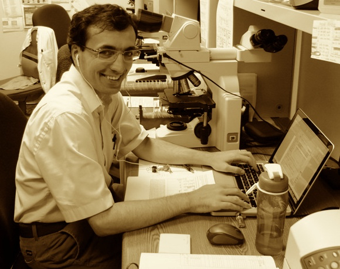

<script async="" charset="utf-8" src="https://badge.dimensions.ai/badge.js"></script>

<script src="https://d1bxh8uas1mnw7.cloudfront.net/assets/embed.js" type="text/javascript"></script>


<div itemscope="" itemtype="https://schema.org/Person">
<script type="application/ld+json">
{
  "@context": "http://schema.org",
  "@type": "Person",
  "name": "Serdar Balcı",
  "url": "http://www.serdarbalci.com/",
  "jobTitle": "MD, Pathologist",
  "sameAs": [
    "https://www.facebook.com/serdarbalcimd",
    "https://www.facebook.com/serdarbalcimdpathologist/",
    "https://www.instagram.com/balciserdar/",
    "https://www.linkedin.com/in/serdar-balci-md-pathologist/",
    "https://plus.google.com/u/0/+SERDARBALCIMD",
    "https://twitter.com/serdarbalci",
    "https://github.com/sbalci",
    "http://sbalci.gitbooks.io/",
    "https://sbalci.github.io/",
    "https://serdarbalci.wordpress.com/",
    "https://drserdarbalci.blogspot.com.tr/",
    "https://sites.google.com/view/drserdarbalci/",
    "https://drserdarbalci.wixsite.com/website"
  ]
}
</script></div>


```{r global_options, include=FALSE}
knitr::opts_chunk$set(fig.width = 12, fig.height = 8, fig.path = 'Figs/', echo = FALSE, warning = FALSE, message = FALSE, error = FALSE, eval = TRUE, tidy = TRUE, comment = NA, cache = TRUE, R.options = list(width = 60))
```


## Biyografi


**Serdar Balcı**  
*Türk Hekim ve Araştırmacı. Patoloji Uzmanı.*
2005 yılında Hacettepe Üniversitesi Tıp (İng) Fakültesi'nden mezun oldu. Aynı yıl patoloji asistanlığına başladı. 2010 yılında patoloji uzmanı oldu. 2009 ve 2013-2014 arasında ABD'de Emory Üniversitesi'nde pankreatobilier sistem tümörleri üzerinde araştırmalar yaptı. Katıldığı çalışmalar ışığında tümör sınıflama ve kılavuzlarında güncellemeler oldu. 2016 yılında doçent oldu.
İlgi alanları arasında tümör sınıflandırılması, tümör evrelemesi, patolojide kalite kontrol uygulamaları, anatomik patolojide istatistik uygulamaları ve R-project yer almaktadır.
Halen serbest akademik danışman olarak araştırmalarına devam etmektedir.

## Biography

I am a Medical Doctor and Pathologist. I graduated from Hacettepe University Faculty of Medicine, Ankara, Turkey, the top medical institution in Turkey. I completed my pathology residency in the Department of Pathology in Hacettepe and then worked at Emory University, Atlanta, GA, USA as a research scholar, and had the opportunity to participate in numerous studies. Since I have always been interested in research, I took statistics and introductory bioinformatics courses at Hacettepe University Biostatistics Department.

<aside>
```{r img SerdarBalci-MD-Pathologist.jpg}

```
</aside>


I have more than 50 articles published in peer-reviewed journals. I have participated in many international studies. For these studies, I have not only participated as a pathologist but was also actively involved in project planning and I have been the main person responsible for data preparation, data cleaning, data analyses, and reporting. I have experience in bibliography programs and image editing software. I have also used SEER data for cancer research.

I am interested in the application of statistical and bioinformatic methods in anatomic and digital pathology. I am also interested in publication metrics and have done some research on bibliometrics. I am using vosviewer and citespace for side projects, and used PubMed data for bibliography and text mining studies.

I have reviewed research papers as you can see on my Publons profile.

Currently, I am on the website committee of Pancreatobiliary Pathology Society and I am actively preparing the Journal Watch for this society.
https://pbpath.org/our-committees/
http://pbpath.org/current-journal-watch/

Serdar Balcı, MD, Pathologist

http://www.serdarbalci.com/  
https://twitter.com/serdarbalci  
https://github.com/sbalci  

CV: https://drive.google.com/file/d/0B4x15l9fUIsjMm01UTAyTkJvNm8/
Google Scholar: http://scholar.google.com/citations?user=q40DcqYAAAAJ
PubMed: http://www.ncbi.nlm.nih.gov/sites/myncbi/collections/public/14I_qdU6Oj6VsIwzi12Lbng/
ORCID: http://orcid.org/0000-0002-7852-3851
Research Gate: http://www.researchgate.net/profile/Serdar_Balci/
Scopus: https://www.scopus.com/authid/detail.uri?authorId=22933834600
Loop: http://loop.frontiersin.org/people/306241/overview
ImpactStory: https://impactstory.org/u/0000-0002-7852-3851/
Publons: https://publons.com/a/467202/


# Eğitim Hayatı {#education}


|  Öğrenim Dönemi|  Derece|  Üniversite|  Öğretim Alanı|
|--:|--:|--:|--:|
|  1998-2005|  Lisans|  Hacettepe Üniversitesi Tıp (İngilizce) Fakültesi|  Tıp Doktorluğu|
|  2005-2010|  Tıbbi Patoloji Uzmanı|  Hacettepe Üniversitesi Tıp Fakültesi Tıbbi Patoloji Anabilim Dalı|  Tıbbi Patoloji Uzmanlığı|
|  2010-2011|  Özel Öğrenci|  Hacettepe Üniversitesi Sağlık Bilimleri Enstitüsü|  Tıp Fakültesi Biyoistatistik Anabilim Dalı|


