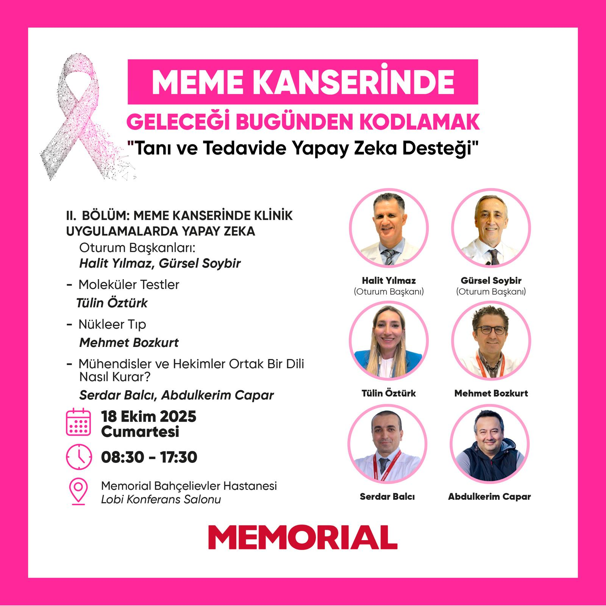
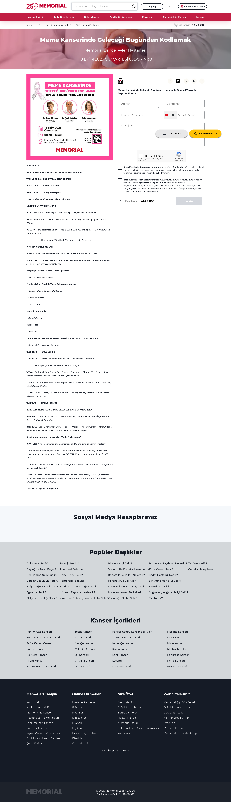

```{r setup, include=FALSE}
knitr::opts_chunk$set(echo = FALSE)
```


<br>

<iframe src="https://www.serdarbalci.com/muhendis-hekim-ortak-dil/#/title-slide" height="500px"></iframe>

<br>


---

- Mühendisler ve Hekimler Ortak Bir Dili Nasıl Kurar?  
[https://www.serdarbalci.com/muhendis-hekim-ortak-dil/](https://www.serdarbalci.com/muhendis-hekim-ortak-dil/)  

- [Mühendisler ve Hekimler Ortak Bir Dili Nasıl Kurar? Patologdan Mühendislere](https://www.serdarbalci.com/muhendis-hekim-ortak-dil/)  





- [Meme Kanserinde Geleceği Bugünden Kodlamak
Memorial Bahçelievler Hastanesi
18 EKİM 2025 CUMARTESİ 08:30 - 17:30](https://www.memorial.com.tr/etkinlikler/meme-kanseri-bilimsel-toplanti-bahcelievler)




