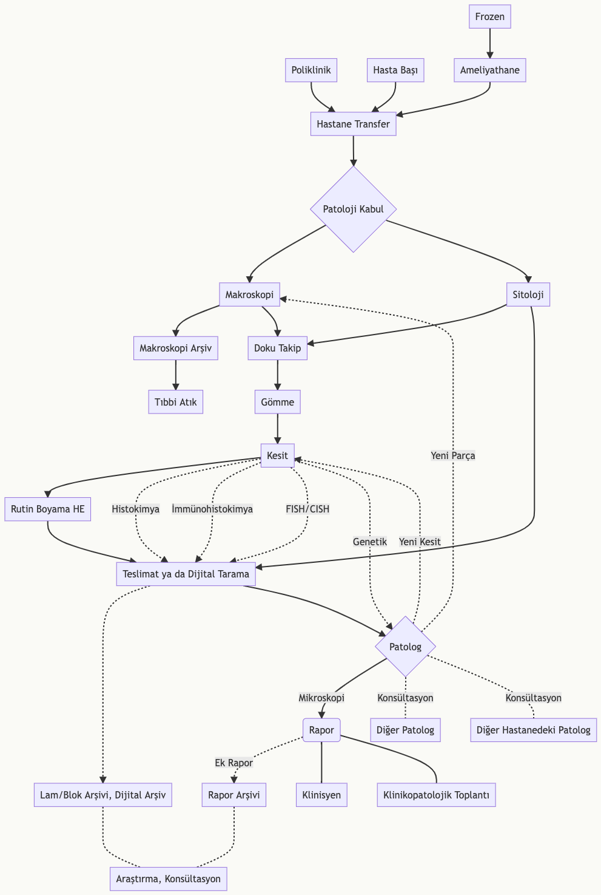
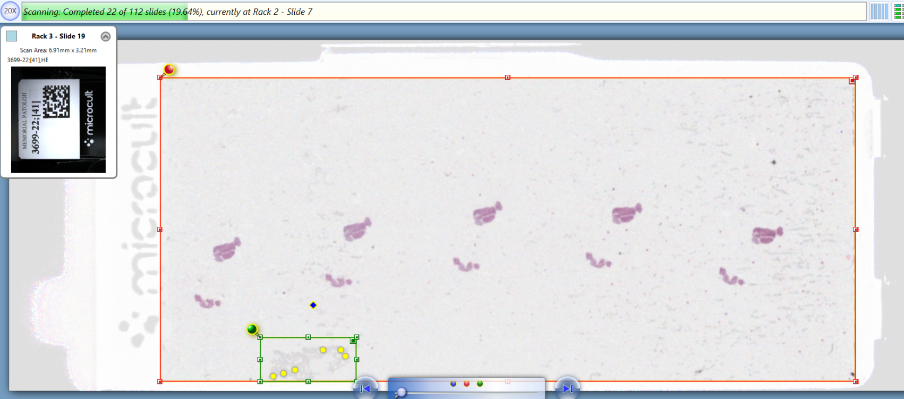

# Patoloji ve Bilişim {#sec-patoloji-ve-bilisim}

<https://zenodo.org/badge/latestdoi/594820002>

[DOI 10.17605/OSF.IO/BRZUF](https://osf.io/brzuf/)

> Bu yazı *Prof. Dr. Alp Usubütün* editörlüğünde hazırlanan *"Sağlık Bilimleri İçin Patoloji ve Patoloji Laboratuvarını Anlama Kılavuzu 2. Baskı - Ekim 2022 Ankara Nobel Tıp Kitabevleri ISBN: 978-625-7564-70-0"* adlı kitaptaki *"8. Bölüm: Patolojide Yeni Yöntemler ve Gelecek"* için hazırlanmıştır.
> Ancak bu alanın çok hızlı ilerlemesi nedeniyle bu metni güncel tutmak (ve bir sonraki baskı için gerekirse hazır bulunmak için) metin içeriği burada güncellenecektir.
> **Doç. Dr. Serdar Balcı**

## Patolojide Bilişimin yeri nedir? {#sec-patolojide-bilisimin-yeri-nedir}

Patologları, hastanın klinik bilgilerini, makroskopi ve mikroskopik görüntüler ile işleyip, literatür ve bilimsel bilgiler ışığında yorumlayan ve rapor adlı yazılı bilgiyi üreten bilgi uzmanları olarak tanımlayabiliriz.
Abartılı bir tarif gibi görünse de çoğu hasta dosyasında, hasta hakkında en çok ve en doğru (hatta hala daha altın standart) bilgiler patologların ürettiği patoloji raporlarında yer almaktadır.

Bilginin teknoloji kullanılarak işlenmesindeki gelişmeleri, patoloji disiplini, bazen geriden bazen öncü olarak, ama emin adımlarla takip etmekte ve kendi işleyişine katmaktadır.
(Computational Pathology: A Path Ahead https://pubmed.ncbi.nlm.nih.gov/26098131/)

-   Bilimsel bilginin sürekli artması,
-   hemen her yıl yeni bir DSÖ sınıflama kitabının çıkması,
-   yeni çıkan antikorların ve yöntemlerin tanısal test olarak kullanımındaki istatistiksel yöntemler,
-   tümörlerin taksonomisi,
-   "ben buna displazi derim" gibi sezgisel yaklaşımlar,
-   klinik bilgilerin elde edilmesi,
-   makroskopik ve mikroskopik görüntülerin elde edilmesi, işlenmesi ve saklanması,
-   rapor yazılması,
-   diktasyon,
-   raporların saklanması,
-   arşivleme,
-   laboratuvar iş akışının düzenlenmesi ve takibi

gibi bir çok basamakta yer alan bilişim teknolojileri, dijital patolojinin yaygınlaşması ile makina öğrenmesi, derin öğrenme ve yapay zeka ile karar destek sistemleri olarak günlük pratiğe daha da girmektedir.

Patoloji raporları ve görüntüleri için kullanılan yazılımlar (Rosai 1. chapter)'da belirtildiği gibi çoğu zaman diğer laboratuvar branşları ya da radyoloji için hazırlanmış platformlara eklemlenmiş gibidirler.
Patolojinin işleyişi ile çoğu zaman örtüşmeyen yazılımlar, çoğu zaman bir metin işlemcisi ve faturalandırma aracı olarak kalmaktadırlar.

## Patolojideki Bilgi Türleri Nelerdir? {#sec-patolojideki-bilgi-turleri-nelerdir}

Patolojide bilgi türleri temel olarak *laboratuvar iş akışı*, *metin* ve *görüntülerden* oluşmaktadır.

### Laboratuvar İş Akışı {#sec-laboratuvar-is-akisi}

Bir laboratuvar branşı olarak patolojideki iş akışı çoğu zaman hastane yöneticilerinin ve hekimlerin de bilmediği karmaşık basamaklardan oluşmaktadır.
Bu basamakların her biri kendine has kalite kontrol ögeleri ve veriler içermektedir.
Her ne kadar laboratuvar branşı olarak görülse de, patoloji sadece klinikten gelen isteklerin yapıldığı bir laboratuvar değildir.
Patologlar gelen spesmene bir hasta gibi yaklaşıp her spesmene özgü ayrı örnekleme ve değerlendirme yapmaktadır.

Patolojinin ayrı bir klinik olarak tanımlanmaması, patoloğun tetkik isteyen bir hekim olarak kurgulanmamış olması nedeniyle hem rutin işleyişte hem de fatura ve performans değerlendirmelerinde sorunlar ortaya çıkmaktadır.

 *Resim 2: Patoloji iş akışı*

### Metin Bilgileri {#sec-metin-bilgileri}

Patolojideki metin bilgilerini:

-   patoloğa
    -   klinikten ve
    -   literatürden gelen bilgiler ile
-   patoloğun ürettiği raporlar oluşturmaktadır.

Bu bilgilerin:

-   düzgün,
-   eksiksiz ve
-   anlaşılır olması beklenmektedir.

Literatürdeki bilgi yoğunluğunun kaldırılamaz halde olduğu ve her antikorun ilk çıktığında oldukça özgün ama çalışmalar sonunda yıllar içinde kullanılamaz hale geldiği günümüzde **"bilgi ve internet okuryazarlığı"** patologlar için vazgeçilmez öneme sahiptir.
Hangi literatürün, nasıl kritik edilerek okunacağı, bilgilerin hasta tanısında nasıl kullanılacağı konusunda da donanımlı olmak gerekmektedir.

Klinik bilgilerin düzgün ve eksiksiz aktarılması için hastane bilgi yönetim sistemlerine patologların **"tedaviyi veren hekim"** yetkisi ile ulaşmasının sağlanması, tanı hızını ve doğruluğunu arttıracaktır.

Patologlar genelde raporlarını hastaların tedavisinden sorumlu olan klinisyenleri hedefleyerek yazsalar da, günümüzde kendi bilgilerini irdelemek isteyen hastalar yanı sıra raporlarını otomatik olarak kategorize etmek isteyen kayıt sistemlerini de dikkate almak gerekmektedir.

Hastaların raporlardaki detaylarla uğraşmasını engellemek ve onları doğru yönlendirmek için **CAP** ve **ADASP** gibi organizasyonlar hastalar için rehberler hazırlamaktadırlar.
Hastaların ve sigorta şirketlerinin patoloji raporlarına yaklaşımları nedeniyle ortaya çıkan sosyal sorunları bertaraf etmek için tümör isimlendirmelerinde yakın zamanda yapılan değişiklikler *(tiroid ve prostat tümörlerindeki gibi)* bu konunun ileride daha da önemli olacağını ve belki de hastalar için ayrı rapor kısımları düzenlememiz gerektireceğini düşündürmektedir.

Raporların eksiksiz olması ve başka kurumlardaki hekimler tarafından da anlaşılmasını sağlamak için **sinoptik (şablon) rapor** kullanılması gerekmektedir.

Her ne kadar kimi patologlar kendi üslupları ile tarif ve açıklama yazmak isteseler de, *her satırda bir özelliğin olduğu* ve *gerekli tüm özelliklerin başlıklarının ve tanılarının açıkça yazıldığı* **sinoptik raporlama** hasta yönetimi için artık vazgeçilmez bir gereklilik halindedir.
Raporların bilgisayar aracılığıyla formlar kullanılarak yazıldığı ve her özelliğin veritabanında ayrı olarak kaydedildiği **yapılandırılmış (structured) raporlar**ın ise ideal olarak her laboratuvarda olması gerekmektedir.

Yapılandırılmış rapor kullanılan sistemlerde hem kalite için izleme ve değerlendirme hızlıca ve otomatik olarak yapılabilmekte, hem de bilimsel araştırmalar için gerekli bilgilere kolayca ulaşmak mümkün olabilmektedir.
Yapılandırılmış rapor kullanan sistemlerde raporun ilk onaylandığı halinin *değiştirilemez bir 'pdf' dökümanı* halinde kaydedilmesi (ve tercihan *elektronik imza* ile eşleştirilmesi) gerekmektedir.
Aksi takdirde rapor her açıldığında veritabanından gelen verilerle yeniden oluşturulduğunda zaman içinde oluşan şekilsel değişiklikler ilk raporla farklılıklar oluşmasına neden olmaktadır.
Bu durum medikolegal sorunlara neden olabilmektedir.

Patoloji raporlarının *metin madenciliği* yöntemleri kullanılarak sınıflandırılması konusunda öneriler ve çalışmalar mevcuttur.
Ancak bu yöntemlerin başarılı olabilmesi için standart yazıma ve daktilo hatalarını en aza indirecek uygulamalara ihtiyaç vardır.

Diktasyon ve sesi metne dönüştüren yazılımların makroskopik ve mikroskopik tariflerde kullanımı yaygınlaşmaktadır.

### Görüntüler {#sec-goruntuler}

Morfolojik analize dayanan anatomik patolojideki bilgilerden biri de görüntülerdir.
Makroskopik ve mikroskopik görüntüler mevcuttur.

**"Makroskopik"** görüntülerin net bir şekilde elde edilmesi ve saklanması giderek önem kazanmaktadır.
Tariflenen bazı bulguların (mezorektal bütünlük gibi) daha sonra tekrar değerlendirilmesi, delici kesici yaralanmalar gibi mikroskopla belirlenemeyecek medikolegal dökümantasyonun sağlanması gibi nedenlerle, patoloji ve hastane bilgi sistemlerine entegre makroskopi resim saklama gerekliliği giderek artmaktadır.

Makroskopik görüntülerin radyoloji ile korelasyonu ve üç boyutlu görüntülerle sanal gerçeklik uygulamaları makroskopik görüntü arşivinin önemini giderek artırmaktadır.

**"Mikroskopik"** görüntülerin *tam yüzey taranması (whole slide imaging)* ile hızlanan dijital patolojiye bir sonraki bölümde detaylı değinilecektir.
Artık günümüzde;

-   dokunun kesit almadan üç boyutlu haritalandırılması,
-   fiziksel olarak boyanmadan sanal boyalar ile incelenmesi
-   ve bunların örnek yeterliliğinde ve hızlı tanıda kullanılması oldukça sık yapılan ve pratiğe geçeceği umulan çalışmalardır.

İki boyutlu klasik mikroskopik görüntülerin çokça kesit alınarak 3 boyutlu (3D) rekonstriksiyonu ile yapılan tümör modelleri, hastalıkların patofizyolojisinin anlaşılmasında yeni olanaklar sunacaktır.

Patolojinin gelecegindeki yeni teknikler arasında

-   üç boyutlu görüntüleme,
-   Raman spektroskopisi [@Movahed-Ezazi2023],
-   FTIR (infrared spectroskop),
-   sanal HE boyama,
-   ve konfokal mikroskopi gibi tekniklerin yer alması beklenmektedir.

## Dijital Patoloji Nedir? {#sec-dijital-patoloji-nedir}

Dijital patoloji dendiğinde günümüzde preparatların tüm yüzey yüksek çözünürlükte taranarak bilgisayar ortamına aktarılması ve bu görüntülerin iletilme ve işlenme süreci akla gelmekte ise de; tüm laboratuvar işleyişinin bilgisayarla takip edilmesi ve gerektiğinde otomatize edilmesi daha kapsayıcı bir tanımlama olacaktır.

Makroskopik görüntülerinin, endoskopik görüntülerin ve mikroskopla çekilen fotoğraflar üzerinde morfometrik çalışmalar dijital patolojinin başlangıcıdır.
Ancak hasta tanısı için ilk etapta mikroskop yerine dijital görüntülerin kullanımı henüz daha yeni olduğundan, bu amaçla kullanılan dijital patoloji daha çok büyük laboratuvar ve üniversite hastaneleri ile sınırlıdır.

Dijital patoloji ilk etapta araştırma ve eğitim amacıyla kullanılmaya başlanmış, daha sonra konsültasyon ve frozenda yerini almıştır.
Bir hastanın *ilk tanı*sı için kullanımı, yakın zamanda pandeminin getirdiği uzaktan çalışma zorunluluğu ile hızlı onay almıştır.

Pratikte dijital patolojinin bizi en çok zorlayan kısmı, *hazır tanısal hale gelmiş preparatların bir daha tekrardan tanı için uygun hale dönüştürülmesi* ile uğraşmak zorunda kalmamızdır.
Mesela radyolojinin basılı filmlerini devasa tarayıcılarla tarayıp dijital ortama aktarsaydık ve adına da 'dijital radyoloji' deseydik herhalde bugün yapılana benzer olurdu.

 *Adenoskuamöz kanserin sanal patoloji mapesi ile vakanın incelenmesi. Farklı boyalar aynı anda incelenerek tümördeki farklı bileşenler kolaylıkla değerlendirilebilir.*

 *Ampulla yerleşimli intraampüller papiller neoplazi zemininde gelişmiş adenokarsinomun megalamda alınan örneğinin dijitalleştirilmiş hali. Birkaç lamda ancak incelenebilecek görüntünün megalam tarayıcısı ile alınan bu görüntüsü sayesinde hem tümörün yayılımı daha kolay anlaşılabiliyor, hem radyolojik korelasyon daha kolay yapılabiliyor hem de tümör biyolojisini anlamak daha da kolaylaşıyor.*

Patoloji makroskopi resimlerinin ve preparatlarının dijital ortama aktarılması ve tanının buradan verilmesi, daha önceleri *analitik evrede kabul ettiğimiz basamakların preanalitik evreye geçmesine* neden olmuştur.

Artık laboratuvarlar sadece preparatın tanısal hale gelmesine değil aynı zamanda dijital görüntünün de tanıya hazır hale gelmesini düşünerek planlama yapmak durumundadır.
Bu yeniden tanısal hale getirme basamağı nedeniyle, tarayıcılar yeni bir analitik basamak halini alırken, tarayıcı öncesinde laboratuvardaki basamaklar da yeni bir tür preanalitik basamak halini almaktadır.
Mesela;

-   önceleri sadece insanın okuyabileceği etiketler yeterli olurken artık tüm laboratuvar sürecinde makinaların da okuyabileceği barkod ya da karekod kullanımı zorunlu hale gelmiştir.
-   Daha önceleri görmezden gelinebilecek küçük artefaktlar, hava kabarcıkları, parmak izleri tarama kalitesini belirli ölçüde etkilediği için **"yeni kuşak preanalitik hatalar"** olarak hayatımıza girmektedir.

 *Kirli bir lamda otomatik doku tespit algoritmasının yanılmasına bir örnek. Yeşil kutu içindeki alan doku olarak algılanmış ve taranmıştır.*

 *Lamda parafin artığı kalması sonucu bulanık taranmış dokunun (solda), lam temizlendikten sonra tekrar tarandığındaki net görüntüsü (sağda).*

 *Akordiyon artefaktı: Eskiden kesit sırasında mikrotoma bıçağın tam yerleştirilmemesi nedeniyle görülen bu artefakt, dijital tarama sırasında kalibrasyonun tam yapılmadığı durumlarda da görülmeye başlamıştır. Bu gibi yeni kuşak artefaktlara hazırlıklı olmamız gerekmektedir.*

### Dijital Patolojinin Kullanım Alanları Nelerdir? {#sec-dijital-patolojinin-kullanim-alanlari-nelerdir}

Dijital patoloji ilk başlarda araştırma ve eğitim amacıyla kullanılmaya başlanmış, daha sonra konsültasyon ve frozenda yerini almıştır.
Bir hastanın ilk tanısı için mikroskop yerine dijital görüntülerin kullanılması başlangıçla tereddütle karşılanmıştır.
Covid pandemisinin getirdiği uzaktan çalışma zorunluluğu dijital patolojinin tanı amaçlı kullanılmasının onaylanması için hızlandırıcı bir faktör olmuştur.

*Rosai*'nin kongrelerde kahve bardaklarından dürbünler yaptığı ve katılımcılardan ekrandaki sunuma önce bu dürbünle sonra da bu dürbünsüz bakmalarını istediği ve bu şekilde dijital patolojinin geleceğini öngördüğü söylenir.

#### Tanı {#sec-tani}

Dijital patoloji, hastalıkların tanısına yardımcı özelliklerin tespit edilmesinde ek bir araç olarak yaygın olarak kullanılmaktadır.

-   Karaciğer yağlanmasının ölçülmesi,
-   tümör büyüklüğünün ve derinliğinin ölçülmesi,
-   tümörün cerrahi sınırlara olan uzaklıklarının tespiti,
-   tümör ile çevre dokunun ayrılması ve
-   immünohistokimyasal belirteçlerin sayısal olarak doğru raporlanması

gibi alanlarda geliştirilmiş yazılım ve karar destek sistemleri mevcuttur.

#### Eğitim {#sec-egitim}

Hem tıp fakültesi hem uzmanlık eğitiminde verilen mikroskop eğitimlerindeki sorunlardan birisi de preparatların eskimesi ve nadir vakaların sayıca az olmasıdır.

Dijital görüntüler ile hem bu sorun aşılacak, hem de interaktif ögelerin de kullanımı ile farklı eğitim teknikleri kullanılabilecektir.

-   Üç boyutlu (3D) organ modellerinin sanal gerçeklikle incelendiği,
-   retina takibi ile mitoz sayma yarışmalarının düzenlendiği,
-   makroskopide merak edilen alanın mikroskopide nasıl yansıdığının hemen görüldüğü,
-   mikroskobik kesitlerin 3 boyutlu rekonstrüksiyonu ile tümör yayılımının daha iyi anlaşıldığı eğitim teknikleri

geleceğin hekimlerini, geleceğin teknolojileri için hazırlayacaktır.

Mikroskoptan ekrana geçişte şimdiki kuşağın yaşadığı sorunların tam tersinin ekrandan konvansiyonel mikroskopa geçecek yeni kuşağın yaşayacağını tahmin edebiliriz.

Ülkemizde genellikle digital slaytlar kullanılarak yukarıda sözü edilen teknik sorunların düzeltildiği ve aşıldığı görülmekle beraber interaktif eğitim teknikleri entegre edilmeden kullanılması sonucu bu yöntemin getirilerinden yeterince yararlanılamadığı görülmektedir.

#### Konsültasyon {#sec-konsultasyon}

Konunun eksper patoloğuna ulaşmak için daha önceleri lam ya da bloğun gönderilmesi, hatta bunun için şehirlerarası ya da ülkeler arası transfer gerekmekteydi.
Artık bu görüntülerin (gigabaytlarca yer tutan sanal görüntülerin bile gönderilmeden) oluşturulacak bir link üzerinden paylaşılması ile konsültasyonlar rutin pratiğin kolay basamaklarından biri olacaktır.

Bu durum ileride uzaktan çalışma ile iş piyasasına da farklı yaklaşımlar getirecektir.

#### Rutin Raporlama {rutin-raporlama}

Önceleri ilgili vakaya ait lamların tümü sıralanmış bir şekilde mapeye dizilip, klinik ve makroskopik bilginin yer aldığı kağıtla bir araya getirildiğinde laboratuvarın işi bitmiş ve vakanın patolog tarafından onaylanma süreci başlamış oluyordu.
Tümüyle dijital ortama taşınan bir laboratuvarda lamları mapeye dizmeye gerek olmadığı gibi lamların herhangi bir sırayla taranması da gerekmiyor.
Ayrıca kağıtlardaki bilgilerin de hepsinin dijitalleştiğini düşünürsek fiziksel bir teslimatın yapılmasına da gerek kalmıyor.

Öte yandan

-   tarama için geçen süre,
-   vakanın her lamının taranıp taranmadığının kontrolü,
-   görüntülerin tanısal yeterlilikte olup olmadığının kontrolü gibi

ek otomatize ya da manuel kontrol basamakları da günlük pratiğe eklenmektedir.

Tarama için geçen sürenin kısaltılmasında sürekli yükleme yapılabilen modeller daha başarılı olmaktadır.

Dijital görüntüler kullanarak rutin raporlamaya yavaş yavaş geçilmektedir.
Geçiş sürecinde yaşanabilecek sorunlar ve çözümleri için derneklerin, **RCAP** ve **Leeds** Üniversitesi'nin hazırladığı öneriler oldukça faydalıdır (Bkz. Okuma önerileri)

Bu yeni yöntemler kendi **ergonomi** sorunlarını da birlikte getirmektedir.
Şaryo kullanmaya ve objektif değiştirmeye alışkın patolog *kas hafızası (muscle memory)* klasik bilgisayar faresi ile eşleşmekten uzaktır.
Bu nedenle 3D fareler ve şaryoyu taklit eden bilgisayar bileşenleri geliştirilmektedir.

Şu an kullanılan ara yüzlerdeki farklılıklar da kullanım alışkanlığı geliştirmeyi zorlaştırmaktadır.

\<--WIP--\> Bilgisayar fare orta tuş kilidi olan ve olmayan arayüzler (https://middleclick.app/), büyütme ve küçültme (zoom in/out) hızlarının klasik mikroskoplardan farklı olması yanısıra klavye ve bilgisayar bileşenlerine (oyunlara) aşina neslin kullandığı oklar, `aswd` tuşlarının ... \<--WIP--\>

Nasıl bir ekran kullanılacağı ve ekranın *"tıbbi ekran"* kategorisinde olup olmaması gerektiği de süregiden bir tartışma konusudur (Bkz. Leeds ekran testi)

*İşaretleme* alışkanlığının değişmesi (lamlara yazılan yazıların artık ekrandan yazılması, lamlardaki işaretlerin taramada *artefakt* oluşturması), *küçük fragmanlar*ın tarama sırasında ya da patolog bakarken atlanması endişesi de güncel tartışmalardandır.

İlk çalışılmaya başlanan, tek tip hücre grubundan oluştuğu için ve patern analizi gerektirmediği için kolay olduğu varsayılan servikal yaymalar dijital patolojide hala öncü yer tutamamaktadır.
Bunun sebebi arasında *Z-stack* taramanın daha zor ve maliyetli olması yer almaktadır.
*Mikrovida* ile değişik katlara bakmaya alışkın sitolog ve patolog gözü yeni sistemlerde bu kolaylığı kolayca elde edememektedir.
Öte yandan HPV testlerinin daha yaygın olması maliyet etkinlik açısından servikal yaymaların dijital taranması için harcanan emeklerin önünde yer almaktadır.

Floresan kullanılarak yapılan incelemeler (FISH, DIF) için ayrı tarama sistemleri gerekmektedir.

Çift kırıcılık gerektiren değerlendirmeler (kongo kırmızısı, yabancı cisim) içinse hala klasik mikroskopa ihtiyaç duyulmaktadır.

Eski vakaların ya da konsültasyon için farklı laboratuvarda hazırlanıp gönderilen lamların taranması ve arşivlenmesi hem zaman hem de maliyet açısından değerlendirilmelidir.
Özellikle soluk ve kapama sorunu olan vakaların taranması sırasında oluşacak artefaktlar göz önünde bulundurulmalıdır.

Dijital görüntüler ile raporlamaya geçmeden önce en az 60 vakanın hem preparat hem de dijital görüntü ile ayrı ayrı raporlanması ve aralarındaki uyumluluğun test edilip dökümante edilmesini içeren *kişisel validasyon çalışmaları*na ihtiyaç vardır.
Bu rakamın her boya, her örnek türü ve her tanıya göre hedeflenmesi istenmekle birlikte, kesin bir sayı olmayıp ilgili biyopsi türünde patoloğun kendini rahat hissedecek ve tanı arayüzü ile aşinalık kazanacak kadar devam etmesi önerilmektedir.

### Dijital Tarayıcı Alınca Dijital Patolojiye Geçmiş Olabilir miyiz? {#sec-dijital-tarayici-alinca-dijital-patolojiye-gecmis-olabilir-miyiz}

Dijital patoloji konusunda çalışma yapan dernekler tarayıcı alımını laboratuvarda yapılacak düzenlemelerden sonra olmasını önermektedir.
Eğer laboratuvar iş akışı barkod ile düzenlenmemiş, ilgili lamın barkodu ile patoloji bilgi sistemi ve hastane bilgi sisteminden gerekli bilgiler alınamayacak ise, tarayıcıdan elde edilen görüntülerin işlenmesi oldukça zor olmaktadır.
Bu gruplanmış yan veriler (*parsed metadata*) otomatizasyonun en önemli kısmını oluşturmaktadır.

-   Görüntünün nereye ve ne kadar süre ile kaydedileceği,
-   hangi diğer lamlar ile eşleşeceği,
-   nasıl bir 'sanal mape' ile patoloğa iletileceği,
-   eğer yapay zeka algoritmaları kullanılacaksa hangi lamın işleneceği

ancak bu bütünlük sağlanabilirse mümkün olacaktır.

Örneğin günümüzde meme biyopsileri için yapılan hormon reseptör incelemelerini patoloğa görüntü iletilmeden analiz edecek ve patoloğa ön rapor sunacak algoritmalar mevcuttur.
Ancak bu algoritmanın çalışabilmesi için o lamın bir meme biyopsisine ait olduğu, o lamdaki boyamanın bir hormon reseptörüne ait olduğu ve boyama değerlendirmesi için çalışacak spesifik algoritmanın ne olduğu belli olmalıdır.

Laboratuvardaki tüm cihazlar aynı barkod bilgisi ile çalışabilecek, ya da barkoddan kendisi ile ilgili alanı okuyabilecek şekilde düzenlenmiş olmalıdır.

Günümüzde kaset, immünohistokimya ve tayarıcılardaki farklı barkod / karekod / datamatrix kullanımı ve bu içeriğin firmalara özgün ve değiştirilemez olarak tanımlanması, kesintisiz bir laboratuvar iş akışı önündeki önemli engellerden biridir.

Tüm yüzey taramadaki görüntüler oldukça fazla yer kaplamaktadır.
Radyoloji görüntüleri ile kıyaslandığında bu fazlalık daha da çarpıcı olarak görülmektedir.
Görüntülerin daha az yer kaplaması için 40x yerine 20x tarama, boş lam alanlarının taranmaması gibi çözümler kullanılmaktadır.
Ancak bu durumda da fragmante dokuların taranmaması riski yanısıra, taranan her lamın tanı için yeterli olduğunun teyidi gibi ek bir iş basamağı da ortaya çıkmaktadır.

Bu gibi optimizasyonlar (düzenlemeler) yapılmadıkça patoloğun iş yükünü kolaylaştırmak yerine zorlaştıracak hale gelen dijital tarama beklenen verimlilikte kullanılamayacaktır.

### Dijital Patoloji İçin Tarayıcıya İhtiyacımız Var Mı? {#sec-dijital-patoloji-icin-tarayiciya-ihtiyacimiz-var-mi}

Dijital patolojinin kolaylıklarından faydalanmak için mutlaka tarayıcının olmasına gerek yoktur.

Araştırma, konsültasyon ve tanıya katkı sağlayacak algoritmaların kullanılması için çoğu zaman kamera bağlı mikroskop yeterli olacaktır.

Araştırma Geliştirme çalışmaları için online veritabanları oldukça geniş olanaklar sunmaktadır: - [TCGA]() - [Grand Challange]() - [cBioPortal]()

Hatta cep telefonlarının görüntü alması için geliştirilen okülere bağlanan ataçmanlar ile trinoküler mikroskop olmadan da görüntüler elde edilebilmektedir.

Mikroskopta lamın hareket ettirilmesi ile çekilen görüntülerin birleştirildiği *"manuel whole slide imaging"* yazılımları da kullanılabilmektedir.

Bir kez taranmış görüntü elde edildikten sonra bu görüntüleri gösterecek ve analiz edecek açık kaynak programlar oldukça yaygın olarak mevcut olmakla birlikte hala daha manuel tam yüzey taramanın kullanılabileceği açık kaynak programların olmaması dijital patoloji önündeki en büyük 'finansal' engel olarak durmaktadır.

## Dijital Patolojinin Geleceği {#sec-dijital-patolojinin-gelecegi}

Dijital patoloji hızla gelişen bir alan olduğundan patologların kendilerini bu gelişmelere hazırlamaları gerekmektedir.

Altyapı yatırımları sırasında geliştirilebilir modüler yapıların tercih edilmesi; basit ekran paylaşımından öteye gitmeyen ve açık kaynak ile ulaşılabilecek programlar için masraf yapmadan önce yetkin görüş alınması önerilmektedir.

Dijital patoloji görüntüleri şu an farklı firmalara ait farklı formatlar halindedir.
Ancak yakın zamanda ortak bir format olan *DICOM*'a geçilmesi ile cihazlar arasındaki uyum da artacaktır.
Bu ortak formata geçilmesi ile görüntülerin daha uygun saklanabilmesi için de geliştirmeler hızlanacaktır.

## Yapay Zekanın Dijital Patolojideki Yeri {#sec-yapay-zekanin-dijital-patolojideki-yeri}

Yapay zekanın görüntüler üzerindeki tecrübesinin patolojiye aktarılması ile bilimsel çalışmalarda sık görmeye başladığımız yapay zeka (makina öğrenmesi, derin öğrenme) kullanımı giderek günlük pratiğe de uygulanabilecek özellikler kazanmaktadır.
Yapay zeka ile ilgili çalışmalar literatürde hesaplamalı/sayısal patoloji (computational pathology), matematiksel patoloji olarak da geçmektedir.

Prostat iğne biyopsilerinin ve meme biyopsilerinin yapay zeka ile ön incelemeden geçirilmesi ve şüpheli alanların işaretlenmesi yakın zamanda rutin kullanım için onaylanmıştır.

Daha önce tanı almış onbinlerce olgunun görüntüleri ve tanıları yapay zeka (artificial intelligence) ve makina öğrenmesi (machine learning) algoritmaları ile işlenmektedir.
Bu şekilde 'öğrenen' algoritma yeni gelen olgunun tanısında ya da özelliklerinin tespitinde kullanılmaktadır.
Bu konuda *AFIP* ve *MSKCC* arşivlerinden elde edilen görüntülerle ilgili çalışmalar yoğun olarak devam etmektedir.

Dijital patolojiye ve genel olarak yapay zekaya yöneltilen en büyük eleştiri, algoritmaların genelde *'kapalı kutu' (black box)* şeklinde olmasıdır.
Şüpheli bir alanın tespit edildiğinde bu alanın neden şüpheli olduğunu bu algoritmalar açıklayamamaktadır.
Ancak bu durum insan beyni için de geçerlidir (araç kullanırken, ya da yemek yerken yaptığımız her hareketi açıklayamayışımız gibi).
Eksiklik gibi görünen bu durum aslında yeni tanı yöntemleri geliştirilmesine olanak tanımakta ve patologların kendilerini de geliştirmelerine katkı sağlamaktadır.
Bu durumu Go ve satranç oyuncularının kendilerini yapay zeka ile geliştirmelerine benzetebiliriz.
Benzer şekilde yapay zekanın yaptığı hatalar patologlar tarafından tespit edilmekte (kanama pigmenti ile immünohistokimyasal incelemelerin karıştırılması gibi) ve algoritmalar güçlendirilmektedir.

Hastanın hayatına direk etki edecek sonuçları olacağından yapay zekanın *açıklanabilir (explainable AI)* olması yönünde çalışmalar devam etmektedir.
Yapay zeka algoritmalarının hedeflenenden farklı değişkenleri (morfolojik bulgu yerine hastanın geldiği klinik gibi veriler) dikkate alabildiği ve hatalı sonuçlar üretebildiği bilindiğinden, bu süreçte kritik edilmekte ve geliştirmeler bu yönde devam etmektedir.

Yapay zeka, dijital patolojinin kendi içindeki kalite sorunlarını çözebildiği gibi (renk ve ışık optimizasyonları), laboratuvarın kalite kontrol basamağında da yer alacaktır.
Boya kalitesinin patoloğa iletilmeden test edilmesi, olası bulaşların önceden tespit edilmesi gibi uygulamalar rutin iş akışına eklenebilecek hale gelmiştir.

Hemen her yıl tekrarlanan metastatik lenf nodlarını tespit edecek yarışmalarda *(Grand Challenge)* müthiş bilgisayar gücü ile Google gibi yazılım firmaları önde yer almaktadır.
Ancak bu sonuçların laboratuvarlarda rutinde kullanabilmesi için güçlü bilgisayar yapısına ve özel ekran kartlarına (GPU altyapısına) ihtiyaç duyulmaktadır.
Maliyeti yüksek olan ve gelişen teknoloji ile sürekli güncellenmesi gereken bu altyapının yerine patoloji yapay zeka firmaları *bulut tabanlı* çözümler de önermektedir.
Buluta yüklenecek görüntülerin analiz edilmesi ve sonuçların tekrar geri gönderilmesini sağlayan bu çözümlerde de yüksek internet bağlantı hızları yanı sıra hasta verisinin farklı ülkelerdeki bulut sistemlerine yüklenmesi konusunda çekinceler bulunmaktadır.

Literatürde yer alan ölçüm temelli çalışmalar (yağ oranı, tümör boyutu, pozitif hücre oranı gibi) genelde semikantitativ yöntemlere dayanmaktadır.
Bu nedenle bilgisayar destekli yeni tanıların *fazla doğru (hypercorrect)* olma ihtimalinin, gereksiz erken tanılara neden olabileceği düşünülmektedir.
Radyolojideki gelişmeler sonrası artan insidentalomalara benzer şekilde ileride patolojideki *erken lezyonların tanımı* da değişecektir.
Bu nedenle klinik faydası olacak eşik değerin seçilmesi ve algortimaların bunlara göre yeniden optimizasyonu gerekecektir.

Yapay zeka ile ilgili çalışmalarda çarpıcı konular ele alınsa da rutin pratiğe etkisi olacak emek yoğun işlemlerde kullanımı hala daha kısıtlıdır.
Morfolojiden sağkalımın ya da genetik özelliklerin tahmin edildiği çalışmalar sansasyonel olarak sunulmakla birlikte, rutin (tabiri caizse amele) işlerde kullanımı daha geri planda kalmaktadır.

Morfolojiden genetiğin tahmin edilebileceği, sadece morfoloji ile sağkalım hakkında çıkarımlar yapılabileceği ve bu bilgilerin insanın farkedemeyeceği özelliklere dayandığını iddia eden çok sayıda çalışma devam etmektedir.

Öte yandan bu gibi reklamı yapılamayacak ve satış için önemli olmayacak ama hasta sağlığı için çok önemli geri plan algoritmaları da mevcuttur.
Mesela her taranan görüntünün rutin olarak kalite kontrolden geçirilip ona göre patoloğun göreceği ekrana aktarılması ya da o günkü tüm vakaları birbiri ile kıyaslayarak olası doku bulaşlarını tespit edip önceden uyarı verilmesi gibi hayati öneme sahip özellikler genelde ön plana çıkamamaktadır.

Farklı laboratuvarlardaki verilerden geliştirilen algoritmaların diğer laboratuvarlardaki kesit ve boya kalitesi ile uyumlu olduğunun gösterilmesi gereklidir.

Yapay zeka ile ilgili beklentilerin realist olması, algoritmaların ise

-   tekrarlanabilir (kendi içinde ve dışarıyla tutarlı),
-   teknik olarak uygulanabilir,
-   klinik pratiğe aktarılabilir ve
-   yeni bilgiler ışığında güncellenebilir olması gerekmektedir.

Gelecekte her mikroskopta bir kameranın olduğu, masabaşında hemen ulaşılabilecek tarama cihazlarının olduğu çalışma ortamı yanısıra, tamamen mikroskopsuz patoloji iş istasyonları da olacaktır.

Algoritma destekli patoloji pratiğinde 'Bu vakayı Alp Hoca'ya danışalım' yerine 'Bu vakayı AlpApp v25'e yükleyelim' gibi cümleler yer alacağı gibi, ihtiyaca göre uygulama indirilen / geliştirilen PathAppStore'ları da hayatımızdaki yeniliklerden olacaktır.

Tüm bu gelişmeler ışığında gelecekte, bilişimin, metin-görüntü işleme ve yapay zekanın patoloji bölümleri içinde bir alt grup olarak yerleşeceğini ve patoloji laboratuvarlarında bilişim sektöründen de çalışanlar olacağı tahmin edilmektedir.

## İlginç ve örnek çalışmalar {#sec-ilginc-ve-ornek-calismalar}

### QuPath {#sec-qupath}

"QuPath" açık kaynak kodlu ve ücretsiz biyomedikal görüntü izleme ve inceleme programları arasında patoloji için en çok uygulama olanağı olan programlardandır.
Programın yazarı ve geliştiricisi Dr. Peter Bankhead görüntü analizi için doktora yaptığı sırada elindeki olanakların yetersizliğini farkederek bu yazılımı oluşturmaya başlamış ve geliştirmeye devam etmektedir.

Kolay bir arayüze sahip bu programda patologlar günlük pratikte metrik ölçümler, hücre sayımı yapabilecekleri gibi kendi vaka setleri ile algortimalar geliştirebilmektedirler.
Tümör ve stromda ayrımı, farklı hücrelerin ve dokuların ayrılması gibi araştırma ya da rutinde kullanılabilecek çok sayıda özelliği mevcuttur.
Yakın zamanda geliştirilen Python entegrasyonları ile de ileride çok daha fazla özellik kazanacağı tahmin edilmektedir.

 *QuPath ile tümördeki müsin oranını kolayca tespit edebilmek mümkündür.*

### HistoQC {#sec-histoqc}

Açık kaynak kodlu bir diğer program olan HistoQC ile taranan lamın ne kadar kaliteli olduğu, üzerindeki artefaktalrın ne kadar yer kapladığı, araştırma amaçlı yeterli olup olmadığı tespit edilebilmektedir.
Ayrıca rutin HE boya kalitesi de bu program ile takip edilebilmektedir.

### Octopi {#sec-octopi}

Stanford üniveristesinden Prakash Laboratuvarı'nın geliştirdiği Octopi ucuz maliyetli (250 dolar) bir dijital tarama cihazıdır.
Bu tarama cihazı periferik kan yaymalarında malaria tespiti için optimize edilmiştir.
Malaria'nın otofloresan özelliği sayesinde hızlıca tarama yapan ve tanısal eritrositleri bulan bu cihaz hem maliyetinin düşük olması hem de dünya çağında önemli bir hastalığın taranmasına katkıda bulunması nedeniyle önemlidir.

Bu çalışma hedefe yönelik olarak geliştirilecek dijital patoloji cihaz ve yöntemlerinin ucuz ve etkin olabileceğinin en önemli örneklerindendir.

Diğer açık kaynak kodlu ve ücretsiz programların listesi okuma önerilerinde verilmiştir.

# Referanslar ve okuma Önerileri

## Referanslar

::: {#refs}
:::

## Okuma önerileri: {#sec-okuma-onerileri}

-   European Society for Digital and Integrative Pathology <https://digitalpathologysociety.org/>
-   Digital Pathology Association <https://digitalpathologyassociation.org/>
-   empaia Academy <https://en.empaia.org/academy-2-1>
-   Patoloji Atlası <https://www.patolojiatlasi.com/>
-   Patoloji Notları <https://www.patolojinotlari.com/>
-   QuPath <https://qupath.github.io/> Bankhead, P. et al. QuPath: Open source software for digital pathology image analysis. Scientific Reports (2017). <https://doi.org/10.1038/s41598-017-17204-5>
-   Pete Bankhead, 2022, Introduction to Bioimage Analysis <https://bioimagebook.github.io>
-   Best practice recommendations for implementing digital pathology, The Royal College of Pathologists <https://www.rcpath.org/uploads/assets/f465d1b3-797b-4297-b7fedc00b4d77e51/Best-practice-recommendations-for-implementing-digital-pathology.pdf>
-   The Leeds Guide to Digital Pathology <https://www.virtualpathology.leeds.ac.uk/research/clinical/docs/2018/pdfs/18778_Leeds%20Guide%20to%20Digital%20Pathology_Brochure_A4_final_hi.pdf>
-   Leeds ekran testi: <https://www.virtualpathology.leeds.ac.uk/research/systems/pouqa/pathology/>
-   Integrating digital pathology into clinical practice <https://pubmed.ncbi.nlm.nih.gov/34599281/>
-   Artificial intelligence-the third revolution in pathology <https://pubmed.ncbi.nlm.nih.gov/30270453/>
-   Grand Challenge A platform for end-to-end development of machine learning solutions in biomedical imaging. <https://grand-challenge.org/>
-   Manual Whole Slide Imaging <https://www.microvisioneer.com/>
-   PathoZoom Scan <https://www.smartinmedia.com/pathozoom-scan/>
-   Pallua JD, Brunner A, Zelger B, Schirmer M, Haybaeck J. The future of pathology is digital Pathol Res Pract. 2020 Sep;216(9):153040. doi: 10.1016/j.prp.2020.153040. Epub 2020 Jun 20. PMID: 32825928.
-   Petascale Computational Pathology - Prof Nasir Rajpoot at HMS-BWH Pathology Grand Rounds 5 Oct 2020 <https://www.youtube.com/watch?v=nVHRNn-nqMg>
-   Advice from one of the world's largest digital pathology implementations <https://medical.sectra.com/case/advice-from-one-of-the-worlds-largest-digital-pathology-implementations/>
-   Octopi: Octopi: Open configurable high-throughput imaging platform for infectious disease diagnosis in the field Hongquan Li, Hazel Soto-Montoya, Maxime Voisin, Lucas Fuentes Valenzuela, Manu Prakash bioRxiv 684423; doi: <https://doi.org/10.1101/684423>
-   Octopi'nin tanıtımı: <https://twitter.com/prakashlab/status/1144453714637230083>
-   Lesson from the COVID-19 pandemic: pathologists need to build their confidence on working in a digital microscopy environment. Virchows Arch 479, 227--229 (2021). <https://doi.org/10.1007/s00428-021-03123-4>
-   Validating Whole Slide Imaging for Diagnostic Purposes in Pathology <https://www.cap.org/protocols-and-guidelines/cap-guidelines/current-cap-guidelines/validating-whole-slide-imaging-for-diagnostic-purposes-in-pathology>
-   Validating Whole Slide Imaging Systems for Diagnostic Purposes in Pathology: Guideline Update From the College of American Pathologists in Collaboration With the American Society for Clinical Pathology and the Association for Pathology Informatics. Arch Pathol Lab Med 1 April 2022; 146 (4): 440--450. doi: <https://doi.org/10.5858/arpa.2020-0723-CP>
-   Digital Pathology & AI in routine clinical practice:From quality control to primary cancer diagnosis <https://www.youtube.com/watch?v=7pRmonus9iM>
-   Atallah, N.M., Toss, M.S., Verrill, C. et al. Potential quality pitfalls of digitalized whole slide image of breast pathology in routine practice. Mod Pathol (2021). <https://doi.org/10.1038/s41379-021-01000-8>

## Açık kaynak kodlu veya ücretsiz dijital patoloji programları: {#sec-programlar}

-   QuickAnnotator <https://github.com/choosehappy/QuickAnnotator>
-   HistoQC <https://github.com/choosehappy/HistoQC>
-   QuPath <https://qupath.github.io/>
-   Cytomine <https://cytomine.be/>
-   Orbit <https://www.orbit.bio/>
-   ASAP <https://computationalpathologygroup.github.io/ASAP/>
-   Micaia <http://www.micaia.ai>
-   ImageJ/ Fiji <https://fiji.sc/>
-   ImageScope <https://www.leicabiosystems.com/digital-pathology/manage/aperio-imagescope/>

navigasyon ok tuşları, aswdrz, +- middle click scroll resim, görüntü kaydetme
