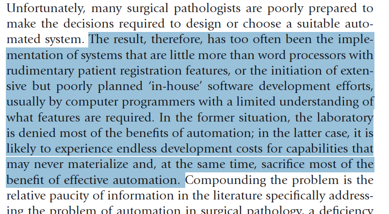
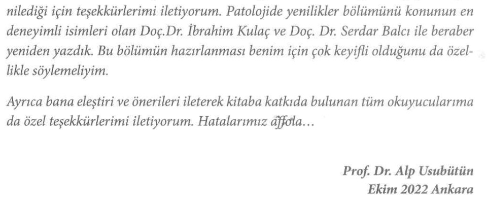

# Patoloji ve Bilişim
Serdar Balcı
2023-10-18

- [Patoloji ve Bilişim](#sec-patoloji-ve-bilisim)
  - [Patolojide Bilişimin yeri
    nedir?](#sec-patolojide-bilisimin-yeri-nedir)
  - [Patolojideki Bilgi Türleri
    Nelerdir?](#sec-patolojideki-bilgi-turleri-nelerdir)
  - [Dijital Patoloji Nedir?](#sec-dijital-patoloji-nedir)
  - [Dijital Patolojinin Geleceği](#sec-dijital-patolojinin-gelecegi)
  - [Yapay Zekanın Dijital Patolojideki
    Yeri](#sec-yapay-zekanin-dijital-patolojideki-yeri)
  - [İlginç ve örnek çalışmalar](#sec-ilginc-ve-ornek-calismalar)
- [Referanslar ve okuma Önerileri](#referanslar-ve-okuma-önerileri)
  - [Referanslar](#referanslar)
  - [Okuma önerileri:](#sec-okuma-onerileri)
  - [Açık kaynak kodlu veya ücretsiz dijital patoloji
    programları:](#sec-programlar)
  - [Videolar](#videolar)

## Patoloji ve Bilişim

<https://zenodo.org/badge/latestdoi/594820002>

[DOI 10.17605/OSF.IO/BRZUF](https://osf.io/brzuf/)

> Bu yazı *Prof. Dr. Alp Usubütün* editörlüğünde hazırlanan [*“Sağlık
> Bilimleri İçin Patoloji ve Patoloji Laboratuvarını Anlama Kılavuzu 2.
> Baskı - Ekim 2022 Ankara Nobel Tıp Kitabevleri ISBN:
> 978-625-7564-70-0”*](https://www.ankaranobel.com/patoloji-ve-laboratuvarini-anlama-kilavuzu)
> [^1] [^2] adlı kitaptaki *“8. Bölüm: Patolojide Yeni Yöntemler ve
> Gelecek”*[^3] için hazırlanmıştı r. Ancak bu alanın çok hızlı
> ilerlemesi nedeniyle bu metni güncel tutmak (ve bir sonraki baskı için
> gerekirse hazır bulunmak için) metin içeriği burada güncellenecekti r.
> **Doç. Dr. Serdar Balcı**

### Patolojide Bilişimin yeri nedir?

Patologları, hastanın klinik bilgilerini, makroskopi ve mikroskopik
görüntüler ile işleyip, literatür ve bilimsel bilgiler ışığında
yorumlayan ve rapor adlı yazılı bilgiyi üreten bilgi uzmanları olarak
tanımlayabiliriz. Abartılı bir tarif gibi görünse de çoğu hasta
dosyasında, hasta hakkında en çok ve en doğru (hatta hala daha altın
standart) bilgiler patologların ürettiği patoloji raporlarında yer
almaktadır.

Bilginin teknoloji kullanılarak işlenmesindeki gelişmeleri, patoloji
disiplini, bazen geriden bazen öncü olarak, ama emin adımlarla takip
etmekte ve kendi işleyişine katmaktadır. (Computational Pathology: A
Path Ahead https://pubmed.ncbi.nlm.nih.gov/26098131/)

- Bilimsel bilginin sürekli artması,
- hemen her yıl yeni bir DSÖ sınıflama kitabının çıkması,
- yeni çıkan antikorların ve yöntemlerin tanısal test olarak
  kullanımındaki istatistiksel yöntemler,
- tümörlerin taksonomisi,
- “ben buna displazi derim” gibi sezgisel yaklaşımlar,
- klinik bilgilerin elde edilmesi,
- makroskopik ve mikroskopik görüntülerin elde edilmesi, işlenmesi ve
  saklanması,
- rapor yazılması,
- diktasyon,
- raporların saklanması,
- arşivleme,
- laboratuvar iş akışının düzenlenmesi ve takibi

gibi bir çok basamakta yer alan bilişim teknolojileri, dijital
patolojinin yaygınlaşması ile makina öğrenmesi, derin öğrenme ve yapay
zeka ile karar destek sistemleri olarak günlük pratiğe daha da
girmektedir.

Patoloji raporları ve görüntüleri için kullanılan yazılımlar (Rosai 1.
chapter)’da belirtildiği gibi çoğu zaman diğer laboratuvar branşları ya
da radyoloji için hazırlanmış platformlara eklemlenmiş gibidirler.
Patolojinin işleyişi ile çoğu zaman örtüşmeyen yazılımlar, çoğu zaman
bir metin işlemcisi ve faturalandırma aracı olarak kalmaktadırlar.

<figure>

<figcaption aria-hidden="true">Patoloji raporları ve görüntüleri için
kullanılan yazılımlar (Rosai 1. chapter)’da belirtildiği gibi çoğu zaman
diğer laboratuvar branşları ya da radyoloji için hazırlanmış
platformlara eklemlenmiş gibidirler. Patolojinin işleyişi ile çoğu zaman
örtüşmeyen yazılımlar, çoğu zaman bir metin işlemcisi ve faturalandırma
aracı olarak kalmaktadırlar.</figcaption>
</figure>

### Patolojideki Bilgi Türleri Nelerdir?

Patolojide bilgi türleri temel olarak *laboratuvar iş akışı*, *metin* ve
*görüntülerden* oluşmaktadır.

#### Laboratuvar İş Akışı

#### Metin Bilgileri

Patolojideki metin bilgilerini:

- patoloğa
  - klinikten ve
  - literatürden gelen bilgiler ile
- patoloğun ürettiği raporlar oluşturmaktadır.

Bu bilgi türlerine belki `sosyal medya`yı da eklemek uygun olacaktır.
Sosyal medyada paylaşılan rutin ya da ilginç patoloji vakaları
derlendiğinde bir patoloji kitabı oluşturmak mümkün olabilir [^4].
Ayrıca bu veriler görüntü analizleri için bile kullanılabilmektedir
[PMID:37592105](https://pubmed.ncbi.nlm.nih.gov/37592105/).

#### Görüntüler

### Dijital Patoloji Nedir?

#### Dijital Patolojinin Kullanım Alanları Nelerdir?

##### Tanı

##### Eğitim

##### Konsültasyon

##### Rutin Raporlama {rutin-raporlama}

Şu an kullanılan ara yüzlerdeki farklılıklar da kullanım alışkanlığı
geliştirmeyi zorlaştırmaktadır.

\<–WIP–\>

- Bilgisayar fare orta tuş kilidi olan ve olmayan arayüzler
  (https://middleclick.app/), büyütme ve küçültme (zoom in/out)
  hızlarının klasik mikroskoplardan farklı olması yanısıra klavye ve
  bilgisayar bileşenlerine (oyunlara) aşina neslin kullandığı oklar,
  `aswd` tuşlarının …

- navigasyon ok tuşları, aswdrz, +- middle click scroll resim, görüntü
  kaydetme

- Sectra, ViraSoft ve OpenSeaDragon arayüzlerindeki farklılıklar.

\<–WIP–\>

Nasıl bir ekran kullanılacağı ve ekranın *“tıbbi ekran”* kategorisinde
olup olmaması gerektiği de süregiden bir tartışma konusudur (Bkz. Leeds
ekran testi)

\<–WIP–\>

- Tek ya da çoklu monitörde çalışma, dokunmatik ekranlar

- ekran çözünürlüğü, tepki süresi

- sanal mape çeşitleri

- lamın vertikal ya da horizontal taranması

- taranan alanların işaretlenmesi (heatmap)

\<–WIP–\>

Günümüzde kaset, immünohistokimya ve tayarıcılardaki farklı barkod /
karekod / datamatrix kullanımı ve bu içeriğin firmalara özgün ve
değiştirilemez olarak tanımlanması, kesintisiz bir laboratuvar iş akışı
önündeki önemli engellerden biridir. Bu konuda firmalar arası
entegrasyonun sağlanabilmesi oldukça önemlidir. Yakın zamanda Memorial
Patoloji’de tüm basamaklardaki datamatrix kodları birleştirilmiş olup,
immünohistokimya cihazındaki entegrasyon da tamamlanmak üzeredir.

#### Dijital Patoloji İçin Tarayıcıya İhtiyacımız Var Mı?

### Dijital Patolojinin Geleceği

- Dijital patoloji sadece mikroskopik görüntülerin bilgisayar ortamına
  aktarılması olarak düşünülmemeli. Dijital patoloji ile tüm patolojide
  üretilen tüm bilginin kullanılabilir veri haline getirilmesi ve
  bunların hastanın diğer bilgileri ile entegre edilmesi
  hedeflenmelidir.

- Yöneticilerin dijital patoloji kurulum hevesleri sırasında, patologlar
  fırsatı ganimet bilip laboratuvarın eksiklerini tamamlatmalı ve
  kaliteyi artırıcı düzenlemeleri uygulatmalıdırlar.

- Yeni çıkan immünohistokimyasal tetkiklerin belli bir süre sonra
  tanısal özgünlüklerini kaybetmeleri patologları yeni testlere karşı
  şüpheli yaklaşmaya zorlamıştır. Aynı şüpheyi yapay zeka algoritmaları
  için de kullanmak gereklidir. Yakın zamanda çok sayıda başarılı olduğu
  iddia edilen algoritma yayınlanmış olmasına karşın bunların kliniğe
  aktarımı hala kısıtlıdır. Yayın ve araştırma bolluğu ile birlikte;
  yapay zeka modellerinin aynı laboratuvardaki tekrarlanabilirlikleri ve
  başka laboratuvar verilerine aktarılabilirlikleri çok önemli bir
  problem olarak ortaya çıkmaya başlamıştır.

- Patoloji asistanları açık kaynak kodlu dijital patoloji programlarını
  kullanmayı öğrenmeli ve açık kaynak kodlu yazılımlar konusunda dijital
  okur yazarlıklarını geliştirmelidirler.

- Meslek örgütleri radyolojide yaşanan “hizmet alımı” süreci ile
  “uzaktan tanı” adı altında düşürülen sağlık hizmeti kalitesi ve
  değersizleştirilen hekim emeğinin farkında olmalı ve buna yönelik
  tedbir ve tavsiyeler için hazırlanmalıdırlar.

### Yapay Zekanın Dijital Patolojideki Yeri

### İlginç ve örnek çalışmalar

#### QuPath

QuPath’ın WSinfer adlı eklentisi ile literatürdeki yapay zeka
modellerini kendi vakalarımızda kolayca uygulamak mümkün. [^5]

> I am really enthusiastic about the \#wsinfer plugin of \#qupath Now it
> will be possible to try published models of digital pathology on my
> cases without having to find data or code “upon reasonable request”,
> or try correct the corrupt code on github. And now the “published
> models” will face the real world scenario. This will change the
> \#digitalpathology and distinguish those models that really work from
> those that work only on the paper. There is one great barrier
> remaining now, an open source program to make \#WSI with a camera
> attached to a microscope. I wish I had the coding skills to do that :)

#### HistoQC

#### Octopi

#### OpenFlexure Microscope {sec-openflexure-microscope}

https://openflexure.org/projects/microscope/

PATHOLOGY RESIDENT EXPERIENCE USING A LOW-COST 3D PRINTED MICROSCOPE FOR
PORTABLE DIGITAL PATHOLOGY https://doi.org/10.1016/j.jpi.2022.100043

#### µManager {sec-micromanager}

Open Source Software for Control and Automation of Microscope Hardware
[^6]

Diğer açık kaynak kodlu ve ücretsiz programların listesi okuma
önerilerinde verilmiştir.

## Referanslar ve okuma Önerileri

### Referanslar

### Okuma önerileri:

- European Society for Digital and Integrative Pathology
  <https://digitalpathologysociety.org/>
- Digital Pathology Association
  <https://digitalpathologyassociation.org/>
- empaia Academy <https://en.empaia.org/academy-2-1>
- Patoloji Atlası <https://www.patolojiatlasi.com/>
- Histopathology Atlas <https://www.histopathologyatlas.com/>
- Patoloji Notları <https://www.patolojinotlari.com/>
- QuPath <https://qupath.github.io/> Bankhead, P. et al. QuPath: Open
  source software for digital pathology image analysis. Scientific
  Reports (2017). <https://doi.org/10.1038/s41598-017-17204-5>
- Pete Bankhead, 2022, Introduction to Bioimage Analysis
  <https://bioimagebook.github.io>
- Best practice recommendations for implementing digital pathology, The
  Royal College of Pathologists
  <https://www.rcpath.org/uploads/assets/f465d1b3-797b-4297-b7fedc00b4d77e51/Best-practice-recommendations-for-implementing-digital-pathology.pdf>
- The Leeds Guide to Digital Pathology
  <https://www.virtualpathology.leeds.ac.uk/research/clinical/docs/2018/pdfs/18778_Leeds%20Guide%20to%20Digital%20Pathology_Brochure_A4_final_hi.pdf>
- Leeds ekran testi:
  <https://www.virtualpathology.leeds.ac.uk/research/systems/pouqa/pathology/>
- Integrating digital pathology into clinical practice
  <https://pubmed.ncbi.nlm.nih.gov/34599281/>
- Artificial intelligence-the third revolution in pathology
  <https://pubmed.ncbi.nlm.nih.gov/30270453/>
- Grand Challenge A platform for end-to-end development of machine
  learning solutions in biomedical imaging.
  <https://grand-challenge.org/>
- Manual Whole Slide Imaging <https://www.microvisioneer.com/>
- PathoZoom Scan <https://www.smartinmedia.com/pathozoom-scan/>
- Pallua JD, Brunner A, Zelger B, Schirmer M, Haybaeck J. The future of
  pathology is digital Pathol Res Pract. 2020 Sep;216(9):153040. doi:
  10.1016/j.prp.2020.153040. Epub 2020 Jun 20. PMID: 32825928.
- Petascale Computational Pathology - Prof Nasir Rajpoot at HMS-BWH
  Pathology Grand Rounds 5 Oct 2020
  <https://www.youtube.com/watch?v=nVHRNn-nqMg>
- Advice from one of the world’s largest digital pathology
  implementations
  <https://medical.sectra.com/case/advice-from-one-of-the-worlds-largest-digital-pathology-implementations/>
- Octopi: Octopi: Open configurable high-throughput imaging platform for
  infectious disease diagnosis in the field Hongquan Li, Hazel
  Soto-Montoya, Maxime Voisin, Lucas Fuentes Valenzuela, Manu Prakash
  bioRxiv 684423; doi: <https://doi.org/10.1101/684423>
- Octopi’nin tanıtımı:
  <https://twitter.com/prakashlab/status/1144453714637230083>
- Lesson from the COVID-19 pandemic: pathologists need to build their
  confidence on working in a digital microscopy environment. Virchows
  Arch 479, 227–229 (2021). <https://doi.org/10.1007/s00428-021-03123-4>
- Validating Whole Slide Imaging for Diagnostic Purposes in Pathology
  <https://www.cap.org/protocols-and-guidelines/cap-guidelines/current-cap-guidelines/validating-whole-slide-imaging-for-diagnostic-purposes-in-pathology>
- Validating Whole Slide Imaging Systems for Diagnostic Purposes in
  Pathology: Guideline Update From the College of American Pathologists
  in Collaboration With the American Society for Clinical Pathology and
  the Association for Pathology Informatics. Arch Pathol Lab Med 1 April
  2022; 146 (4): 440–450. doi:
  <https://doi.org/10.5858/arpa.2020-0723-CP>
- Digital Pathology & AI in routine clinical practice:From quality
  control to primary cancer diagnosis
  <https://www.youtube.com/watch?v=7pRmonus9iM>
- Atallah, N.M., Toss, M.S., Verrill, C. et al. Potential quality
  pitfalls of digitalized whole slide image of breast pathology in
  routine practice. Mod Pathol (2021).
  <https://doi.org/10.1038/s41379-021-01000-8>

### Açık kaynak kodlu veya ücretsiz dijital patoloji programları:

- QuickAnnotator <https://github.com/choosehappy/QuickAnnotator>
- HistoQC <https://github.com/choosehappy/HistoQC>
- QuPath <https://qupath.github.io/>
- Cytomine <https://cytomine.be/>
- Orbit <https://www.orbit.bio/>
- ASAP <https://computationalpathologygroup.github.io/ASAP/>
- Micaia <http://www.micaia.ai>
- ImageJ/ Fiji <https://fiji.sc/>
- ImageScope
  <https://www.leicabiosystems.com/digital-pathology/manage/aperio-imagescope/>

### Videolar

- [Introduction to Bioimage
  Analysis](https://www.youtube.com/playlist?list=PL4ta8RxZklWk88KIspPfkYZBP7ZFoAzWs)

- [QuPath tutorial \#1 - Getting
  started](https://www.youtube.com/playlist?list=PL4ta8RxZklWkPB_pwW-ZDVAGPGktAlE5Y)

- [QuPath tutorial \#2 - IHC
  analysis](https://www.youtube.com/playlist?list=PL4ta8RxZklWk_O_Z7K0bZlhmHtaH73vlh)

- [QuPath Spring
  2022](https://www.youtube.com/playlist?list=PL87AjRiLthaRmXuSkNQfQKR4HSR0-DqOM)

- [From Samples to Knowledge
  2020](https://www.youtube.com/playlist?list=PLlGXRBscPbCD89fRULm4peopF57qugciN)

- [PathLAKE Masterclasses
  2021](https://www.youtube.com/playlist?list=PL33zGSM6CfFB_rezhCamTceNVZ0xazMSp)

- [TIA Centre Seminar
  Series](https://www.youtube.com/playlist?list=PL33zGSM6CfFCN3gbUFfZ5S0R1HrnMQS7-)

- [Invited Talks &
  Presentations](https://www.youtube.com/playlist?list=PL33zGSM6CfFDz2dXzirEWjefMGiLZOeOd)

- [ECDP
  2019](https://www.youtube.com/playlist?list=PL33zGSM6CfFAhERCNI6YVePePRuTk2YQt)

- [Image processing with
  python](https://www.youtube.com/playlist?list=PLZsOBAyNTZwYx-7GylDo3LSYpSompzsqW)

- [Dijital Patoloji Webinar Serisi-1 Dr. Juan Retamero
  (**memorialsaglik?**) \#memorialpatoloji
  (**paige_ai?**)](https://www.youtube.com/watch?v=sHIQI-w87Tc&ab_channel=SERDARBALCI)

- [Dijital Patoloji Webinar Serisi-2 Dijital Patolojide
  Validasyon](https://www.youtube.com/watch?v=qgssA3XLSpU&ab_channel=SERDARBALCI)

- [Dijital Patoloji Webinar Serisi-3 Dijital Patolojinin Rutinde
  Kullanımı Dr. Serdar
  Balcı](https://www.youtube.com/watch?v=xlxfSO-zSrA&ab_channel=SERDARBALCI)

[^1]:
    <figure>
    
    <figcaption>Sağlık Bilimleri için Patoloji ve Patoloji Laboratuvarını
    Anlama Kılavuzu</figcaption>
    </figure>

[^2]:
    <figure>
    
    <figcaption>Sağlık Bilimleri için Patoloji ve Patoloji Laboratuvarını
    Anlama Kılavuzu</figcaption>
    </figure>

[^3]:
    <figure>
    
    <figcaption>Sağlık Bilimleri için Patoloji ve Patoloji Laboratuvarını
    Anlama Kılavuzu</figcaption>
    </figure>

[^4]: [Patoloji Notları](https://www.patolojinotlari.com/)

[^5]: [preprint](https://arxiv.org/abs/2309.04631)
    [documentation-1](https://wsinfer.readthedocs.io/en/latest/)
    [documentation-2](https://qupath.readthedocs.io/en/latest/docs/deep/wsinfer.html)
    [image.sc](https://forum.image.sc/t/for-wsinfer-extension-how-can-i-find-model-documentations/85493)
    [linkedIN](https://www.linkedin.com/feed/update/urn:li:activity:7108787522310184960/)

[^6]: https://micro-manager.org/
