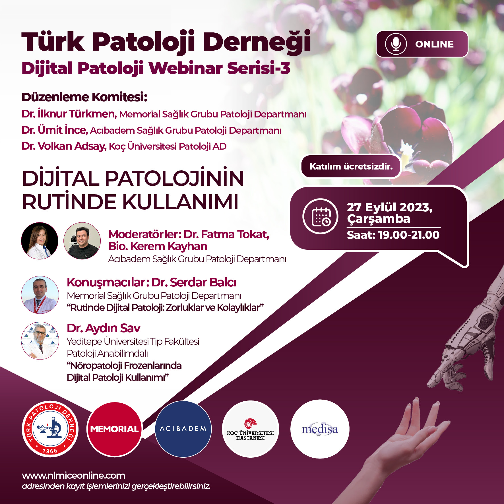

Rutinde Dijital Patoloji: Zorluklar ve Kolaylıklar. 27 Eylül 2023. Türk Patoloji Derneği Dijital Webinar Serisi-3 Dijital Patolojinin Rutinde Kullanımı

{width="40%"}

<https://www.youtube.com/watch?v=xlxfSO-zSrA&ab_channel=SERDARBALCI>

<iframe width="560" height="315" src="https://www.youtube.com/embed/xlxfSO-zSrA?si=1KMzMEpV93tBUV26" title="YouTube video player" frameborder="0" allow="accelerometer; autoplay; clipboard-write; encrypted-media; gyroscope; picture-in-picture; web-share" allowfullscreen></iframe>

 

<iframe src="https://www.serdarbalci.com/rutinde-dijital-patoloji/#/title-slide" height="500px"></iframe>

 
