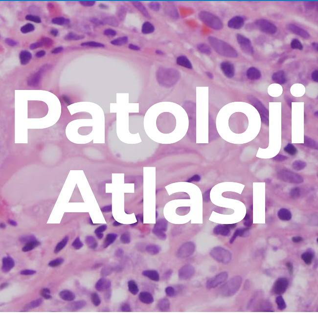

---
format:
  html:
    grid:
      sidebar-width: 50px
      body-width: 4000px
      margin-width: 50px
      gutter-width: 5em
---

::::: {.grid}

:::: {.g-col-12 .g-col-md-8}

# Examples for AI in Pathology

## Clinical:

### Ki-67

[Clinical](https://clinical-trialclinical-eu.aiforia.com/#/cases)

## Research:

[Research](https://cloud.aiforia.com/MemorialHospitalTurkey_Ilknur_12072022#!/)

### H.pylori: 
TEST IMAGE

### Pancreas: 
case3a

# Discussion Points

- Are AI models file type agnostic? (.svs, .tiff, .ndpi) 
- Are AI models PACS agnostic? 
- Will there be different environments for models? (similar to iOS vs android, windows vs mac vs linux) 
- Where are the analysis performed? 
  - Where is the GPU power run? Locally, Cloud? 
- How are the files transferred? 
- Which additional information (metadata) should be transferred? 
- How is security managed? 
- HIPAA, KVKK
- Where are the results stored? 
- How long are the results stored? 
- Are the results embedded into the original image? 
- Is it possible to rerun the model? 
- If there is an update into the model, what happens if the original interpratation changes? 
- When are the analysis done? Prior to the review by pathologist or if pathologist triggers?
- Do we need FDA or IVD approval for all models? Regarding that most IHC clones are 'research only'

::::

:::: {.g-col-12 .g-col-md-4}

{width="40%"}

{width="40%"}

{width="40%"}

{width="40%"}

{ width="40%"}

::::

:::::

