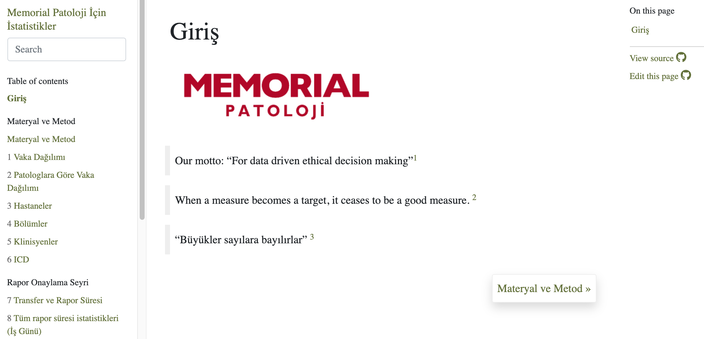

```{r global, include=FALSE}
knitr::opts_chunk$set(results = 'asis',
                      echo = FALSE,
                      warning = FALSE,
                      tidy = FALSE,
                      message = FALSE,
                      fig.align = 'center',
                      out.width = "100%")
options(knitr.table.format = "html") 
```


::::: {style="display: grid; grid-template-columns: 1fr 1fr 1fr; grid-column-gap: 20px;"}

::: {style="border-right: dotted; border-width:1px;"}


# What is anatomic pathology report?

- Anatomic pathology reports:
    - *semi-structured* texts
    - have specific *jargon*
    - include *sensitive patient information*
    - have *unique* patient and biopsy number, thus suitable for data analysis.


# Why use R for pathology reports?

- Laboratory information systems provide statistics and quality control measures but more information is needed from a clinical view.

- `R` is a practical way to get more insight from pathology reports.

- This poster is describing an applied use of R in clinical practice, in an anatomic pathology laboratory.

- Medical doctors and laboratory managers can use R and bookdown to generate reports for their own needs and get quality control measures that are specific for their work conditions.

- `R packages` that are used for publication quality tables and graphs can also be used for routine workflow.

- `cron` jobs makes it easy to get most up to date data summaries without manual intervention.

- With reduced workload, laboratory managers and physicians can focus on solutions.


```{r, echo=FALSE, fig.cap="A Front Page of Report", out.width = '100%'}

```


:::


::: {style="border-right: dotted; border-width:1px;"}

# How do we use R?

- `{bookdown}`  
    - Analysis are made and reports are generated simultaneously.  
    - Data are pre-processed in the first chapters  
    - saved as separate RDS files (to reduce memory use)  
    - then read in other chapters when necessary.  
- `{bookdown}` is flexible:  
    - to add new analysis in any place  
    - to produce multiple format reports  
    - render a single chapter quickly and see a specific result  
- `{cronR}`   
    - The reports are rendered with `cron jobs`periodically.  
- `{stringr}` and `regular expressions`  
    - to categorize reports for organs systems, diagnosis, ancillary techniques used  
    - label pathology reports  
- `{lubridate}`  
    - extracting day, hour of specimen movements, calculating transfer and reporting dates  
- `{gt}` `{gtsummary}` and `{glue}` to make tables  
- `{ggstatsplot}` to generate plots  
- `{DiagrammeR}` to generate workflow diagrams  
- `{readxl}` `{readr}` `{jsonlite}` and `{pdftools}` to read data  


```{r, echo=FALSE, fig.cap="B Reporting times based on the day specimen arrives", out.width = '100%'}
knitr::include_graphics("./images/reporting-time.png")
```


:::


::: {}


# Where do we use it?

- Istanbul Memorial Healthcare Pathology Laboratory, serves 8 hospitals in 5 cities.  

- The hospitals use data systems from different vendors and extracted data are available in various formats (`csv`, `json`, `excel` and `pdf`).

- **Follow-up**
Using patient number and biopsy date we can follow up patients when they get follow-up.  
Per disease patient survival analyses are also evaluated.
- **Quality Control, Diagnostic Correlations**
Since the reports are labelled for organs and diagnoses we can make comparisons for cytology-pathology correlation, initial biopsy and radical resection comparisons.
We can define discrepant cases and they are later reviewed for quality control.
Logistics, specimen movements, transfer-reporting time measurements, and laboratory physician workload are calculated.
- **Workload calculation**
Defining hospitals, clinicians and pathologists as parameters it is possible to generate parameter based markdown reports.


```{r, echo=FALSE, fig.cap="C Specimen Follow-up with sankey diagram using {networkD3}", out.width = '100%'}
knitr::include_graphics("./images/report-process.png")
```


:::


:::::


